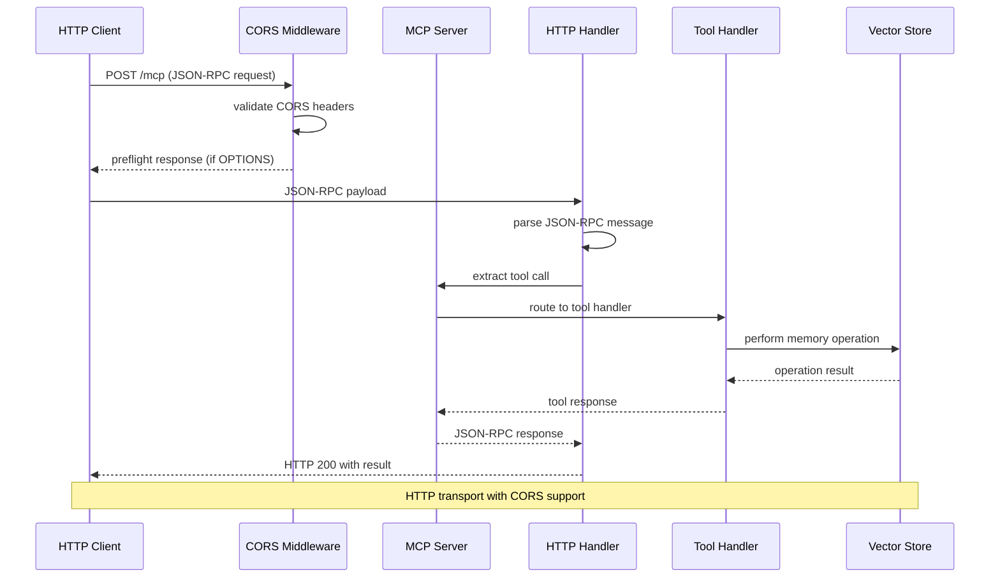
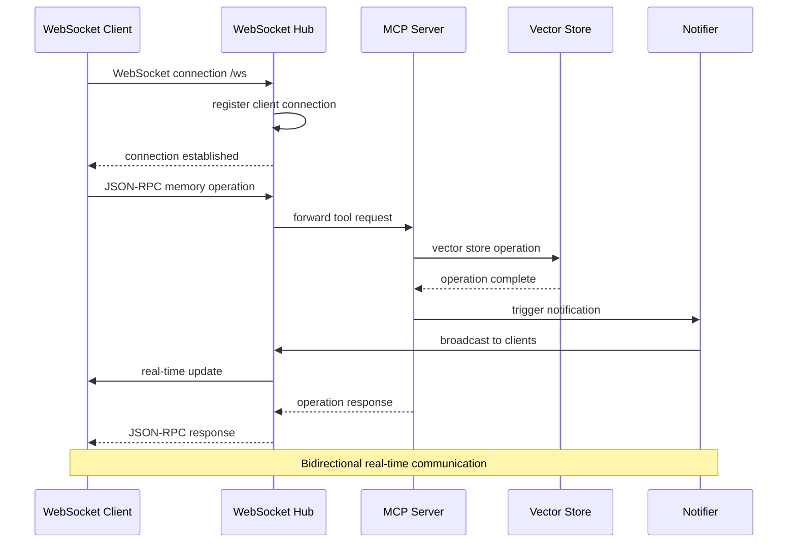
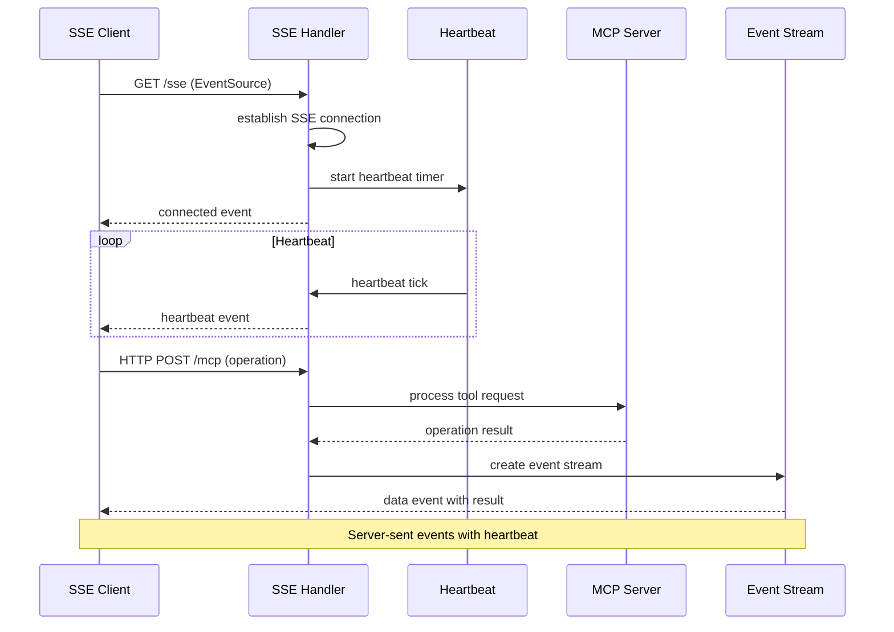
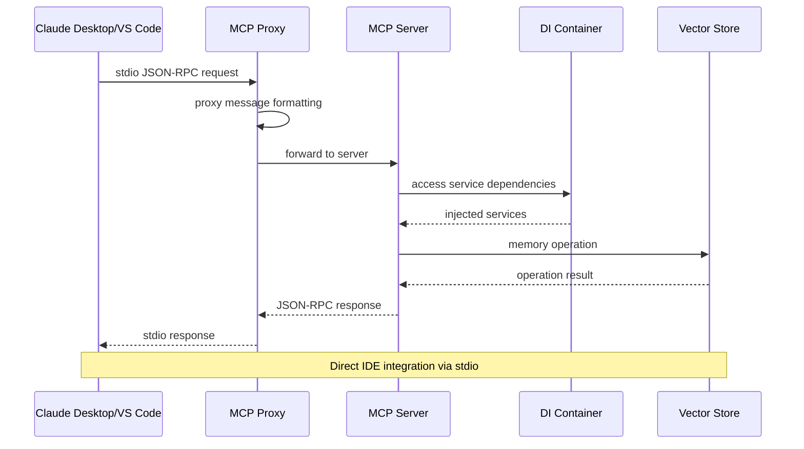
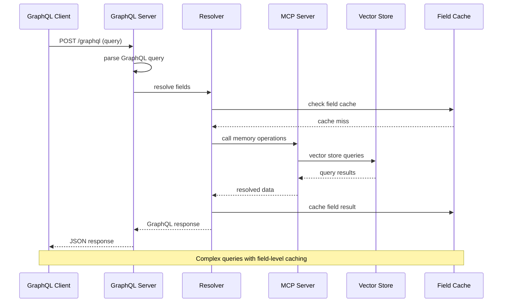
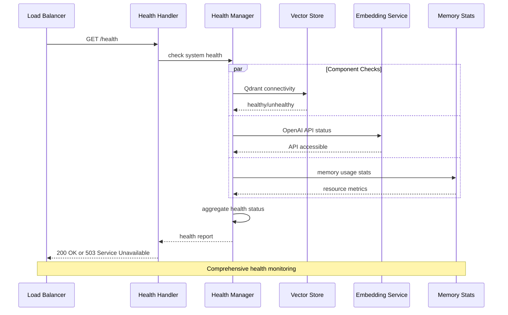
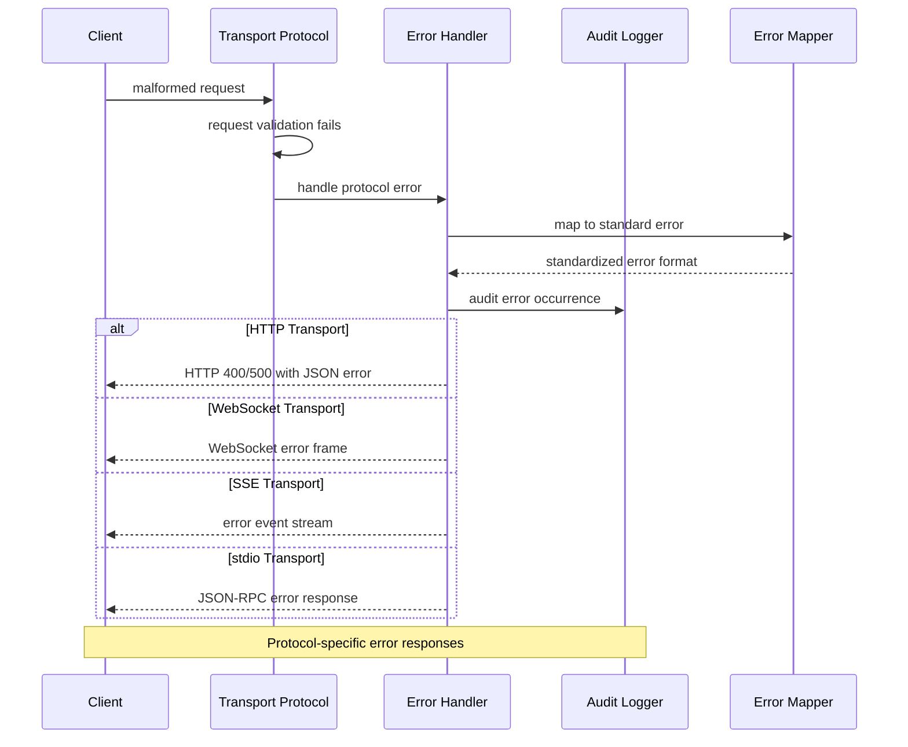
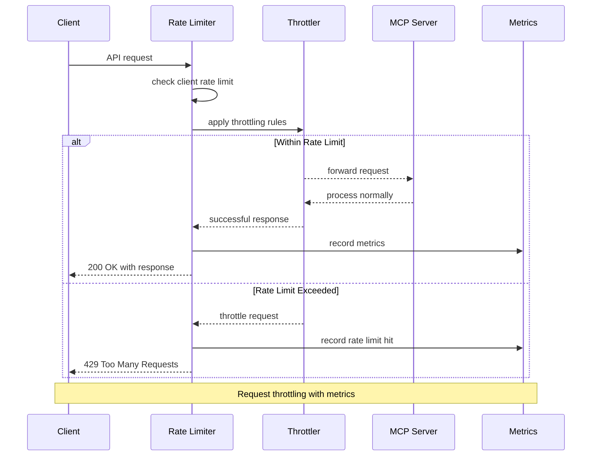

# API Transport Flow Diagrams

Multi-protocol API interactions supporting stdio, HTTP, WebSocket, and SSE transports.

## HTTP JSON-RPC Flow



## WebSocket Real-Time Flow



## Server-Sent Events (SSE) Flow



## stdio MCP Protocol Flow



## GraphQL API Flow



## Health Check Endpoints Flow



## Multi-Protocol Error Handling



## Rate Limiting & Throttling Flow



## Authentication Flow (API Key)

```mermaid
sequenceDiagram
    participant C as Client
    participant AM as Auth Middleware
    parameter AC as Access Control
    participant S as MCP Server
    parameter U as User Store
    
    C->>AM: request with X-API-Key header
    AM->>AC: validate API key
    AC->>U: lookup user by key
    U-->>AC: user permissions
    AC->>AC: check repository access
    
    alt Valid Key & Permissions
        AC-->>AM: authorization granted
        AM->>S: forward with user context
        S-->>AM: operation result
        AM-->>C: authorized response
    else Invalid Key or No Access
        AC-->>AM: authorization denied
        AM-->>C: 401 Unauthorized
    end
    
    Note over C,U: Token-based authentication with repository scoping
```