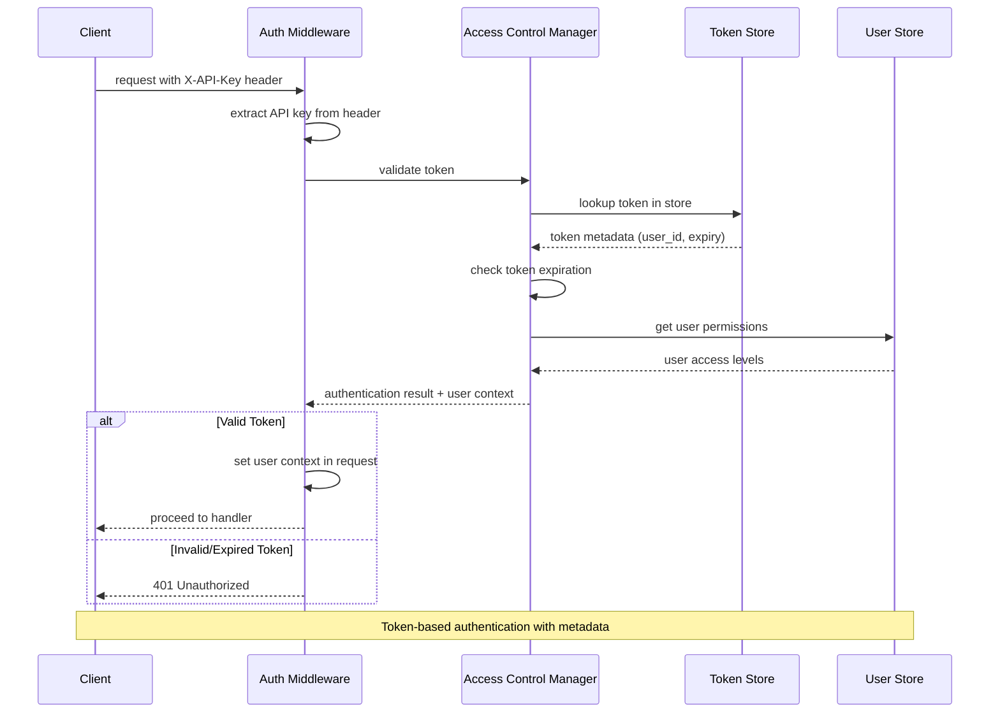
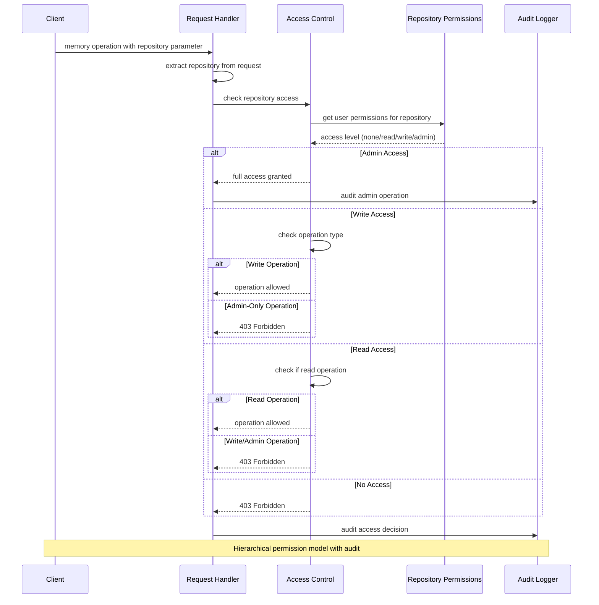
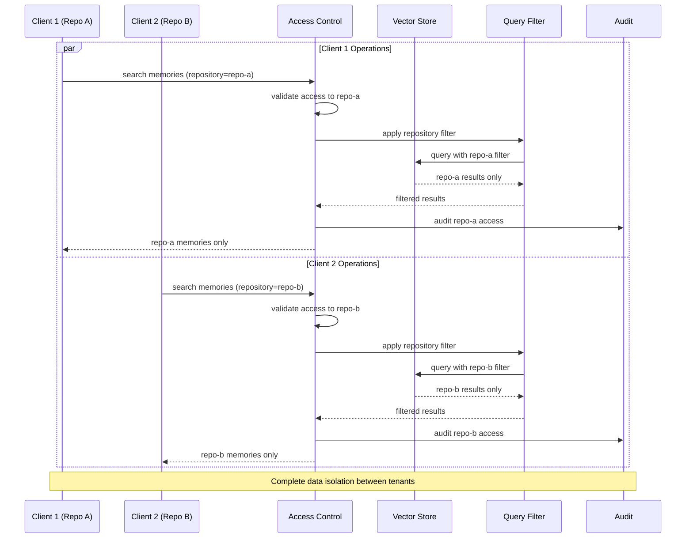
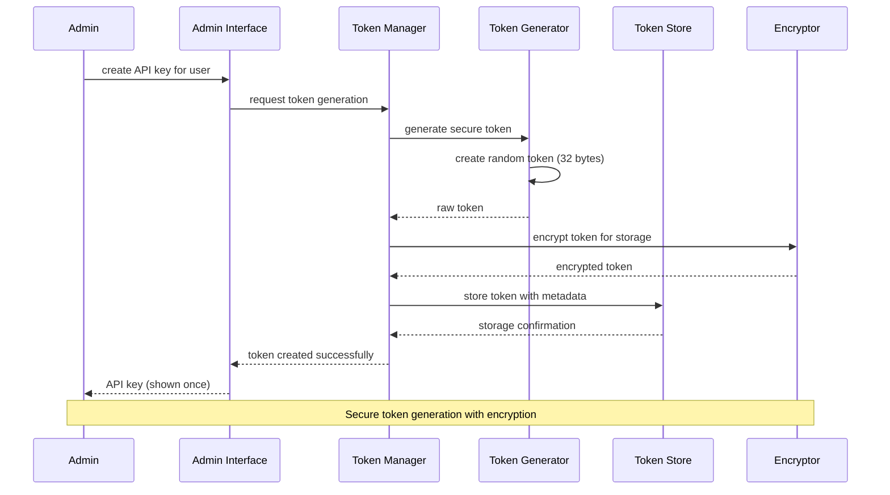
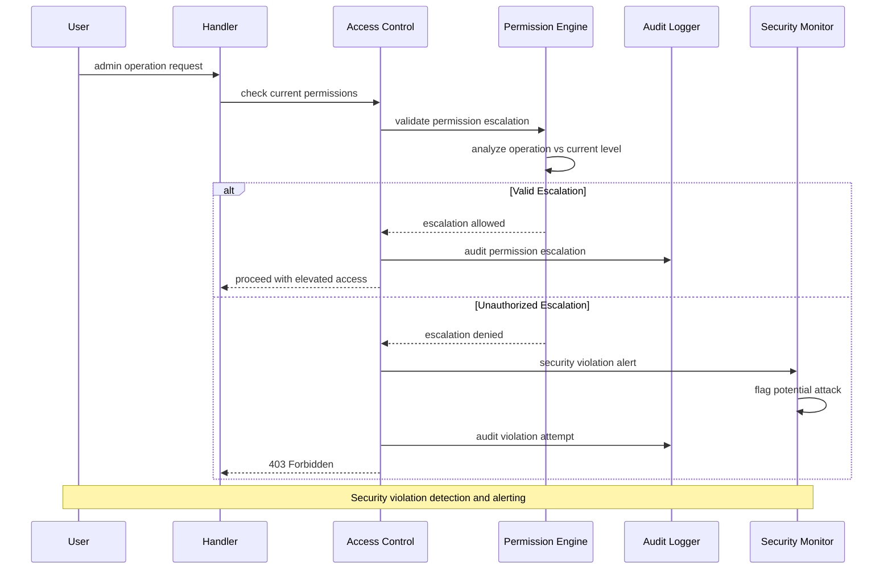
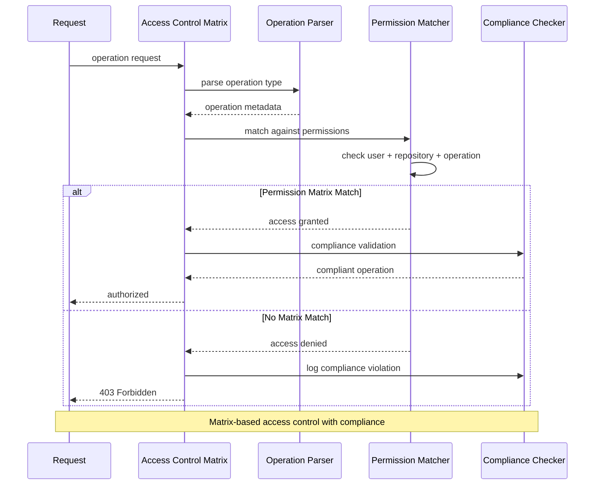
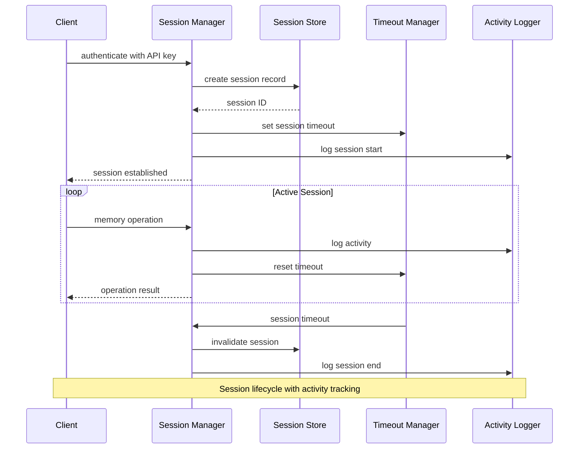
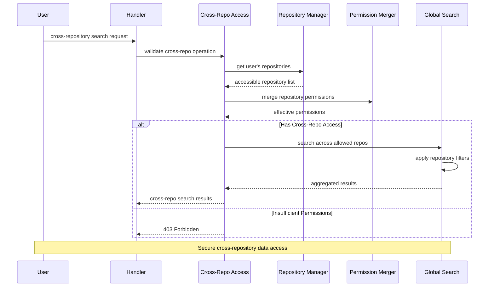
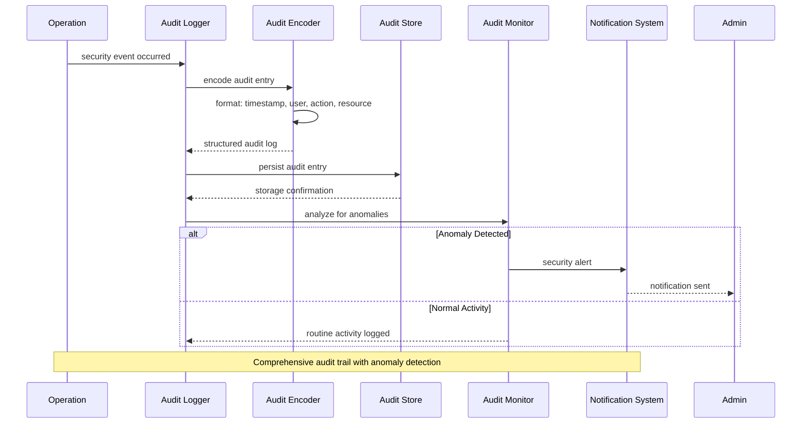

# Authentication & Authorization Flow Diagrams

Security flows for multi-tenant access control and API key authentication.

## API Key Authentication Flow

## Repository Access Control Flow

## Multi-Tenant Isolation Flow

## Token Generation & Management

## Permission Escalation Check

## Access Control Matrix Validation

## Session Management Flow

## Cross-Repository Access Flow

## Audit Trail Flow

