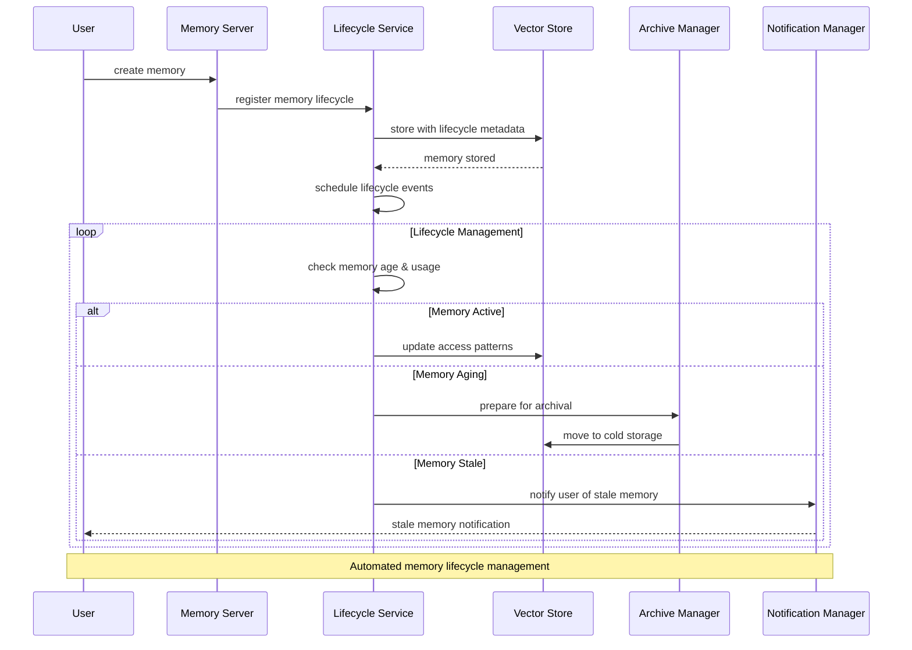
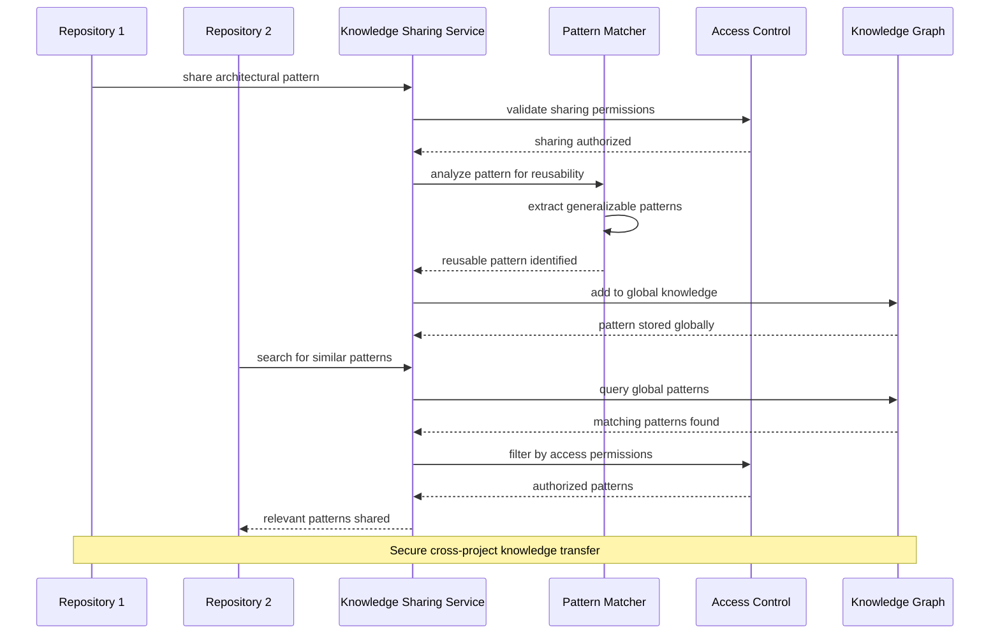
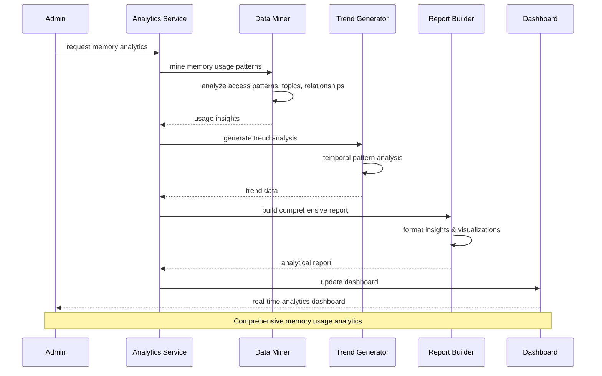
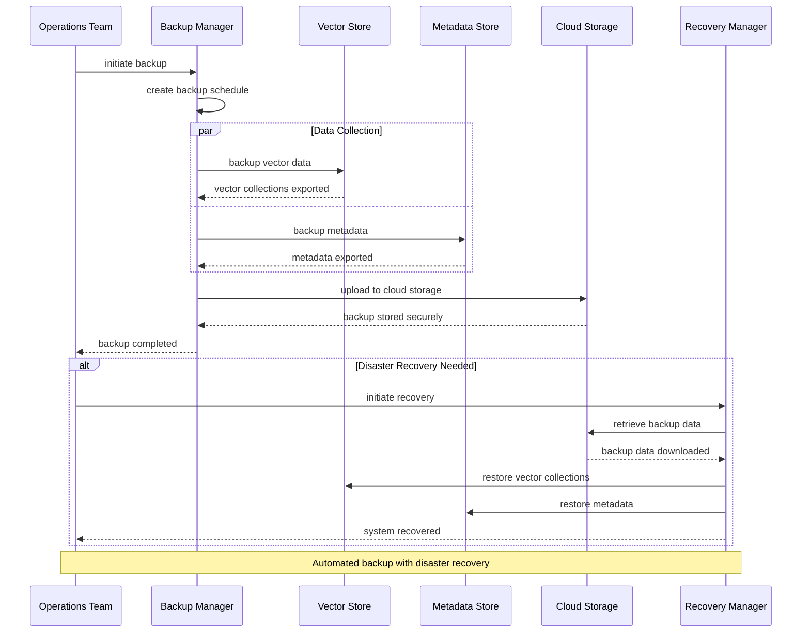
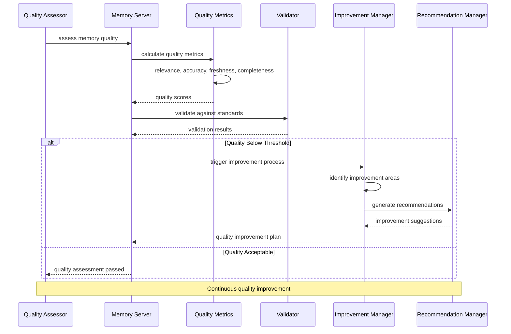
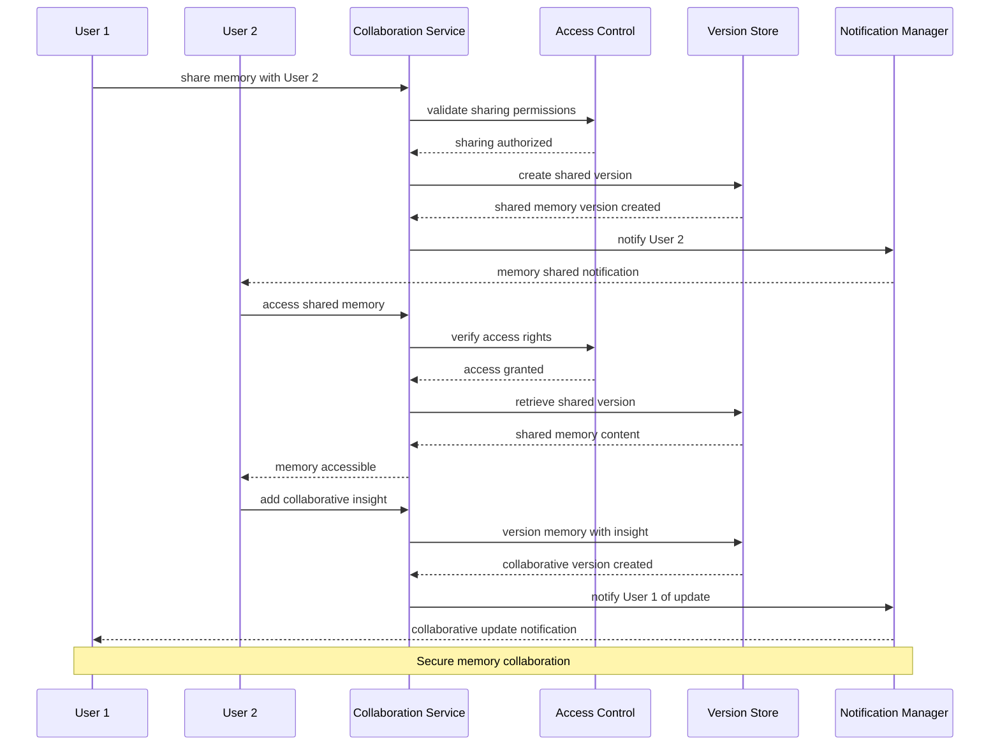
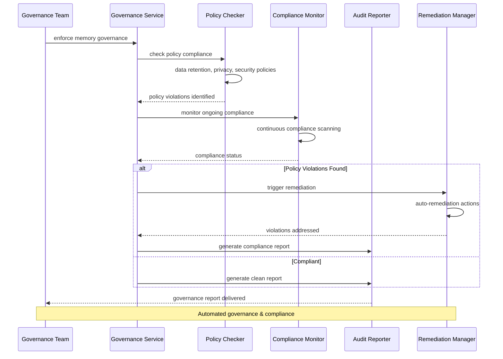
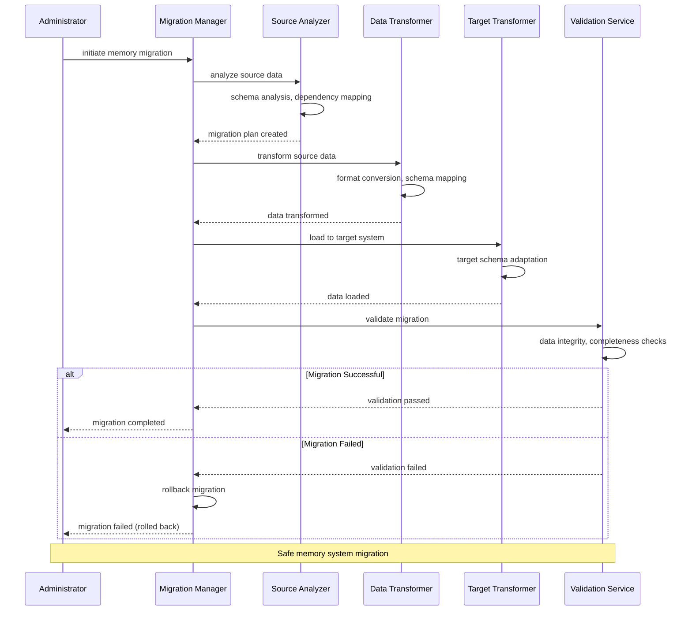
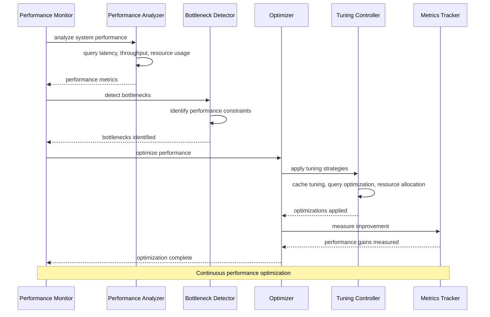
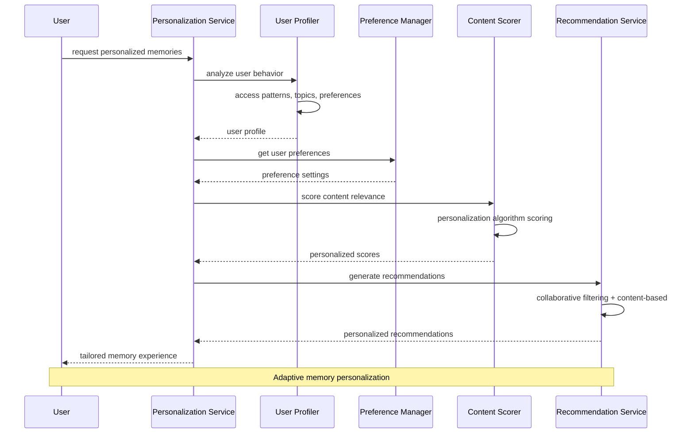

# Business Process Flow Diagrams

Core memory operations and business workflows for the MCP Memory Server.

## Memory Lifecycle Management

## Cross-Repository Knowledge Sharing

## Memory Analytics & Insights

## Backup & Recovery Operations

## Memory Quality Assessment

## Memory Collaboration Flow

## Memory Governance Workflow

## Memory Migration Workflow

## Performance Optimization Flow

## Memory Personalization Flow

