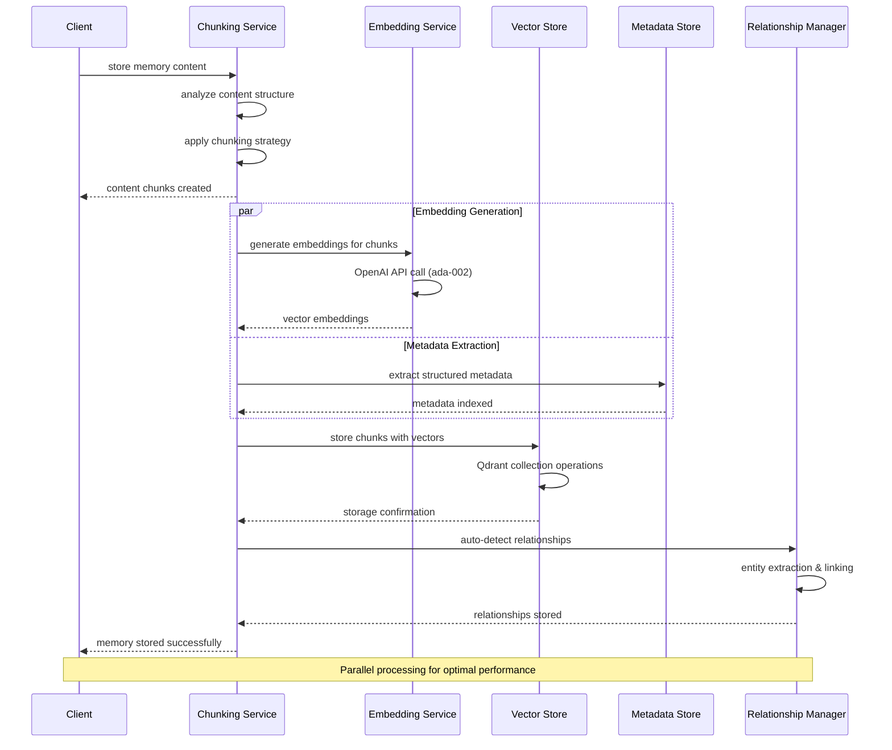
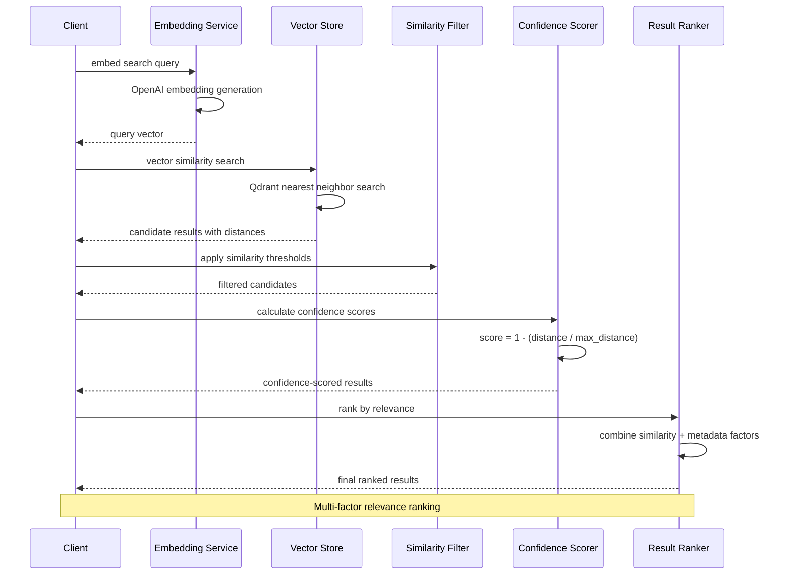
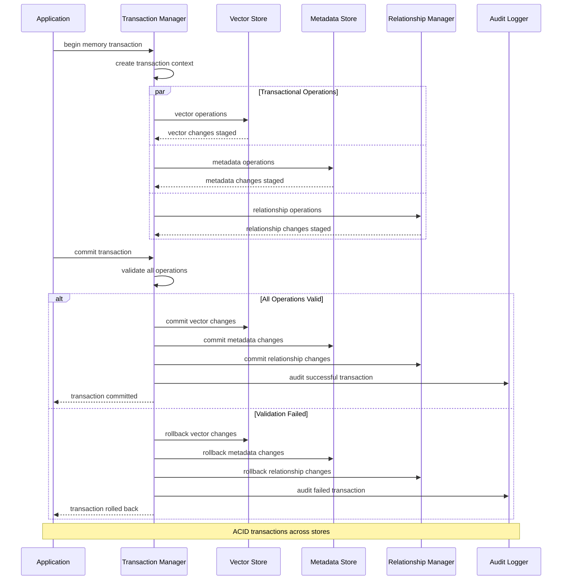
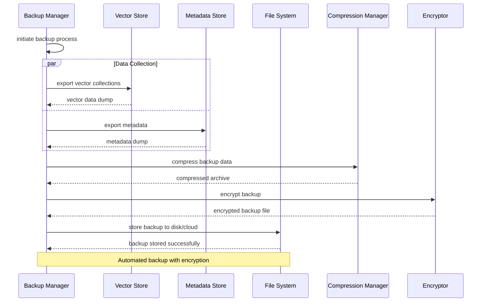
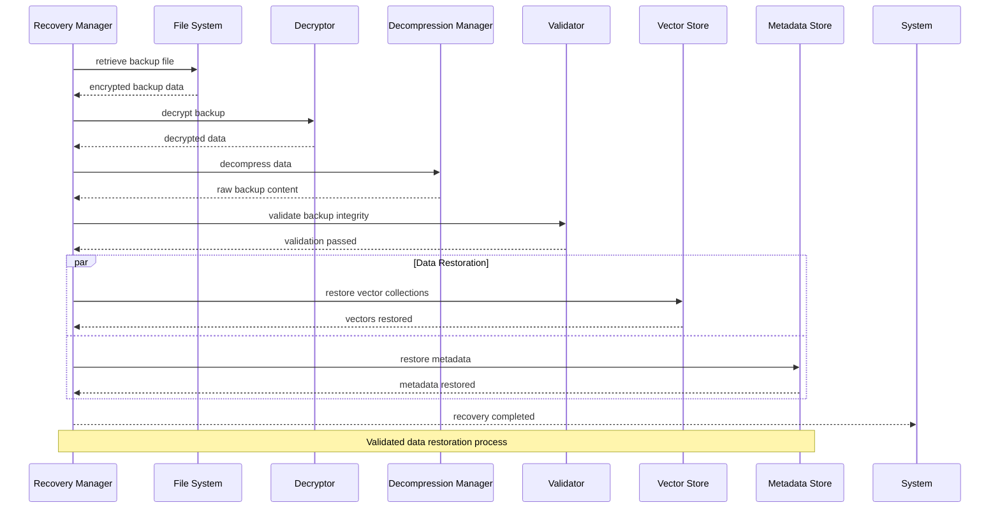
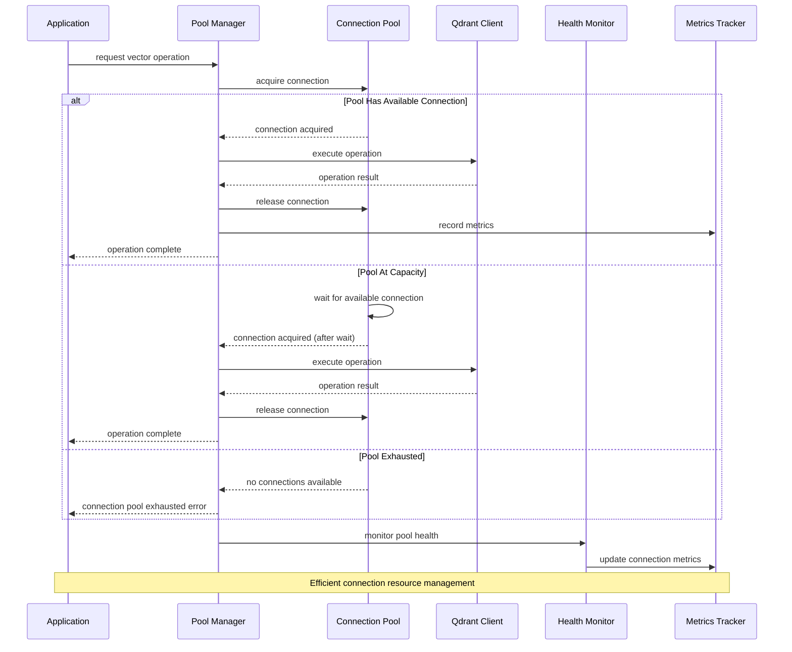

# Data Processing & Storage Flow Diagrams

Memory storage, retrieval, and vector processing workflows.

## Memory Storage Pipeline



## Vector Similarity Search



## Chunking Workflow

```mermaid
sequenceDiagram
    participant I as Input Content
    participant CS as Chunking Service
    participant SA as Strategy Analyzer
    participant TC as Text Chunker
    parameter CC as Code Chunker
    participant SC as Semantic Chunker
    participant VA as Validator
    
    I->>CS: content to chunk
    CS->>SA: analyze content type
    SA-->>CS: chunking strategy selected
    
    alt Text Content
        CS->>TC: apply text chunking
        TC->>TC: sentence/paragraph boundaries
        TC-->>CS: text chunks
    else Code Content
        CS->>CC: apply code chunking
        CC->>CC: function/class boundaries
        CC-->>CS: code chunks
    else Complex Content
        CS->>SC: semantic chunking
        SC->>SC: meaning-based boundaries
        SC-->>CS: semantic chunks
    end
    
    CS->>VA: validate chunk quality
    VA->>VA: check size, coherence, overlap
    VA-->>CS: quality metrics
    CS-->>I: optimized chunks ready
    
    Note over I,VA: Content-aware chunking strategies
```

## Database Transaction Flow



## Data Backup & Recovery



## Data Recovery Flow



## Vector Operations with Circuit Breaker

```mermaid
sequenceDiagram
    participant A as Application
    participant CB as Circuit Breaker
    participant RW as Retry Wrapper
    participant VS as Vector Store (Qdrant)
    participant HM as Health Monitor
    parameter AL as Alert System
    
    A->>CB: vector store operation
    CB->>CB: check circuit state
    
    alt Circuit Closed (Healthy)
        CB->>RW: attempt operation
        RW->>VS: Qdrant API call
        
        alt Operation Successful
            VS-->>RW: successful response
            RW-->>CB: operation complete
            CB->>CB: record success
            CB-->>A: successful result
        else Operation Failed
            VS-->>RW: connection error
            RW->>RW: exponential backoff retry
            RW->>VS: retry operation
            VS-->>RW: failure again
            RW-->>CB: max retries exceeded
            CB->>CB: record failure
            CB->>HM: health check
            
            alt Failure Threshold Reached
                CB->>CB: open circuit
                CB->>AL: alert system failure
                CB-->>A: circuit breaker open error
            else Below Threshold
                CB-->>A: operation failed (retry later)
            end
        end
    else Circuit Open (Unhealthy)
        CB-->>A: fast fail (circuit open)
    else Circuit Half-Open (Testing)
        CB->>VS: test operation
        alt Test Successful
            VS-->>CB: success
            CB->>CB: close circuit
            CB-->>A: operation successful
        else Test Failed
            VS-->>CB: failure
            CB->>CB: reopen circuit
            CB-->>A: circuit remains open
        end
    end
    
    Note over A,AL: Resilient vector operations with failure handling
```

## Connection Pool Management

