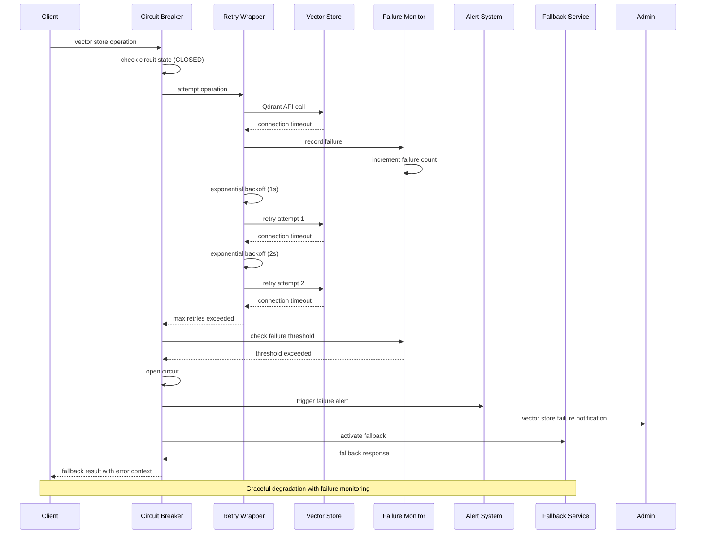
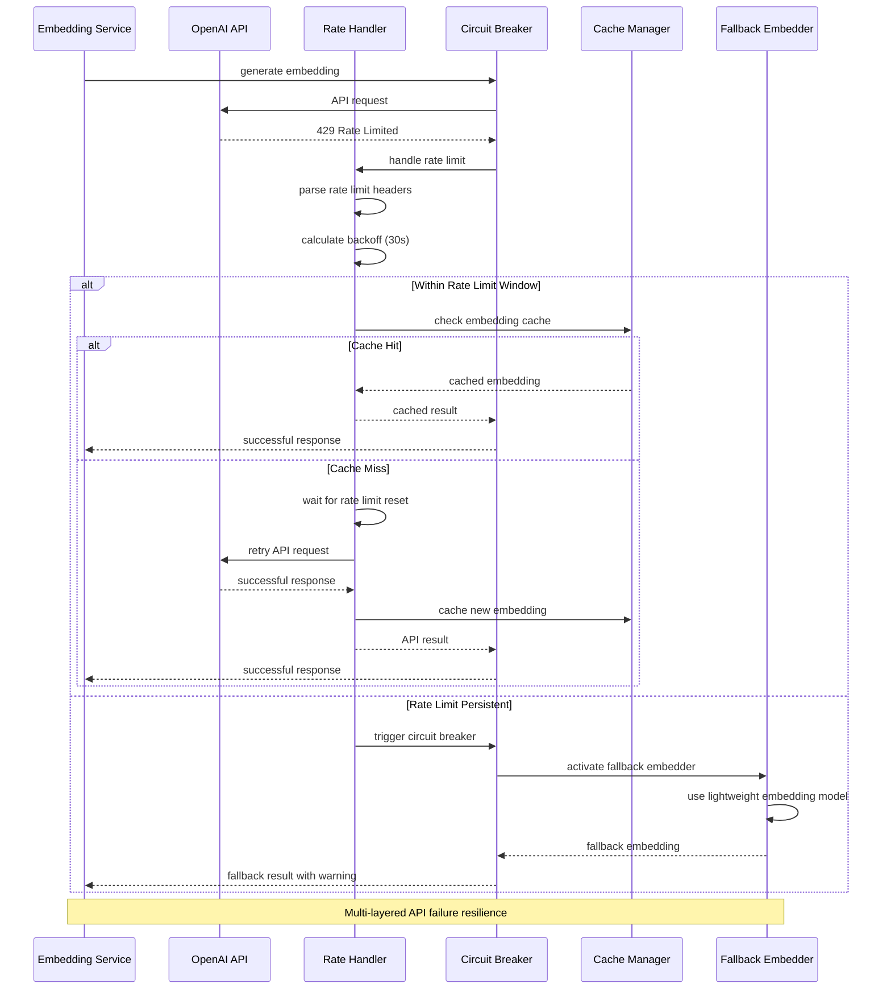
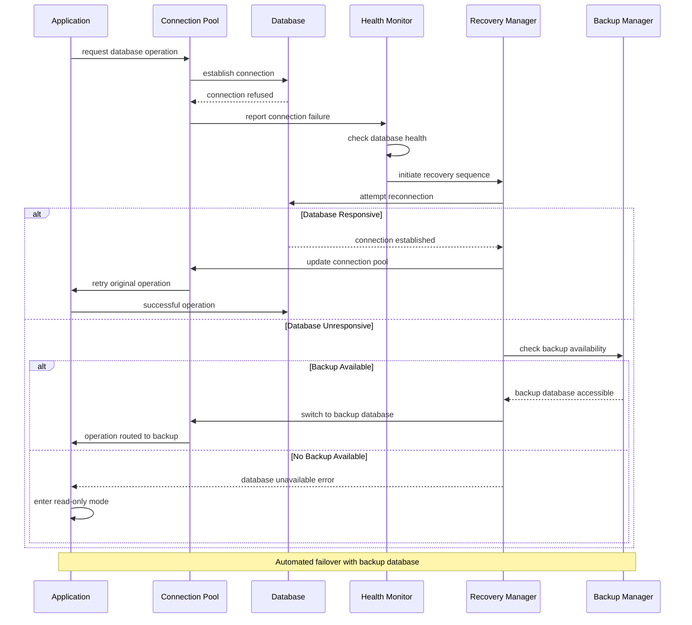
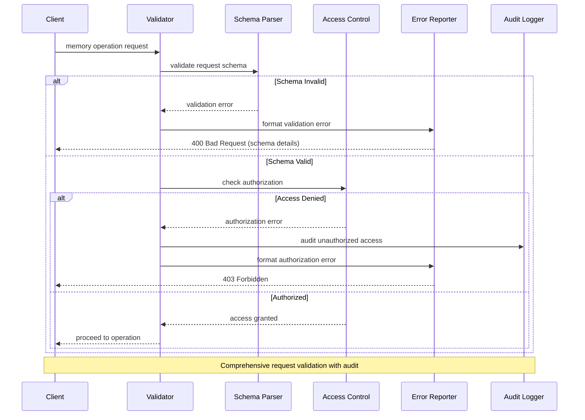
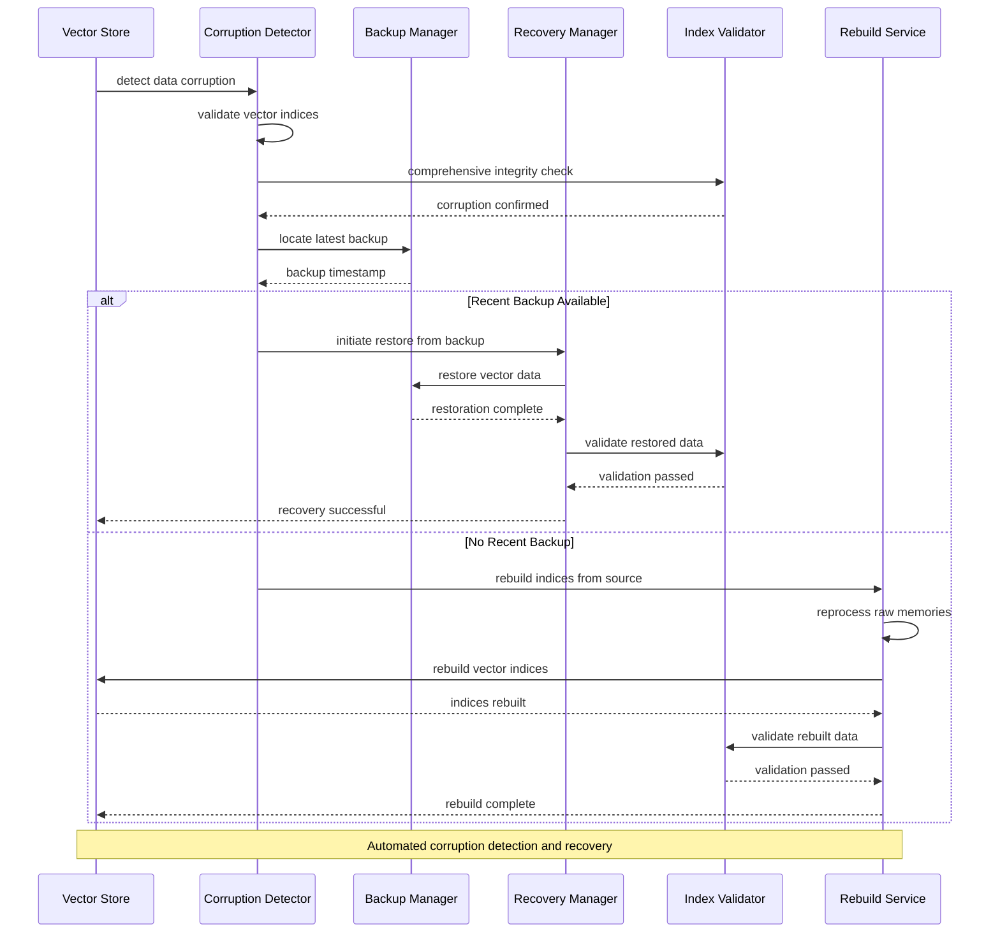
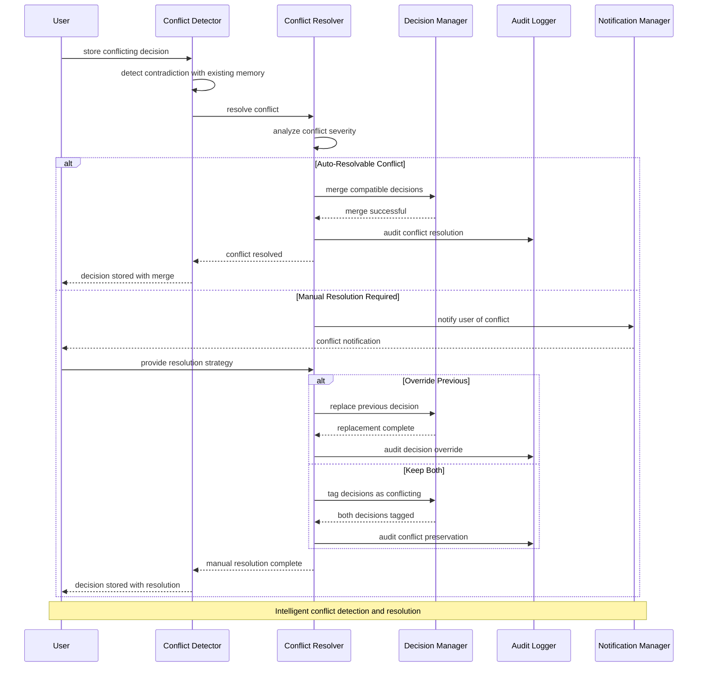
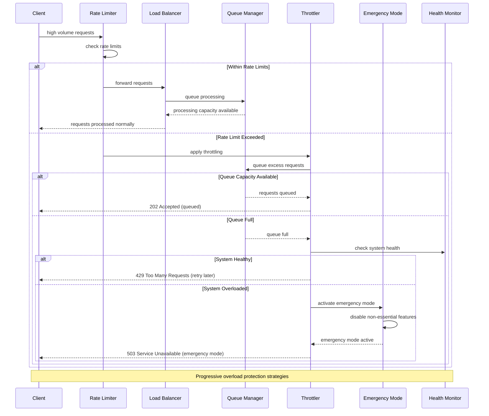
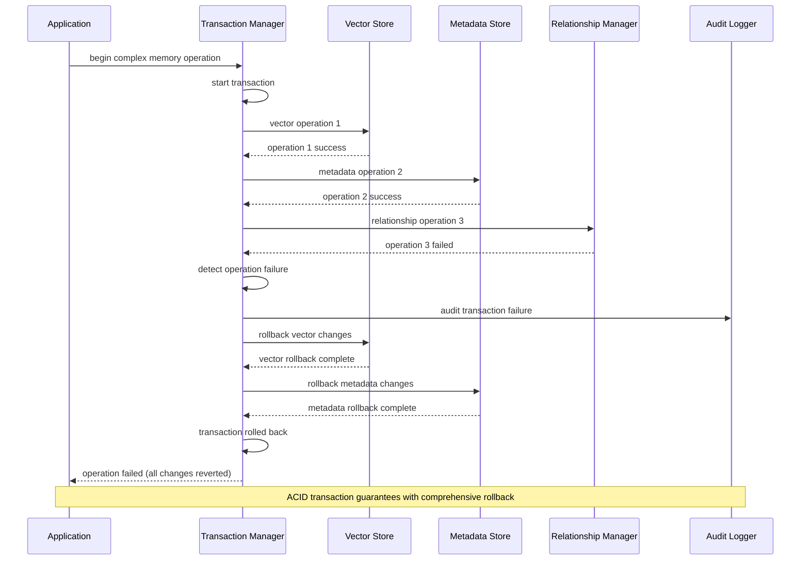
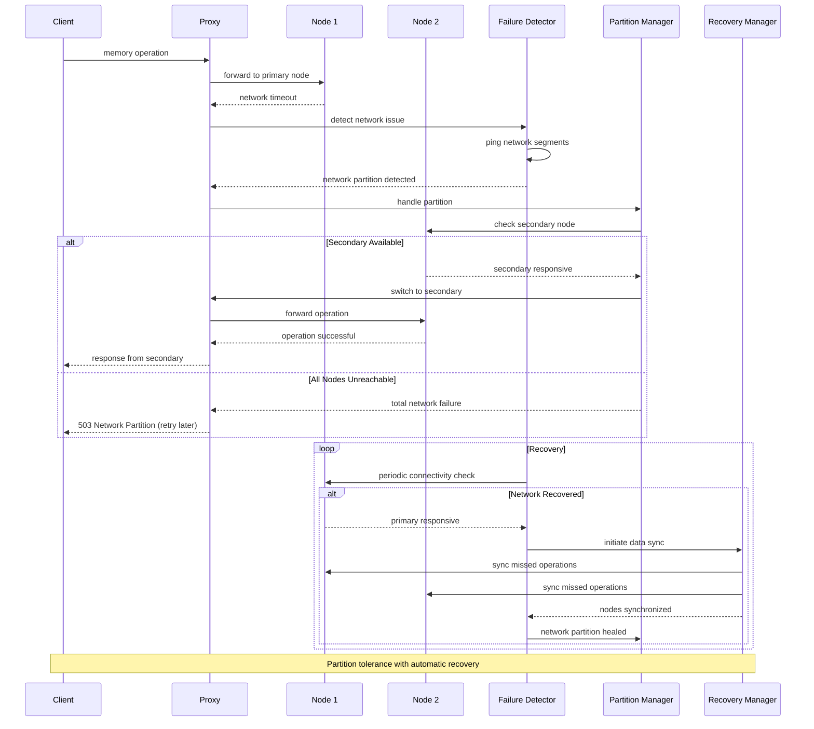

# Error Handling & Recovery Flow Diagrams

Comprehensive error handling, recovery strategies, and failure management patterns.

## Circuit Breaker Error Flow

## OpenAI API Error Handling

## Database Connection Error Recovery

## Memory Operation Validation Error Flow

## Vector Store Corruption Recovery

## Memory Conflict Resolution Error Flow

## System Overload Protection

## Transaction Rollback Flow

## Network Partition Handling

