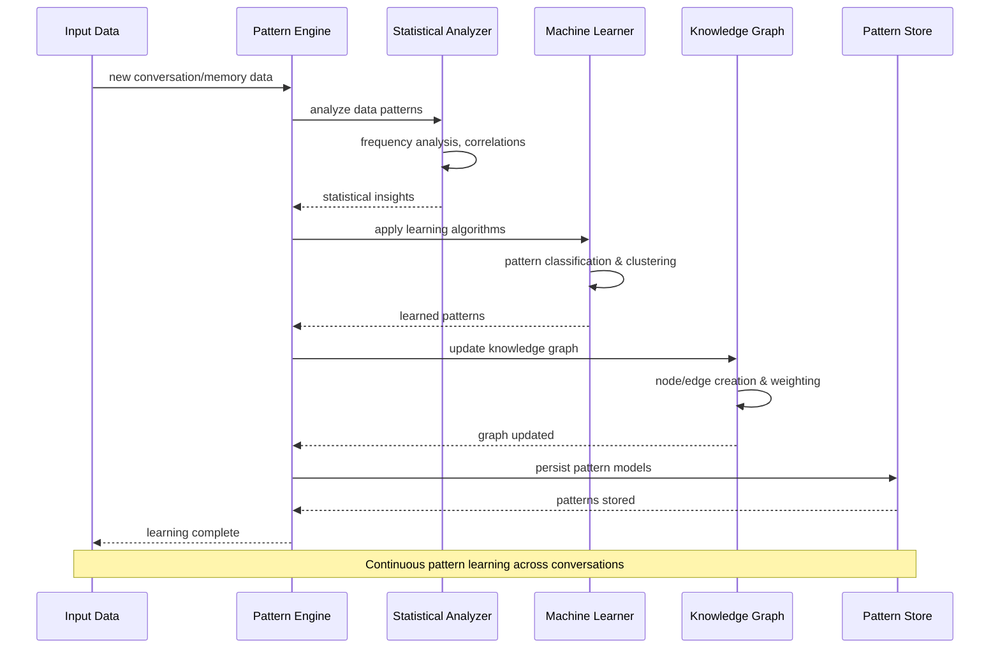
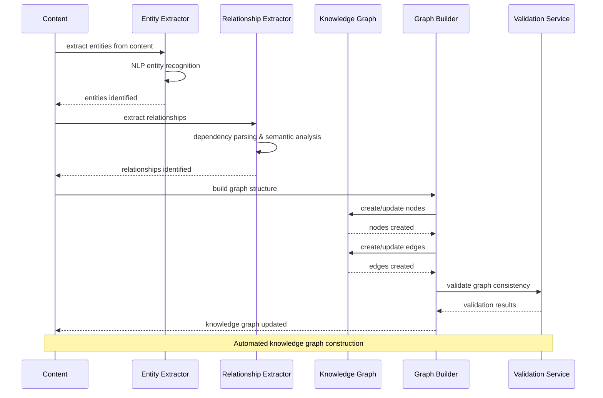
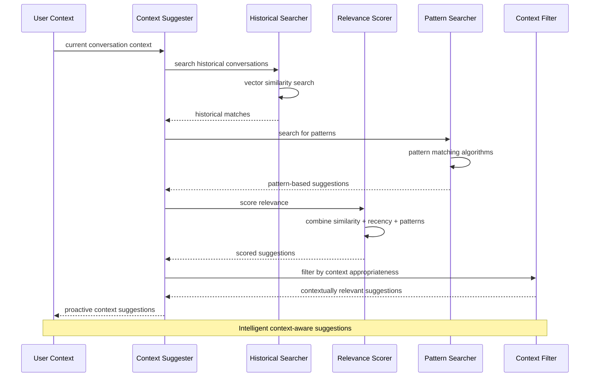
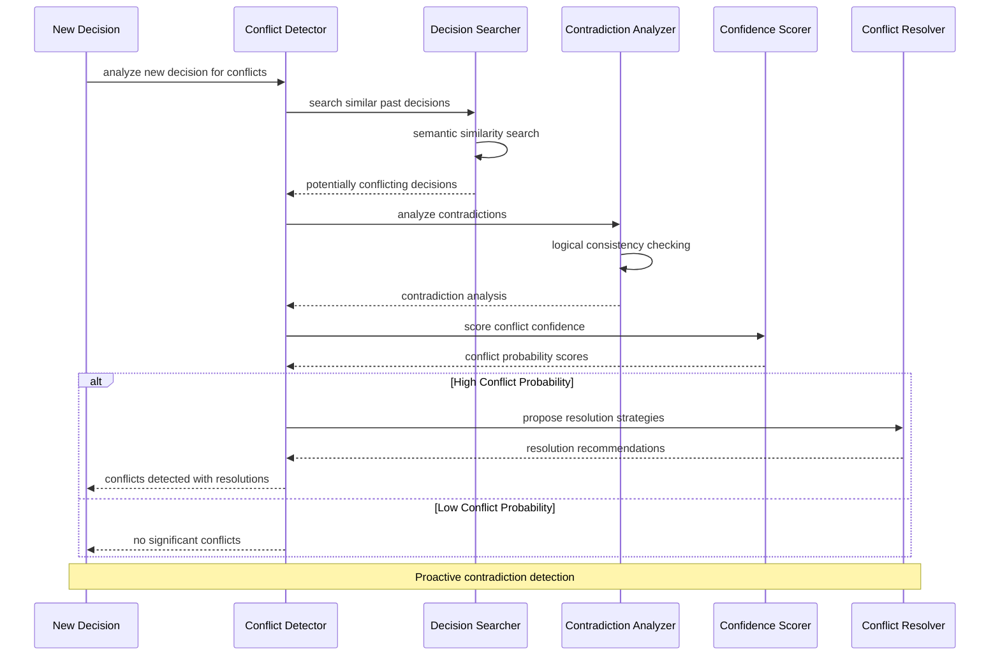
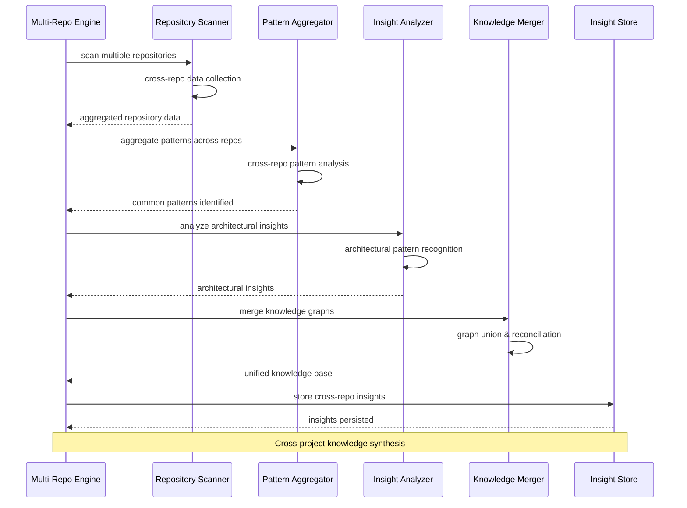
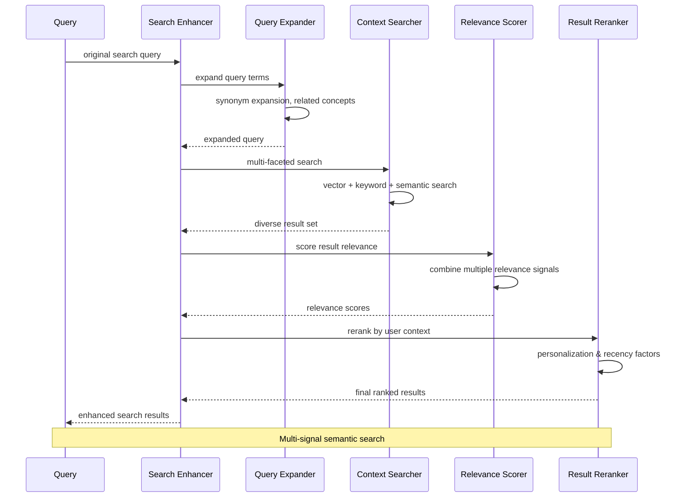
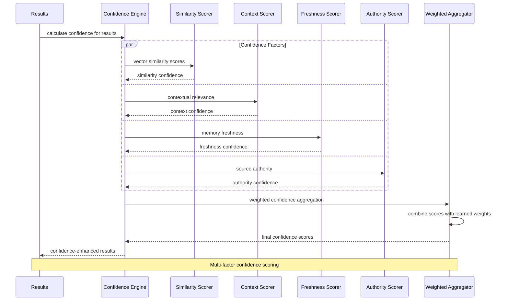

# Intelligence & Learning Flow Diagrams

AI-powered memory operations, pattern recognition, and knowledge graph construction.

## Pattern Learning Flow



## Knowledge Graph Construction



## Context Suggestion Flow



## Conflict Detection Flow



## Multi-Repository Intelligence



## Learning Engine Training

```mermaid
sequenceDiagram
    participant TD as Training Data
    participant LE as Learning Engine
    participant FE as Feature Extractor
    participant MT as Model Trainer
    participant VL as Validator
    parameter MS as Model Store
    
    TD->>LE: new training examples
    LE->>FE: extract features
    FE->>FE: conversation features, patterns, outcomes
    FE-->>LE: feature vectors
    LE->>MT: train models
    MT->>MT: incremental learning algorithms
    MT-->>LE: updated models
    LE->>VL: validate model performance
    VL->>VL: cross-validation & metrics
    
    alt Model Improved
        VL-->>LE: validation passed
        LE->>MS: persist improved model
        MS-->>LE: model saved
    else Model Degraded
        VL-->>LE: validation failed
        LE->>MT: rollback to previous model
        MT-->>LE: previous model restored
    end
    
    Note over TD,MS: Incremental learning with validation
```

## Semantic Search Enhancement



## Freshness Management Flow

```mermaid
sequenceDiagram
    participant FM as Freshness Manager
    participant VS as Vector Store
    participant TS as Time Scorer
    parameter DS as Decay Scheduler
    participant UM as Update Manager
    participant NM as Notification Manager
    
    FM->>VS: scan for stale memories
    VS-->>FM: memories with timestamps
    FM->>TS: calculate freshness scores
    TS->>TS: time-based decay functions
    TS-->>FM: freshness scores
    
    alt Memory Stale
        FM->>DS: schedule for refresh
        DS->>UM: trigger memory update
        UM->>UM: re-embed with current context
        UM-->>DS: memory refreshed
        DS->>NM: notify of refresh
    else Memory Fresh
        FM->>TS: update access timestamp
    end
    
    FM-->>System: freshness management complete
    
    Note over FM,NM: Automated memory freshness maintenance
```

## Confidence Engine Flow

