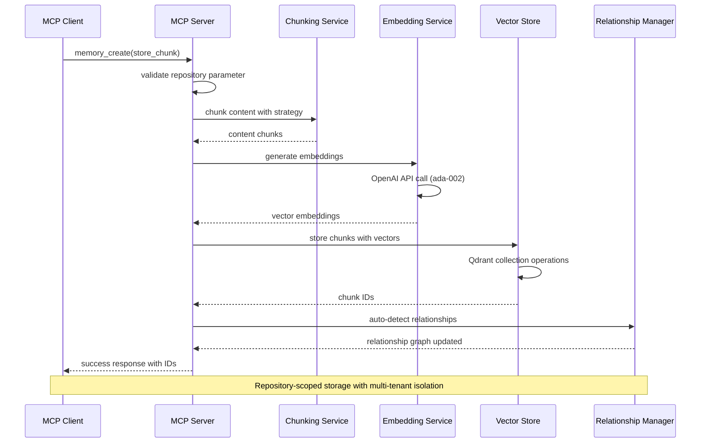
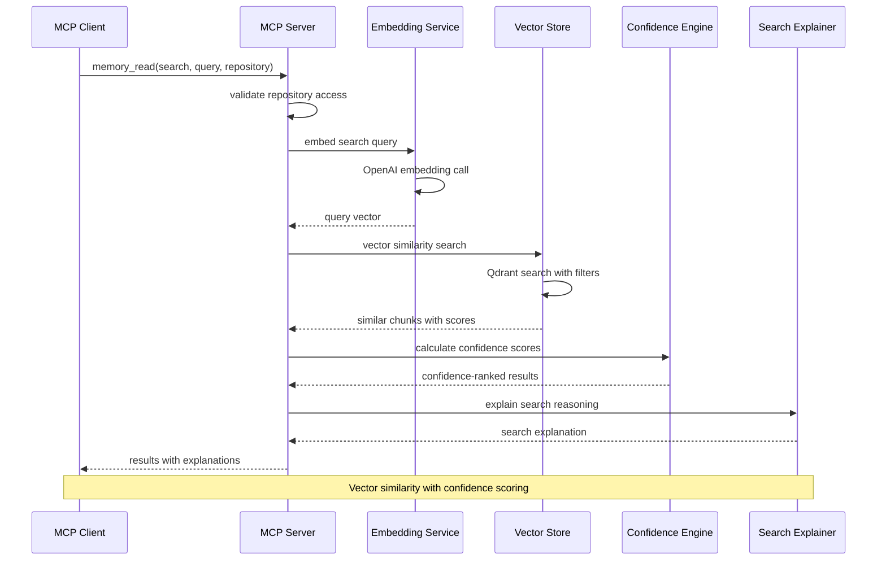
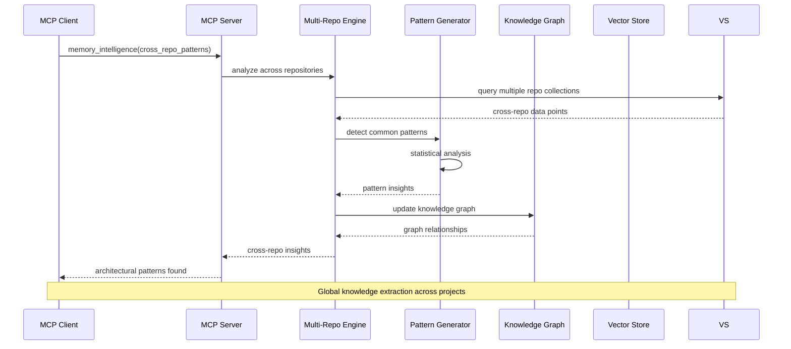
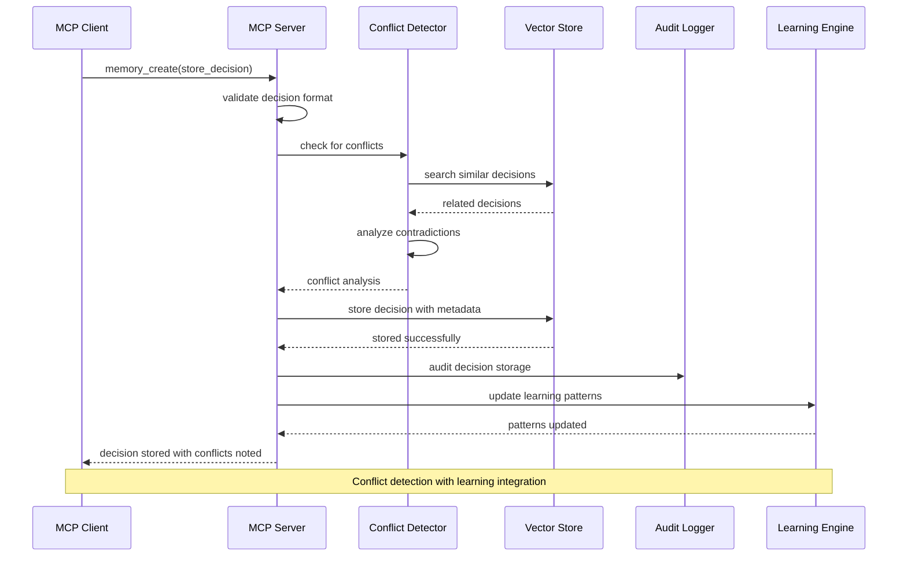
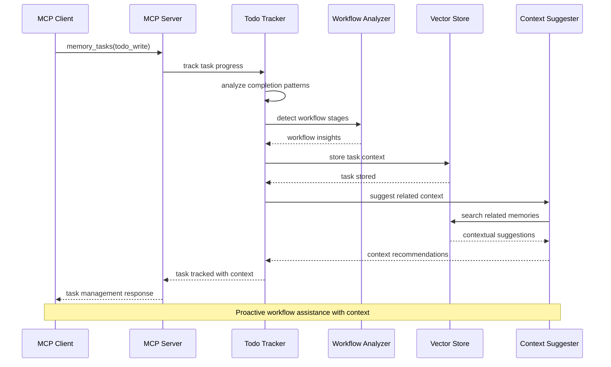
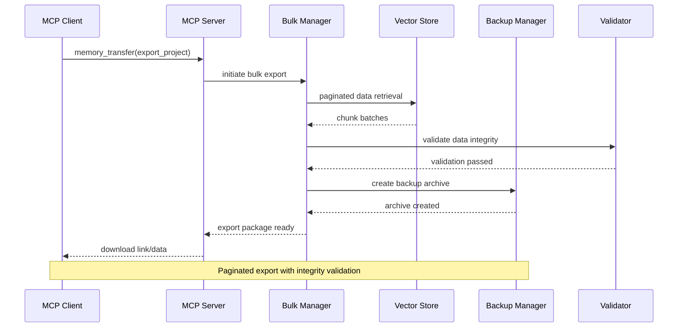
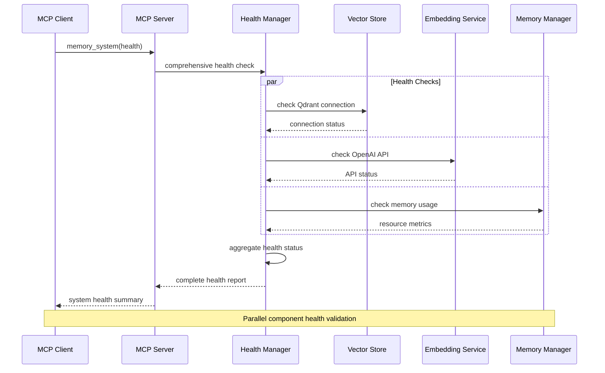
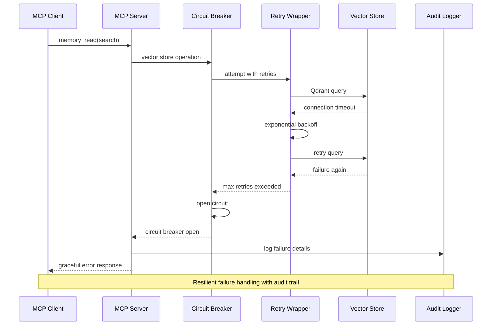

# MCP Protocol Flow Diagrams

Core MCP (Model Context Protocol) interactions for the memory server's 9 consolidated tools.

## Memory Creation Flow

## Memory Search Flow

## Multi-Repository Intelligence Flow

## Decision Storage Flow

## Task Management Flow

## Bulk Data Transfer Flow

## Health Check Flow

## Error Handling & Recovery Flow

