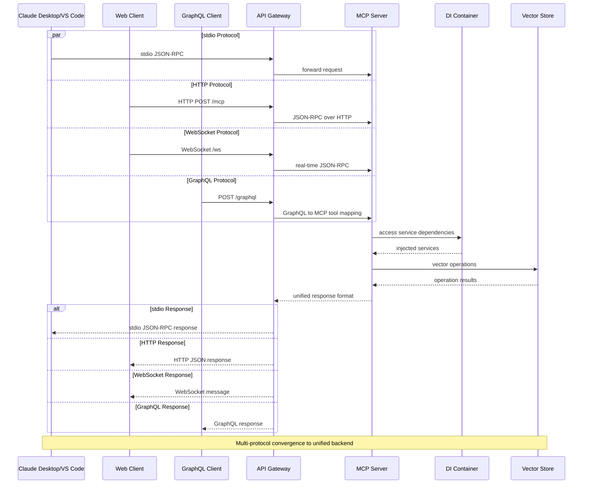
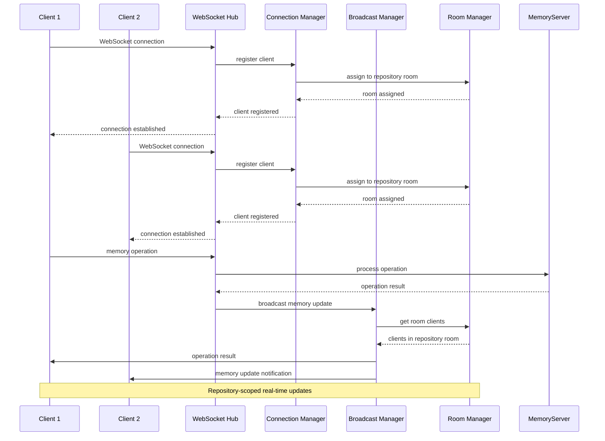
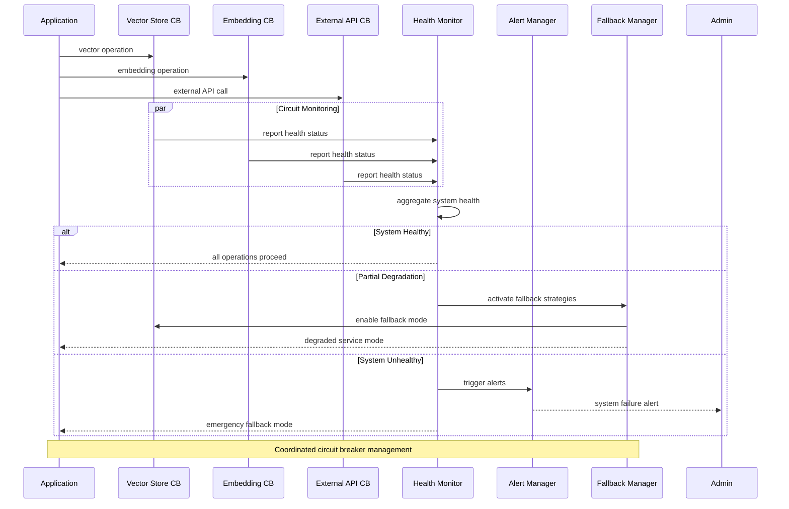
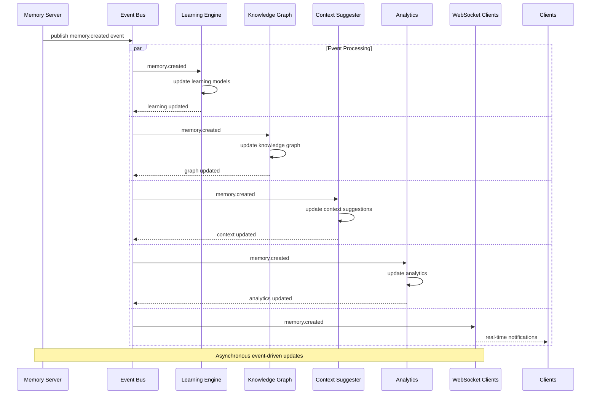
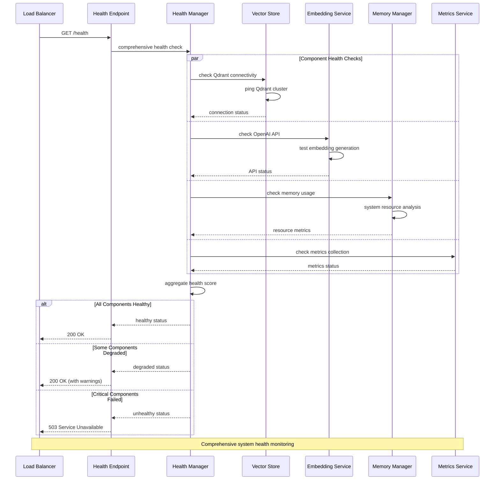
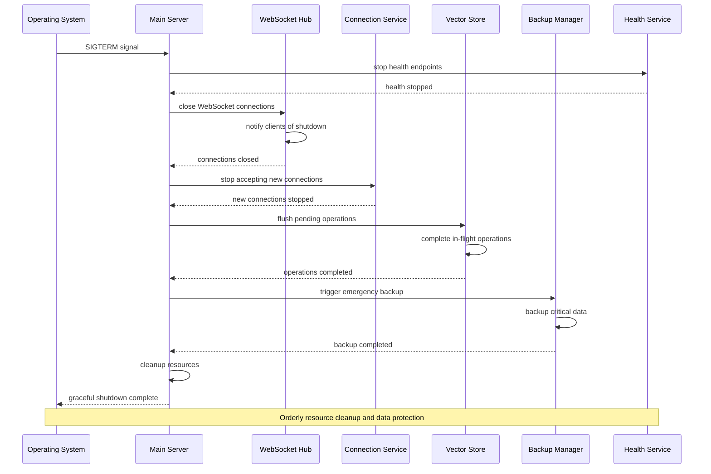
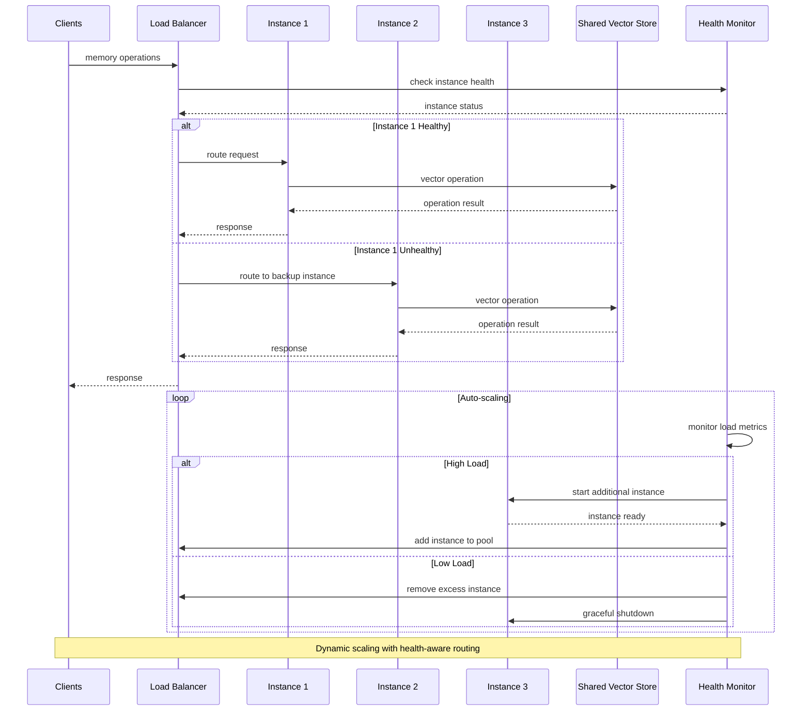
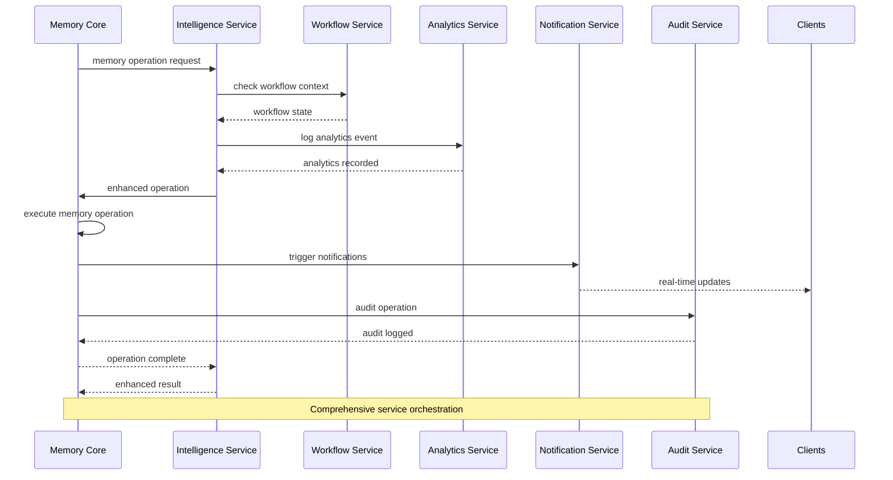

# System Interaction Flow Diagrams

Service-to-service communication, transport protocols, and system architecture patterns.

## Multi-Protocol Transport Architecture



## Service Dependency Initialization

```mermaid
sequenceDiagram
    participant M as Main
    participant DI as DI Container
    parameter CS as Config Service
    participant VS as Vector Store
    participant ES as Embedding Service
    participant IS as Intelligence Services
    participant WS as Workflow Services
    parameter HS as Health Service
    
    M->>DI: initialize container
    DI->>CS: load configuration
    CS-->>DI: config loaded
    
    DI->>VS: initialize vector store
    VS->>VS: Qdrant client + wrappers
    VS-->>DI: vector store ready
    
    DI->>ES: initialize embedding service
    ES->>ES: OpenAI client + circuit breaker
    ES-->>DI: embedding service ready
    
    DI->>IS: initialize intelligence layer
    IS->>IS: learning, pattern, knowledge engines
    IS-->>DI: intelligence services ready
    
    DI->>WS: initialize workflow services
    WS->>WS: context suggester, todo tracker
    WS-->>DI: workflow services ready
    
    DI->>HS: initialize health monitoring
    HS-->>DI: health service ready
    
    DI-->>M: all services initialized
    
    Note over M,HS: Ordered dependency injection with health monitoring
```

## WebSocket Hub Management



## Circuit Breaker Coordination



## Event-Driven Memory Updates



## Health Monitoring System



## Graceful Shutdown Sequence



## Load Balancing & Scaling



## Cross-Service Communication Pattern

