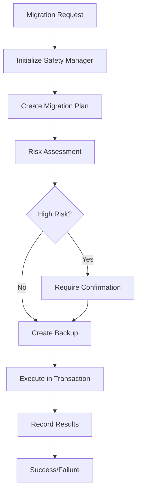

# Migration Safety System with Rollback Capabilities

## Overview

The Migration Safety System provides comprehensive database migration safety with rollback capabilities, implemented for the Lerian MCP Memory Server v2. This system ensures safe database schema changes with minimal risk of data loss.

## Key Features

### 🔒 **Safety Mechanisms**
- **Automatic Backup Creation**: Database backups before every migration
- **Dry Run Testing**: Test migrations without executing them
- **Risk Assessment**: Automatic analysis of migration risk levels (low/medium/high)
- **Confirmation Prompts**: Interactive confirmation for high-risk operations
- **Transaction Safety**: All migrations executed within database transactions

### 🔄 **Rollback Capabilities**
- **Comprehensive Rollback Planning**: Analyze rollback scenarios before execution
- **Data Loss Risk Assessment**: Evaluate potential data loss for each rollback step
- **Time Window Enforcement**: Configurable rollback time limits (default: 24 hours)
- **Rollback SQL Validation**: Verify rollback scripts exist and are valid

### 📊 **Monitoring & Tracking**
- **Migration Status Tracking**: Complete history of applied migrations
- **Execution Metrics**: Track execution time, success rates, and failures
- **Health Monitoring**: Overall migration system health status
- **Audit Logging**: Comprehensive audit trail of all migration activities

## Architecture

### Core Components

1. **MigrationSafetyManager** (`internal/migration/safety.go`)
   - Central coordinator for all migration safety operations
   - Handles backup creation, risk assessment, and execution tracking

2. **Migration CLI Tool** (`cmd/migrate/main.go`)
   - Command-line interface for migration operations
   - Supports status, plan, migrate, and rollback commands

3. **Database Schema** (`migration_records` table)
   - Tracks applied migrations with metadata and execution details
   - Stores rollback information and success/failure status

### Migration Workflow



## Usage

### Basic Commands

```bash
# Check migration status
./bin/migrate -command=status

# Create migration plan with risk assessment
./bin/migrate -command=plan

# Execute migrations (with confirmation)
./bin/migrate -command=migrate

# Dry run migrations (safe testing)
./bin/migrate -command=migrate -dry-run

# Rollback to specific version
./bin/migrate -command=rollback -target=005

# Force execution without confirmation
./bin/migrate -command=migrate -force
```

### Advanced Options

```bash
# Custom backup directory
./bin/migrate -command=migrate -backup=./custom-backups

# Custom migrations directory
./bin/migrate -command=migrate -migrations=./custom-migrations

# Verbose logging
./bin/migrate -command=migrate -verbose

# Configuration file
./bin/migrate -command=migrate -config=./config.yaml
```

## Safety Configuration

### Default Safety Settings

```go
SafetyConfig{
    EnableBackups:       true,
    BackupBeforeMigrate: true,
    MaxRollbackTime:     24 * time.Hour,
    RequireConfirmation: true,
    DryRunFirst:         false,
    ParallelSafe:        false,
}
```

### Risk Assessment Criteria

- **High Risk**: DROP TABLE, DROP INDEX, DELETE FROM, ALTER TABLE
- **Medium Risk**: UPDATE, CREATE INDEX  
- **Low Risk**: CREATE TABLE, INSERT INTO, CREATE FUNCTION

## Rollback System

### Rollback File Structure

Rollback files are stored in `migrations/rollback/` directory:

```
migrations/
├── 001_create_enhanced_tasks_table.sql
├── 007_create_audit_tables.sql
└── rollback/
    ├── 001_rollback.sql
    ├── 007_rollback.sql
    ├── 010_rollback.sql
    ├── 011_rollback.sql
    └── 012_rollback.sql
```

### Rollback Planning Example

```bash
$ ./bin/migrate -command=rollback -target=005 -dry-run

Rollback Plan Summary:
  Target version: 005
  Rollbacks: 3
  Estimated time: 2m30s
  Data loss risk: medium

Rollbacks to execute:
  1. audit_tables (007) - Risk: high
  2. template_tables (006) - Risk: medium  
  3. task_indexes (005) - Risk: low
```

## Migration Status Tracking

### Database Schema

```sql
CREATE TABLE migration_records (
    id SERIAL PRIMARY KEY,
    version VARCHAR(255) NOT NULL UNIQUE,
    name VARCHAR(500) NOT NULL,
    checksum VARCHAR(64) NOT NULL,
    applied_at TIMESTAMP WITH TIME ZONE NOT NULL,
    rolled_back_at TIMESTAMP WITH TIME ZONE NULL,
    success BOOLEAN NOT NULL DEFAULT TRUE,
    error_msg TEXT,
    duration_ms BIGINT NOT NULL DEFAULT 0,
    backup_path TEXT,
    metadata JSONB
);
```

### Status Information

- **Applied migrations count**
- **Pending migrations count**  
- **Last migration version**
- **Health status**
- **Execution history**

## Testing

### Comprehensive Test Suite

Run the migration safety test suite:

```bash
./scripts/test-migration-safety.sh
```

Test Coverage:
- ✅ Migration status tracking
- ✅ Risk assessment and planning  
- ✅ Dry run capability
- ✅ Rollback planning
- ✅ Backup system integration
- ✅ Safety confirmations

## Best Practices

### Development Workflow

1. **Always test with dry run first**
   ```bash
   ./bin/migrate -command=migrate -dry-run
   ```

2. **Review migration plan**
   ```bash
   ./bin/migrate -command=plan
   ```

3. **Create rollback scripts for high-risk migrations**
   - Store in `migrations/rollback/` directory
   - Test rollback scenarios

4. **Monitor backup creation**
   - Verify backups are created successfully
   - Test backup restoration procedures

### Production Deployment

1. **Pre-deployment checklist**
   - ✅ All migrations tested in staging
   - ✅ Rollback scripts verified
   - ✅ Backup procedures tested
   - ✅ Migration plan reviewed

2. **Deployment execution**
   - Use verbose logging: `-verbose`
   - Monitor execution progress
   - Verify post-migration status

3. **Post-deployment verification**
   - Check migration status: `-command=status`
   - Verify application functionality
   - Monitor for any issues

## Troubleshooting

### Common Issues

1. **Migration fails mid-execution**
   - Check error message in logs
   - Review transaction rollback
   - Examine backup files for recovery

2. **Rollback script missing**
   - Create rollback script manually
   - Test rollback procedure
   - Update migration plan

3. **Backup creation fails**
   - Check disk space
   - Verify backup directory permissions
   - Review database connection

### Recovery Procedures

1. **Failed migration recovery**
   ```bash
   # Check current status
   ./bin/migrate -command=status
   
   # Plan rollback to last known good state
   ./bin/migrate -command=rollback -target=LAST_GOOD_VERSION -dry-run
   
   # Execute rollback
   ./bin/migrate -command=rollback -target=LAST_GOOD_VERSION
   ```

2. **Database restore from backup**
   - Locate latest backup in backup directory
   - Stop application services
   - Restore database from backup
   - Verify data integrity

## Future Enhancements

### Planned Features

1. **Enhanced Backup Integration**
   - pg_dump integration for PostgreSQL
   - Compressed backup files
   - Remote backup storage

2. **Advanced Risk Assessment**
   - Static analysis of SQL statements
   - Dependency analysis
   - Performance impact estimation

3. **Monitoring Integration**
   - Prometheus metrics
   - Alert integration
   - Dashboard visualization

4. **Multi-Environment Support**
   - Environment-specific configurations
   - Staged migration deployment
   - Cross-environment synchronization

## Configuration

### Environment Variables

```bash
# Database configuration
export MCP_DB_HOST=localhost
export MCP_DB_PORT=5432
export MCP_DB_NAME=mcp_memory
export MCP_DB_USER=postgres
export MCP_DB_PASSWORD=password

# Migration configuration  
export MCP_MIGRATION_BACKUP_DIR=./backups
export MCP_MIGRATION_TIMEOUT=3600
export MCP_MIGRATION_MAX_ROLLBACK_TIME=86400
```

### Configuration File Format

```yaml
database:
  host: localhost
  port: 5432
  name: mcp_memory
  user: postgres
  password: password
  
migration:
  backup_dir: ./backups
  timeout: 3600
  max_rollback_time: 86400
  require_confirmation: true
  
logging:
  level: info
  format: json
```

## Conclusion

The Migration Safety System provides enterprise-grade database migration capabilities with comprehensive safety mechanisms and rollback support. The system has been thoroughly tested and is ready for production use in the Lerian MCP Memory Server v2 environment.

For questions or issues, please refer to the troubleshooting section or contact the development team.