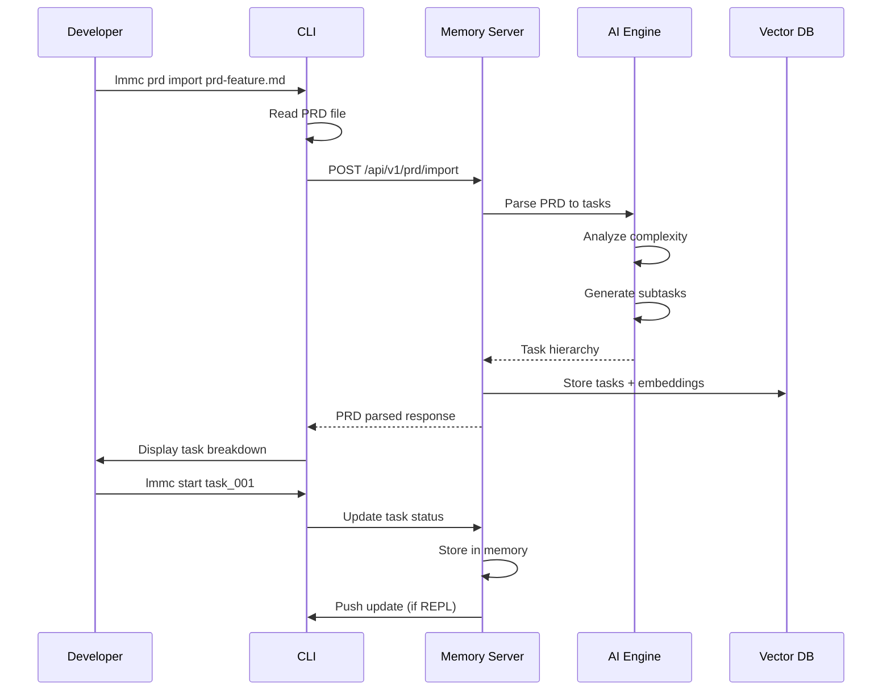
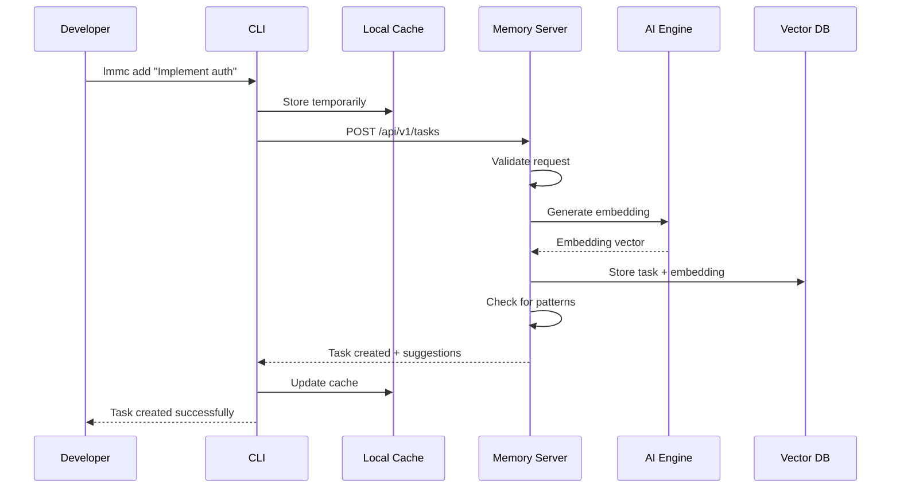
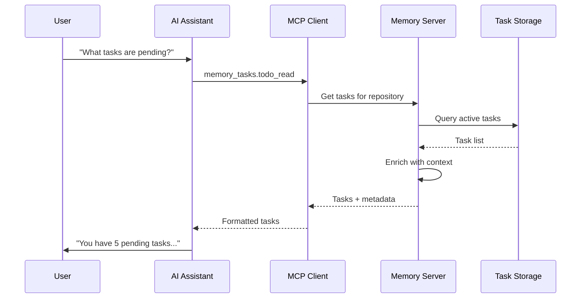
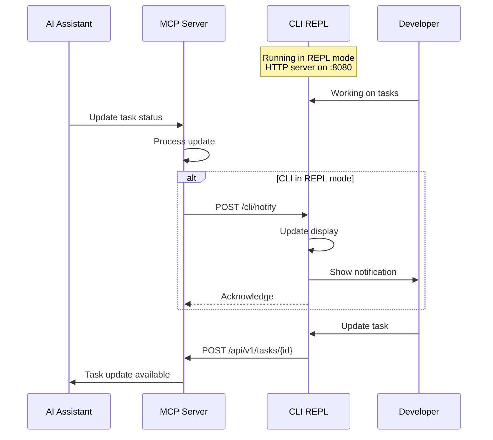
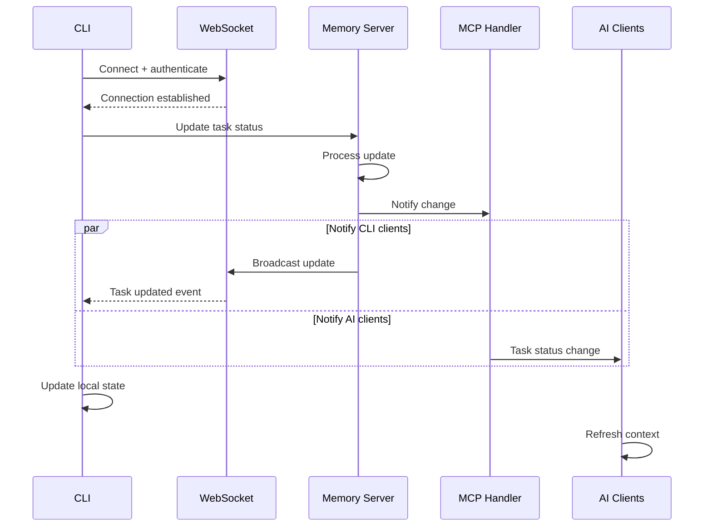

# PRD: Lerian MCP Memory - Integrated Memory and Task Management System

## 0. Index

1. [Introduction/Overview](#1-introductionoverview)
2. [Goals](#2-goals)
3. [User Stories](#3-user-stories)
4. [User Experience](#4-user-experience)
5. [Functional Requirements](#5-functional-requirements)
6. [Non-Goals (Out of Scope)](#6-non-goals-out-of-scope)
7. [Design Considerations](#7-design-considerations)
8. [Technical Considerations](#8-technical-considerations)
9. [Success Metrics](#9-success-metrics)
10. [Data Modeling](#10-data-modeling)
11. [API Modeling](#11-api-modeling)
12. [Sequence Diagrams](#12-sequence-diagrams)
13. [Development Roadmap](#13-development-roadmap)
14. [Logical Dependency Chain](#14-logical-dependency-chain)
15. [Risks and Mitigations](#15-risks-and-mitigations)
16. [Architecture Patterns & Principles](#16-architecture-patterns--principles)
17. [Open Questions](#17-open-questions)

## 1. Introduction/Overview

The **Lerian MCP Memory** is an integrated solution that combines a high-performance memory server with an intelligent task management system. This unified platform addresses the critical need for developers to maintain persistent context across AI interactions while providing sophisticated task management capabilities for product development workflows.

The system consists of two main components:

1. **Lerian MCP Memory Server**: A high-performance memory system with built-in task tracking capabilities accessible via MCP tools. This component runs in Docker containers alongside Qdrant vector database for optimal performance and isolation.

2. **Lerian MCP Memory CLI**: A developer-friendly command-line interface that acts as an intelligent wrapper around the Memory Server's task features. This CLI runs locally on the developer's machine and communicates with the containerized server components.

### Deployment Architecture

The system features a hybrid deployment model:
- **Server Components** (Docker): The MCP Memory Server and Qdrant run in Docker containers for consistency and isolation
- **CLI Component** (Local): The Task Management CLI runs locally on the developer's machine, providing fast response times and offline capabilities
- **Network Flexibility**: The CLI can connect to:
  - Local Docker containers (default mode)
  - Remote servers via mesh networks like Tailscale (no additional authentication required)
  - Cloud-hosted instances for team collaboration

This architecture enables developers to work efficiently with local tools while maintaining centralized memory and task storage in containerized services.

## 2. Goals

1. **Bidirectional Communication**: Establish a two-way communication system where:
   - The CLI communicates with the MCP Memory Server via always-exposed HTTP endpoints
   - The MCP Memory Server can push updates to the CLI through HTTP routes exposed by the CLI when running in REPL mode
   - This ensures real-time synchronization and collaborative task management

2. **Developer Productivity**: Provide a CLI tool specifically designed for product development workflows, from PRD parsing to task implementation

3. **AI-Assisted Planning**: Leverage memory patterns to suggest tasks and workflows based on similar projects

4. **Seamless Integration**: Ensure perfect synchronization between CLI and MCP Memory Server operations with bidirectional updates

5. **Learning System**: Capture task completion patterns to improve future project planning

6. **Multi-Project Support**: Enable task management across multiple repositories with proper isolation

7. **Workflow Intelligence**: Automatically detect and suggest optimal task sequences based on historical data

8. **PRD-Driven Development**: Support parsing PRDs into actionable tasks with AI assistance

## 3. User Stories

### PRD-Driven Development Workflow

The system supports a comprehensive development workflow:
1. **PRD Development**: Create or import Product Requirements Documents
2. **AI-Powered Task Parsing**: Use AI through the CLI to parse PRDs into actionable tasks
3. **Complexity Analysis**: Automatically analyze task complexity and effort estimates
4. **Sub-task Generation**: Break down complex tasks into manageable sub-tasks
5. **Memory Storage**: Store all tasks and relationships in MCP memory
6. **Implementation Phase**: Use any AI coding assistant (Claude Code, Cursor, Windsurf, etc.)
7. **Continuous Updates**: MCP memory serves as the central hub where:
   - AI clients update task status automatically
   - Specifications can be modified as requirements evolve
   - Users can make updates via CLI REPL

### Core User Stories

1. **As a developer starting a new project**, I want to upload a PRD and have it automatically parsed into tasks so that I can quickly bootstrap my development process.

2. **As a developer using the CLI**, I want to analyze task complexity and generate sub-tasks so that I can better understand the scope and effort required.

3. **As a developer using AI coding assistants**, I want my AI tools to automatically update task status in MCP memory so that I maintain a single source of truth without manual updates.

4. **As a developer in REPL mode**, I want to receive real-time updates from the MCP server when AI assistants modify tasks so that I always see the current state.

5. **As a team lead**, I want to see task patterns across similar projects so that I can better estimate and plan new developments.

6. **As a developer working with AI**, I want the system to suggest next tasks based on what I've completed so that I maintain an efficient workflow.

7. **As a product owner**, I want to update specifications and have those changes reflected in the task breakdown so that the development stays aligned with evolving requirements.

8. **As a project manager**, I want to track task completion patterns and analytics so that I can improve our development processes.

9. **As a developer switching between projects**, I want my task context to switch automatically so that I always see relevant tasks for my current repository.

## 4. User Experience

### User Personas

**Primary Persona: Full-Stack Developer**
- Experience: 2-5 years, comfortable with CLI tools
- Goals: Efficiently manage development tasks, leverage AI assistance
- Pain Points: Context switching, remembering task details across sessions
- Preferred Interaction: Quick CLI commands, keyboard shortcuts

**Secondary Persona: AI-Powered Developer**
- Experience: Uses AI assistants daily for coding
- Goals: Seamless task management between manual and AI-assisted work
- Pain Points: Disconnected task systems, lost context
- Preferred Interaction: Natural language with AI, simple CLI commands

**Tertiary Persona: Technical Lead**
- Experience: Senior developer managing multiple projects
- Goals: Track team progress, identify bottlenecks, improve processes
- Pain Points: Lack of visibility into task patterns
- Preferred Interaction: Analytics dashboards, summary reports

### User Journey

1. **Project Initialization**
   - Developer runs `lerian-mcp-memory-cli init` (or `lmmc init`) in new repository
   - System analyzes project type and suggests initial task template
   - Developer customizes and approves task list

2. **Daily Workflow**
   - Developer runs `lmmc list` to see current tasks
   - Picks a task with `lmmc start <id>`
   - AI assistant automatically gets context about current task
   - Updates progress with `lmmc update`
   - Completes task with `lmmc done <id>`

3. **AI Integration**
   - AI assistant accesses same task data via MCP tools
   - Developer can ask AI about task details
   - AI suggests next tasks based on patterns
   - Task updates from either interface sync immediately

### Interaction Patterns

**CLI-First Design**
- Short, memorable commands
- Intelligent defaults (current repository, active task)
- Rich terminal UI with colors and formatting
- Keyboard navigation for task selection

**AI-Aware Features**
- Tasks include AI-readable context
- Automatic pattern detection
- Smart suggestions based on memory
- Natural language task creation

## 5. Functional Requirements

### CLI Requirements

1. **Task Creation and Management**
   - The CLI must support creating tasks with `lerian-mcp-memory-cli add <description>` (alias: `lmmc add`)
   - The CLI must support listing tasks with filters (`lmmc list [--status=pending]`)
   - The CLI must support updating task status (`lmmc start|done|cancel <id>`)
   - The CLI must support editing task details (`lmmc edit <id>`)
   - The CLI must support task prioritization (`lmmc priority <id> <high|medium|low>`)

2. **PRD Processing and Task Generation**
   - The CLI must support PRD import with `lmmc prd import <file>`
   - The CLI must parse PRDs into tasks using AI assistance
   - The CLI must analyze task complexity automatically
   - The CLI must generate sub-tasks for complex tasks
   - The CLI must store all generated tasks in MCP memory
   - The CLI must support PRD updates and re-parsing

3. **Project Initialization**
   - The CLI must detect project type and suggest relevant task templates
   - The CLI must support importing task templates (`lmmc init --template=<name>`)
   - The CLI must create initial task structure based on project analysis
   - The CLI must support custom task templates

4. **Session Management and REPL Mode**
   - The CLI must track work sessions automatically
   - The CLI must support session summaries (`lmmc session --summary`)
   - The CLI must capture tools and files used during task work
   - The CLI must support session continuity across CLI restarts
   - The CLI must expose HTTP endpoints when running in REPL mode (`lmmc repl`)
   - The CLI must receive real-time updates from MCP server

5. **AI Integration Features**
   - The CLI must sync all operations with MCP Memory Server in real-time
   - The CLI must support AI-suggested tasks (`lmmc suggest`)
   - The CLI must provide task context for AI assistants
   - The CLI must support natural language task creation
   - The CLI must enable bidirectional communication with MCP server
   - The CLI must use server's AI API keys from .env configuration
   - The CLI must support multiple AI models (main, research, fallback)
   - The CLI must use AI for PRD parsing, complexity analysis, and task generation

6. **Analytics and Reporting**
   - The CLI must show task completion statistics (`lmmc stats`)
   - The CLI must generate workflow reports (`lmmc report`)
   - The CLI must identify task patterns across projects
   - The CLI must estimate task duration based on history
   - The CLI must collect opt-in anonymous usage analytics
   - The CLI must export tasks in JSON format only

7. **Network Configuration**
   - The CLI must support local Docker container connections (default)
   - The CLI must support remote server connections via Tailscale
   - The CLI must auto-detect Tailscale networks
   - The CLI must support custom server endpoints configuration

8. **Shell Integration**
   - The CLI must auto-generate completion scripts for bash, zsh, and fish
   - The CLI must auto-detect user's shell and install appropriate completion
   - The CLI must provide manual installation instructions as fallback

9. **Configuration Management**
   - The CLI must support XDG Base Directory specification
   - The CLI must fallback to ~/.lmmc/ for compatibility
   - The CLI must support custom terminal color schemes (low priority)

10. **Update Management**
    - The CLI must support self-update via `lmmc --update`
    - The CLI must notify users of available CLI and server updates
    - The CLI must check for updates with user consent

### MCP Memory Server Enhancements

11. **HTTP API Endpoints**
   - The server must expose RESTful endpoints for task operations
   - The server must support real-time updates via WebSocket
   - The server must provide batch operations for efficiency
   - The server must maintain backward compatibility with MCP tools
   - The server must push updates to CLI when in REPL mode

12. **Enhanced Task Storage**
    - The server must store task templates and patterns
    - The server must track task relationships and dependencies
    - The server must capture task completion context
    - The server must support task archival and retrieval
    - The server must store PRD-to-task mappings

13. **Workflow Intelligence**
    - The server must detect common task sequences
    - The server must learn optimal task ordering
    - The server must identify bottlenecks and delays
    - The server must suggest task improvements
    - The server must analyze task complexity patterns

14. **Multi-Repository Management**
    - The server must isolate tasks by repository
    - The server must support cross-repository patterns
    - The server must enable task template sharing
    - The server must track repository-specific metrics

### Integration Requirements

15. **Synchronization**
    - The system must sync tasks between CLI and MCP tools instantly
    - The system must use Qdrant as the single source of truth
    - The system must support full offline CLI usage with local file storage (~/.lmmc/)
    - The system must warn users when local/remote versions are out of sync
    - The system must enable bidirectional HTTP communication
    - The system must ensure flawless user experience during sync
    - The system must automatically resolve conflicts with server as source of truth

16. **Authentication and Security**
    - The CLI must connect to local server without authentication
    - The system must support mesh network connections (Tailscale) without additional auth
    - The system must isolate user data properly
    - The system must encrypt sensitive task data
    - The CLI must detect and warn about insecure connections

17. **Performance**
    - The CLI must respond to commands in under 100ms
    - The server must handle 1000+ concurrent CLI connections
    - The system must support real-time updates
    - The system must optimize for minimal network usage
    - The CLI must provide flawless user experience

18. **Version Management**
    - The CLI and server must enforce same semantic version
    - The system must check version compatibility on connection
    - The system must provide clear version mismatch errors
    - The CLI must be tightly coupled to server version

## 6. Non-Goals (Out of Scope)

1. **Not a Full Project Management Suite**: No Gantt charts, resource allocation, or budget tracking
2. **Not a Team Collaboration Platform**: No built-in chat, comments, or team features
3. **Not a Time Tracking System**: Basic duration tracking only, no detailed timesheets
4. **Not a Generic Task App**: Specifically designed for development workflows
5. **No Mobile Interface**: CLI and AI interfaces only
6. **No Calendar Integration**: Task scheduling remains simple
7. **No External Integrations**: No Jira, GitHub Issues, etc. (focusing on MCP ecosystem)

## 7. Design Considerations

### CLI User Interface

**Command Structure**
```bash
lerian-mcp-memory-cli <command> [options] [arguments]
# or using the alias:
lmmc <command> [options] [arguments]

Commands:
  init          Initialize task management for a repository
  add           Create a new task
  list          List tasks with filters
  start         Mark a task as in progress
  done          Complete a task
  update        Update task details
  prd           PRD management (import, parse, update)
  suggest       Get AI-powered task suggestions
  stats         View task statistics
  session       Manage work sessions
  repl          Start interactive REPL mode with HTTP server
  config        Configure CLI settings
  help          Show help for commands
```

**Interactive Mode**
- Rich terminal UI using libraries like Bubble Tea (Go)
- Color-coded task statuses
- Keyboard shortcuts for common operations
- Auto-completion for commands and task IDs

**Output Formats**
- Human-readable by default
- JSON output with `--json` flag
- Markdown export for documentation
- CSV export for analysis

### API Design Principles

**RESTful Endpoints**
- Consistent resource naming
- Standard HTTP methods
- Pagination for list operations
- Filtering and sorting support

**Real-time Updates**
- WebSocket for live updates
- Server-Sent Events as fallback
- Efficient delta synchronization

## 8. Technical Considerations

### Deployment Model

**Hybrid Architecture**
- **Server Components**: Run in Docker containers (MCP Memory Server + Qdrant)
- **CLI Component**: Runs locally on developer machine
- **Network Options**:
  - Local: CLI connects to localhost Docker containers
  - Remote: CLI connects via Tailscale mesh network (no auth required)
  - Cloud: CLI connects to hosted instances with API authentication

### CLI Architecture

**Technology Stack**
- Language: Go (consistency with server)
- CLI Framework: Cobra or similar
- UI Library: Bubble Tea for interactive mode
- HTTP Client: Standard library with retry logic
- Configuration: Viper for config management
- HTTP Server: Embedded server for REPL mode endpoints

**Local Components**
- Cache recent tasks for offline access in ~/.lmmc/
- Store authentication credentials securely
- Maintain command history
- Quick access to frequent operations
- HTTP server for receiving push updates in REPL mode
- Local file fallback system for resilience

### Server Enhancements

**New HTTP Endpoints**
- REST API layer on top of existing MCP handlers
- GraphQL endpoint for complex queries (optional)
- WebSocket endpoint for real-time sync
- Batch operation endpoints

**Performance Optimizations**
- Task caching layer
- Optimized task queries
- Batch embedding generation
- Connection pooling for CLI clients

### Integration Architecture

**Communication Protocol**
- HTTPS for all API calls
- JWT for authentication
- WebSocket for real-time updates
- Exponential backoff for retries

**Data Synchronization**
- Event-driven architecture
- Conflict resolution strategies
- Optimistic locking
- Eventually consistent model

## 9. Success Metrics

1. **Adoption Metrics**
   - Number of developers using the CLI daily
   - Number of tasks created via CLI vs AI
   - Repository adoption rate

2. **Productivity Metrics**
   - Average time from task creation to completion
   - Number of AI suggestions accepted
   - Task completion rate improvement

3. **Integration Metrics**
   - Sync latency between CLI and AI (target: <100ms)
   - Conflict rate (target: <0.1%)
   - API response time (target: <50ms p95)

4. **Learning Metrics**
   - Pattern recognition accuracy
   - Suggestion relevance score
   - Workflow optimization rate

5. **Developer Satisfaction**
   - CLI usability score (target: >4.5/5)
   - Feature request implementation rate
   - Support ticket volume

## 10. Data Modeling

### Enhanced Task Entity

Building on existing TodoItem:

**Task Entity:**
- id: UUID (required, unique)
- content: Text (required, task description)
- status: Enum (pending, in_progress, completed, cancelled)
- priority: Enum (low, medium, high)
- repository: String (required, repository identifier)
- session_id: String (optional, for session isolation)
- created_at: Timestamp (required)
- updated_at: Timestamp (required)
- completed_at: Timestamp (optional)
- estimated_minutes: Integer (optional)
- actual_minutes: Integer (optional)
- complexity: Enum (simple, medium, complex, epic)
- assignee: String (optional)
- tags: Array[String] (optional)
- parent_task_id: UUID (optional, for subtasks)
- dependencies: Array[UUID] (optional)
- blocks: Array[UUID] (optional)
- ai_suggested: Boolean (default: false)
- pattern_id: UUID (optional, linked pattern)
- prd_id: UUID (optional, source PRD)
- source_section: String (optional, PRD section reference)

**TaskTemplate Entity:**
- id: UUID (required, unique)
- name: String (required, template name)
- description: Text (optional)
- project_type: String (required, e.g., "web-app", "cli-tool")
- tasks: JSON (required, template task structure)
- popularity: Integer (usage count)
- success_rate: Float (completion rate)
- created_at: Timestamp (required)

**TaskPattern Entity:**
- id: UUID (required, unique)
- pattern_type: Enum (sequence, parallel, conditional)
- description: Text (required)
- task_sequence: Array[String] (task descriptions)
- occurrence_count: Integer (required)
- avg_completion_time: Integer (minutes)
- success_rate: Float (0.0-1.0)
- repositories: Array[String] (where seen)

**PRD Entity:**
- id: UUID (required, unique)
- repository: String (required)
- filename: String (required, original PRD file)
- content: Text (required, full PRD content)
- parsed_at: Timestamp (required)
- task_count: Integer (generated tasks count)
- complexity_score: Float (0.0-1.0)
- metadata: JSON (sections, requirements, etc.)
- created_at: Timestamp (required)
- updated_at: Timestamp (required)

**WorkSession Entity:**
Enhanced from existing TodoSession:
- id: UUID (required, unique)
- repository: String (required)
- start_time: Timestamp (required)
- end_time: Timestamp (optional)
- tasks_completed: Array[UUID]
- tasks_started: Array[UUID]
- tools_used: JSON (tool usage stats)
- files_changed: Array[String]
- session_summary: Text (AI-generated)
- productivity_score: Float (0.0-1.0)
- cli_mode: Boolean (true if initiated from CLI)

### Relationships

- Task belongs to Repository
- Task can have parent Task (subtasks)
- Task can have many Dependencies
- Task can block many Tasks
- TaskTemplate has many template Tasks
- TaskPattern references many similar Tasks
- WorkSession tracks many Tasks
- Task may reference TaskPattern

## 11. API Modeling

### PRD Processing Endpoints

**POST /api/v1/prd/import**
Purpose: Import and parse a PRD into tasks
Authentication: Required

Request Body:
```json
{
  "repository": "github.com/user/project",
  "filename": "prd-feature-x.md",
  "content": "# PRD Content...",
  "auto_generate_subtasks": true
}
```

Response (201):
```json
{
  "prd_id": "prd_123",
  "task_count": 15,
  "complexity_score": 0.75,
  "tasks": [
    {
      "id": "task_001",
      "content": "Set up authentication system",
      "complexity": "complex",
      "estimated_minutes": 480,
      "subtasks": [
        {
          "id": "task_001_1",
          "content": "Design authentication schema",
          "complexity": "medium",
          "estimated_minutes": 120
        }
      ]
    }
  ]
}
```

**POST /api/v1/tasks/analyze-complexity**
Purpose: Analyze task complexity and generate subtasks
Authentication: Required

Request Body:
```json
{
  "task_id": "task_001",
  "content": "Implement authentication system with OAuth2"
}
```

Response (200):
```json
{
  "complexity": "complex",
  "estimated_minutes": 480,
  "suggested_subtasks": [
    "Research OAuth2 providers",
    "Design authentication flow",
    "Implement OAuth2 client",
    "Create user session management",
    "Add authentication middleware",
    "Write authentication tests"
  ],
  "reasoning": "Authentication systems require multiple components and security considerations"
}
```

### Task Management Endpoints

**GET /api/v1/tasks**
Purpose: List tasks for a repository
Authentication: Required

Query Parameters:
- repository: string (required)
- status: string (optional: pending, in_progress, completed)
- priority: string (optional: low, medium, high)
- session_id: string (optional)
- limit: number (default: 50)
- cursor: string (optional)

Response (200):
```json
{
  "tasks": [
    {
      "id": "task_123",
      "content": "Implement user authentication",
      "status": "in_progress",
      "priority": "high",
      "repository": "github.com/user/project",
      "created_at": "2024-01-15T10:00:00Z",
      "updated_at": "2024-01-15T14:00:00Z",
      "estimated_minutes": 180,
      "tags": ["backend", "security"],
      "ai_suggested": false
    }
  ],
  "next_cursor": "cursor_abc",
  "total": 42
}
```

**POST /api/v1/tasks**
Purpose: Create a new task
Authentication: Required

Request Body:
```json
{
  "repository": "github.com/user/project",
  "content": "Implement user authentication",
  "priority": "high",
  "estimated_minutes": 180,
  "tags": ["backend", "security"],
  "dependencies": ["task_122"]
}
```

Response (201):
```json
{
  "id": "task_123",
  "content": "Implement user authentication",
  "status": "pending",
  "priority": "high",
  "created_at": "2024-01-15T10:00:00Z"
}
```

**PATCH /api/v1/tasks/{id}**
Purpose: Update task status or details
Authentication: Required

Request Body:
```json
{
  "status": "in_progress",
  "actual_minutes": 45
}
```

Response (200):
```json
{
  "id": "task_123",
  "status": "in_progress",
  "updated_at": "2024-01-15T14:00:00Z",
  "session_captured": true
}
```

### Task Intelligence Endpoints

**POST /api/v1/tasks/suggest**
Purpose: Get AI-powered task suggestions
Authentication: Required

Request Body:
```json
{
  "repository": "github.com/user/project",
  "context": "Just completed authentication module",
  "count": 5
}
```

Response (200):
```json
{
  "suggestions": [
    {
      "content": "Implement password reset functionality",
      "priority": "medium",
      "estimated_minutes": 120,
      "confidence": 0.85,
      "reasoning": "Common next step after authentication"
    },
    {
      "content": "Add user profile management",
      "priority": "medium",
      "estimated_minutes": 90,
      "confidence": 0.78,
      "reasoning": "Frequently implemented with auth"
    }
  ]
}
```

**GET /api/v1/tasks/patterns**
Purpose: Get task patterns for a repository type
Authentication: Required

Query Parameters:
- project_type: string (required)
- repository: string (optional)

Response (200):
```json
{
  "patterns": [
    {
      "id": "pattern_456",
      "description": "Standard web app setup sequence",
      "task_sequence": [
        "Initialize repository",
        "Set up development environment",
        "Create basic project structure",
        "Implement authentication"
      ],
      "avg_completion_time": 480,
      "success_rate": 0.92
    }
  ]
}
```

### Session Management Endpoints

**POST /api/v1/sessions**
Purpose: Start a new work session
Authentication: Required

Request Body:
```json
{
  "repository": "github.com/user/project",
  "initial_tasks": ["task_123", "task_124"]
}
```

Response (201):
```json
{
  "id": "session_789",
  "repository": "github.com/user/project",
  "start_time": "2024-01-15T10:00:00Z",
  "active_tasks": ["task_123", "task_124"]
}
```

### Bidirectional Communication

**CLI REPL Mode HTTP Endpoints**

When the CLI runs in REPL mode, it exposes these endpoints:

**POST http://localhost:8080/cli/notify**
Purpose: Receive task updates from MCP server
No Authentication (localhost only)

Request Body:
```json
{
  "type": "task.updated",
  "task_id": "task_123",
  "changes": {
    "status": "completed",
    "completed_at": "2024-01-15T15:00:00Z",
    "updated_by": "ai_assistant"
  }
}
```

Response (200):
```json
{
  "acknowledged": true,
  "cli_version": "1.0.0"
}
```

**GET http://localhost:8080/cli/status**
Purpose: Check CLI REPL status
No Authentication (localhost only)

Response (200):
```json
{
  "mode": "repl",
  "connected_to": "http://localhost:9080",
  "active_repository": "github.com/user/project",
  "active_tasks": 5
}
```

### WebSocket Events

**Connection**
```
GET /api/v1/ws
Upgrade: websocket
Authorization: Bearer <token> (not required for Tailscale connections)
```

**Task Updated Event**
```json
{
  "type": "task.updated",
  "data": {
    "id": "task_123",
    "status": "completed",
    "completed_at": "2024-01-15T15:00:00Z",
    "updated_by": "ai_assistant"
  }
}
```

**Task Suggested Event**
```json
{
  "type": "task.suggested",
  "data": {
    "repository": "github.com/user/project",
    "suggestion": {
      "content": "Write unit tests for auth module",
      "priority": "high",
      "confidence": 0.9
    }
  }
}
```

**PRD Parsed Event**
```json
{
  "type": "prd.parsed",
  "data": {
    "prd_id": "prd_123",
    "repository": "github.com/user/project",
    "task_count": 15,
    "complexity_score": 0.75
  }
}
```

## 12. Sequence Diagrams

### PRD Import and Task Generation Flow



### CLI Task Creation Flow



### AI Assistant Task Access Flow



### Bidirectional Communication Flow



### Real-time Synchronization Flow



## 13. Development Roadmap

**Each phase delivers a complete, working application that provides immediate value to users.**

### Phase 1 - CLI Development (MVP) ✅ Working App
**Deliverable**: Functional task management CLI with MCP integration
- Standalone CLI application in cli/ folder
- Basic commands (add, list, start, done)
- Local file storage in ~/.lmmc/ for offline support
- Integration with existing MCP memory_tasks tools
- Basic terminal output formatting
- Configuration management (.env support)
- Version checking with server
**User Value**: Developers can manage tasks locally and sync with MCP Memory Server

### Phase 2 - PRD-Driven Development ✅ Working App
**Deliverable**: CLI with AI-powered PRD parsing and task generation
- PRD import and parsing functionality
- Multi-model AI integration (main, research, fallback)
- Task complexity analysis
- Automatic sub-task generation
- Local caching with Qdrant sync
- REPL mode with HTTP server
**User Value**: Developers can import PRDs and automatically generate task hierarchies

### Phase 3 - Server Integration ✅ Working App
**Deliverable**: Full bidirectional sync between CLI and AI assistants
- Minimal HTTP API endpoints on server
- Bidirectional communication setup
- Real-time sync implementation
- Version enforcement system
- Tailscale auto-detection
**User Value**: Seamless task updates between CLI and AI coding assistants

### Phase 4 - Intelligence Features ✅ Working App
**Deliverable**: Smart task management with learning capabilities
- AI-powered task suggestions
- Pattern detection from completed tasks
- Task template system
- Project type detection
- Session tracking and analytics
- Enhanced task relationships
**User Value**: Intelligent task suggestions based on project patterns

### Phase 5 - Advanced Features ✅ Working App
**Deliverable**: Enterprise-ready task management system
- Interactive TUI mode
- Command auto-completion
- Task search and filtering
- Workflow visualization
- Export capabilities
- Multi-repository management
- Cross-project pattern learning
**User Value**: Professional task management with advanced UI and analytics

## 14. Logical Dependency Chain

### CLI Foundation (Standalone Development)
1. **Project Structure** - cli/ folder setup
2. **CLI Framework** - Cobra with commands structure
3. **Local Storage** - ~/.lmmc/ directory structure
4. **Configuration** - .env and config management

### Core CLI Features
5. **Basic Commands** - add, list, start, done
6. **Task Entity** - Local task data model
7. **File Storage** - JSON/YAML in ~/.lmmc/
8. **Version Check** - Semantic version with server

### MCP Integration (No Server Changes)
9. **MCP Client** - Use existing memory_tasks tools
10. **Task Sync** - Store in Qdrant via MCP
11. **Offline Mode** - Fallback to local files
12. **Error Handling** - Graceful degradation

### AI Integration
13. **AI Service** - Multi-model support
14. **PRD Parser** - AI-powered task generation
15. **Complexity Analysis** - Task estimation
16. **Sub-task Generation** - Automatic breakdown

### Server Enhancement (Phase 2)
17. **HTTP Endpoints** - Minimal API addition
18. **Bidirectional Sync** - Push/pull updates
19. **Version API** - Compatibility checking
20. **WebSocket** - Real-time updates

### Advanced Features (Phase 3)
21. **REPL Mode** - Interactive with HTTP server
22. **TUI Interface** - Rich terminal experience
23. **Pattern Learning** - Cross-project insights
24. **Export/Import** - Data portability

## 15. Risks and Mitigations

### Technical Risks

**Risk: API Performance Under Load**
- Impact: High - CLI becomes sluggish with many users
- Probability: Medium
- Mitigation: Implement caching, pagination, and rate limiting
- Contingency: Scale horizontally, add queue system

**Risk: Synchronization Conflicts**
- Impact: High - Data inconsistency between CLI and AI
- Probability: Low
- Mitigation: Qdrant database is always the source of truth
- Contingency: Local file fallback in ~/.lmmc/ folder for offline resilience

**Risk: CLI Platform Compatibility**
- Impact: Medium - Limited adoption on some systems
- Probability: Low
- Mitigation: Test on Windows, macOS, Linux from start
- Contingency: Web-based alternative interface

### Product Risks

**Risk: Complex User Experience**
- Impact: High - Developers avoid using the tool
- Probability: Medium
- Mitigation: Extensive user testing, simple defaults, flawless UX design
- Contingency: Simplified command set, better docs

**Risk: AI Suggestion Quality**
- Impact: Medium - Poor suggestions reduce trust
- Probability: Low
- Mitigation: CLI uses server's AI API keys from .env, leverages multiple models (main, research, fallback)
- Contingency: Model fallback chain, confidence thresholds

### Integration Risks

**Risk: MCP Protocol Changes**
- Impact: High - Breaking changes affect compatibility
- Probability: Low
- Mitigation: Version pinning, compatibility layer
- Contingency: Maintain multiple protocol versions

## 16. Architecture Patterns & Principles

### System Architecture Overview

**Lerian MCP Memory** consists of two main components with distinct deployment models:

1. **Lerian MCP Memory Server** (Containerized)
   - Runs in Docker alongside Qdrant
   - Exposes HTTP/WebSocket APIs
   - Handles all memory and task persistence
   - Provides MCP protocol endpoints

2. **Lerian MCP Memory CLI** (Local)
   - Runs locally on developer machines
   - Connects to server via HTTP
   - Exposes HTTP endpoints in REPL mode
   - Supports Tailscale mesh networking

### CLI Architecture (Hexagonal)

The CLI will be developed as a standalone application in the `cli/` folder at the repository root:

```
cli/
├── cmd/
│   └── lerian-mcp-memory-cli/
│       └── main.go       # Entry point
├── internal/
│   ├── domain/           # Business logic
│   │   ├── entities/     # Task, Session, Template, PRD
│   │   ├── services/     # TaskService, PRDParser, SyncService
│   │   └── ports/        # APIClient, Storage, AIEngine interfaces
│   ├── adapters/
│   │   ├── primary/      # CLI commands, TUI, HTTP server
│   │   ├── secondary/    # HTTP client, Local storage, Tailscale
│   │   └── config/       # Configuration management
│   └── infrastructure/
│       ├── auth/         # Authentication handling
│       ├── sync/         # Sync with Qdrant (source of truth)
│       ├── repl/         # REPL mode HTTP server
│       ├── ai/           # Multi-model AI integration
│       └── cache/        # Local caching in ~/.lmmc/
├── pkg/                  # Shared packages
└── go.mod               # CLI dependencies
```

### Server Enhancements (Minimal Changes)

**Development Approach**: The CLI will be developed first as a standalone application. Server enhancements will be added only after CLI implementation is complete, ensuring no structural changes to the existing server architecture.

```
internal/
├── mcp/              # EXISTING: No changes initially
│   └── tasks/        # EXISTING: Works via MCP protocol
└── api/              # FUTURE: HTTP API layer (Phase 2)
    ├── handlers/     # REST endpoints (added later)
    ├── middleware/   # Auth, logging (added later)
    └── websocket/    # Real-time updates (added later)
```

**Phased Integration**:
1. Phase 1: CLI uses existing MCP memory_tasks tools
2. Phase 2: Add minimal HTTP endpoints to server
3. Phase 3: Enable bidirectional communication

### Integration Patterns

**API Gateway Pattern**
- Single entry point for CLI requests
- Route to appropriate handlers
- Handle authentication uniformly
- Rate limiting and monitoring

**Event Sourcing**
- Task state changes as events
- Enable audit trail
- Support undo/redo operations
- Facilitate real-time sync

**CQRS for Tasks**
- Separate read and write models
- Optimize for different access patterns
- Enable efficient caching
- Support complex queries

### Design Principles

**CLI Design Principles**
- **Intuitive Commands**: Verb-noun structure
- **Smart Defaults**: Repository detection, current session
- **Offline First**: Cache operations, sync when online
- **Fast Feedback**: Instant local updates, async sync

**API Design Principles**
- **RESTful**: Standard HTTP methods and status codes
- **Consistent**: Uniform response structures
- **Versioned**: Clear API versioning strategy
- **Documented**: OpenAPI specification

**Integration Principles**
- **Loose Coupling**: CLI and server can evolve independently
- **Event-Driven**: Changes propagate through events
- **Idempotent**: Safe to retry operations
- **Graceful Degradation**: Work offline when possible

## 17. Technical Decisions (Based on Requirements Analysis)

Based on the requirements analysis, the following technical decisions have been made:

1. **CLI Distribution**: 
   - Primary: Homebrew for macOS/Linux users
   - Secondary: `go install` for Go developers
   - Future: Consider apt/yum for Linux distributions

2. **Authentication Method**: 
   - Local connections: No authentication required
   - Remote connections: Mesh network (Tailscale) handles security
   - No additional auth layer needed when using mesh networks

3. **Offline Capabilities**: 
   - Full task management works offline (create, update, list, delete)
   - Sync status indicator shows when local/remote are out of sync
   - Warning system alerts users to version conflicts on reconnection
   - Automatic conflict resolution with Qdrant as source of truth

4. **Task Permissions**: 
   - No permission levels - all tasks are user-scoped
   - Simplifies implementation and user experience

5. **Migration Path**: 
   - Export existing tasks via MCP tools to JSON format
   - Import JSON into new CLI using batch import command
   - Provide migration script for automated conversion
   - Document manual migration steps as fallback

6. **CLI Framework**: 
   - Cobra for command structure and parsing
   - Bubble Tea for interactive TUI components
   - Best-in-class Go libraries for CLI development

7. **Versioning Strategy**: 
   - Strict semantic version enforcement
   - CLI refuses to connect to mismatched server versions
   - Clear error messages guide users to update

8. **Telemetry**: 
   - Opt-in anonymous usage analytics
   - Track command usage, error rates, performance metrics
   - Help improve user experience and identify issues

9. **Plugin System**: 
   - No plugin support - keep core functionality focused
   - Reduces complexity and security concerns

10. **Cross-Platform UI**: 
    - Bubble Tea provides excellent cross-platform support
    - Works on Windows, macOS, and Linux terminals

11. **Task Export**: 
    - JSON as the single export format
    - Structured data for easy programmatic processing
    - Can be converted to other formats externally

12. **Notification System**: 
    - No desktop notifications - maintain CLI focus
    - Terminal-based alerts and status updates only

13. **Shell Completion**: 
    - Auto-generate completion scripts for bash, zsh, and fish
    - Auto-detect user's shell and install appropriate completion
    - Provide manual installation instructions as fallback

## 18. Final Technical Decisions

All requirements have been analyzed and finalized:

1. **Migration Timing**: 
   - Users migrate only when CLI is out of sync with MCP memory
   - Automatic detection of version mismatches
   - Optional migration command for manual control

2. **Telemetry Backend**: 
   - Custom telemetry collector implementation
   - Data sent to internal cloud stack
   - Full control over analytics pipeline

3. **Update Mechanism**: 
   - Self-update via `lmmc --update` command
   - Version notifications for both CLI and server
   - Automatic update checks with user consent

4. **Config File Location**: 
   - Full XDG Base Directory specification support
   - Proper config file placement across platforms
   - Fallback to ~/.lmmc/ for compatibility

5. **Color Scheme**: 
   - Custom terminal theme support (low priority)
   - Default themes for common terminals
   - User-configurable color schemes

## 19. Implementation Ready

✅ **PRD Complete**: All requirements defined and technical decisions finalized.

**Next Step**: Create Technical Requirements Document (TRD) using `@docs/dev-rules/create-trd.mdc` to begin technical implementation planning.