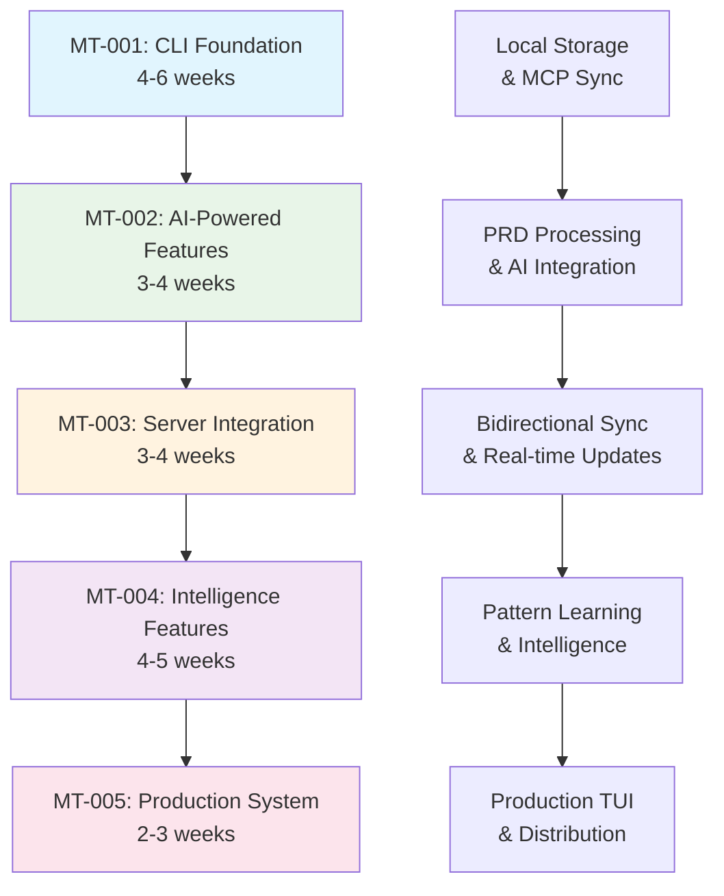
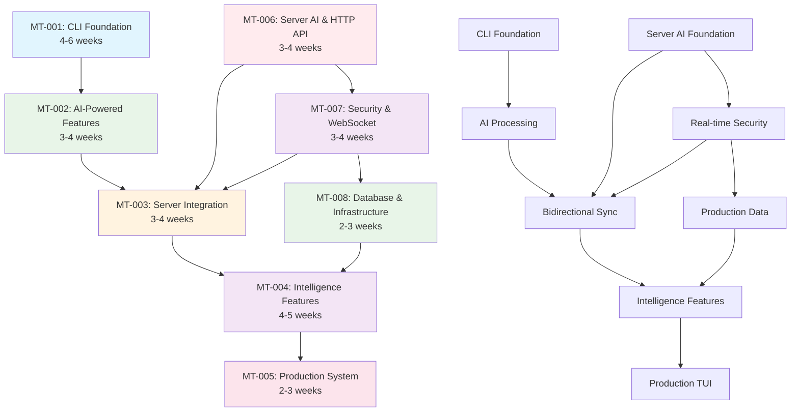

# Main Tasks - Lerian MCP Memory Integrated System

**Based on**: `docs/pre-development/prd-lmmc.md` and `docs/pre-development/trd-lmmc.md`  
**Created**: 2025-01-08  
**Version**: 1.0.0

## Overview

This document defines five atomic main tasks that together deliver the complete Lerian MCP Memory integrated system. Each main task represents a functional, deployable application increment that provides immediate value to users while building toward the complete system vision.

**Atomic Principle**: Each main task is self-contained, functional, testable, deployable, and valuable as a standalone working application.

---

## MT-001: CLI Foundation with Local Storage and MCP Integration

### 1. Task Overview
- **Task ID:** MT-001
- **Task Name:** CLI Foundation with Local Storage and MCP Integration
- **Phase Type:** Foundation
- **Duration Estimate:** 4-6 weeks
- **Atomic Validation:** ✅ Delivers a complete working CLI that manages tasks locally and syncs with MCP Memory Server

### 2. Deliverable Description
- **Primary Deliverable:** Functional CLI application that manages tasks with local file storage and MCP synchronization
- **User Value:** Developers can create, list, update, and complete tasks locally with automatic sync to the MCP Memory Server
- **Business Value:** Provides immediate task management capability without server dependency, establishes foundation for all future phases
- **Working Definition:** CLI responds to all basic commands, persists data locally in ~/.lmmc/, and successfully syncs with existing MCP memory_tasks tools

### 3. Functional Scope
- **Included Features:**
  - Task creation with `lmmc add "task description"`
  - Task listing with status filtering `lmmc list [--status=pending]`
  - Task status updates (`lmmc start <id>`, `lmmc done <id>`, `lmmc cancel <id>`)
  - Task editing with `lmmc edit <id>`
  - Priority management with `lmmc priority <id> <high|medium|low>`
  - Local configuration management
  - Repository auto-detection
  - Shell completion installation
  - Version checking with server
- **User Capabilities:**
  - Create new tasks with descriptions and metadata
  - View all tasks with filtering by status, priority, or repository
  - Mark tasks as started, completed, or cancelled
  - Edit task details and priorities
  - Configure CLI settings and server endpoints
  - Work offline with local storage fallback
- **API Endpoints:** Uses existing MCP memory_tasks tools only
- **UI Components:** Terminal CLI interface with colored output and formatted tables

### 4. Technical Scope
- **Architecture Components:**
  - Hexagonal architecture in `cli/` folder
  - Cobra CLI framework with command structure
  - Domain entities (Task, Session, Repository)
  - Local storage adapters for ~/.lmmc/ JSON files
  - MCP client integration layer
  - Configuration management with Viper
- **Data Model:**
  - Task entity with validation (ID, content, status, priority, repository, timestamps)
  - Local cache structure in JSON format
  - Configuration schema for server endpoints and user preferences
- **Integration Points:**
  - Existing MCP memory_tasks tools for server communication
  - Local file system for offline storage
  - Git repository detection for automatic context
- **Infrastructure:** Single Go binary with no external dependencies

### 5. Dependencies
- **Required Previous Phases:** None (foundational task)
- **External Dependencies:**
  - Go 1.23+ development environment
  - Existing MCP Memory Server running
  - Access to github.com/spf13/cobra and supporting libraries
- **Internal Dependencies:**
  - Existing MCP memory_tasks tools functionality
  - Qdrant vector database (via MCP tools)
- **Blocking Dependencies:** MCP Memory Server must be accessible for sync operations

### 6. Acceptance Criteria
- **Functional Criteria:**
  1. All basic CLI commands work correctly (add, list, start, done, edit, priority)
  2. Tasks persist locally in ~/.lmmc/ directory structure
  3. CLI successfully syncs with MCP Memory Server via memory_tasks tools
  4. Repository context automatically detected from current directory
  5. Configuration management works for server URLs and user preferences
  6. Shell completion can be installed for bash, zsh, and fish
  7. Version checking prevents incompatible server connections
  8. Offline mode works when server is unavailable
- **Technical Criteria:**
  1. Code follows Go conventions and hexagonal architecture
  2. CLI binary builds on Windows, macOS, and Linux
  3. Memory usage remains under 50MB during normal operation
  4. Command response time under 100ms for local operations
  5. Error handling provides clear, actionable user messages
  6. Configuration validates and provides helpful defaults
- **Quality Criteria:**
  1. Unit test coverage ≥80% for domain logic
  2. Integration tests validate MCP communication
  3. CLI commands include help text and examples
  4. Error messages are user-friendly and actionable
- **User Acceptance:**
  1. Developers can complete full task workflow without documentation
  2. CLI feels responsive and reliable during daily use
  3. Sync status is always clear to users

### 7. Testing Requirements
- **Unit Testing:**
  - Task entity validation and business rules
  - CLI command parsers and validators
  - Local storage operations and file handling
  - Configuration management and validation
  - Error handling for all edge cases
- **Integration Testing:**
  - MCP tools communication and error handling
  - File system operations across platforms
  - Git repository detection logic
  - Configuration file loading and validation
- **End-to-End Testing:**
  - Complete task lifecycle (create → start → done)
  - Offline/online mode transitions
  - Cross-platform CLI installation and usage
  - Shell completion installation and function
- **Performance Testing:**
  - CLI startup time under various conditions
  - Large task list handling (1000+ tasks)
  - Concurrent CLI usage scenarios

### 8. Deployment Definition
- **Deployment Target:** Developer local machines (Windows, macOS, Linux)
- **Configuration:**
  - Default config in ~/.lmmc/config.yaml
  - Environment variable overrides
  - Server endpoint auto-detection
  - Repository-specific settings
- **Data Migration:** Initial ~/.lmmc/ directory structure creation
- **Rollback Plan:** Previous CLI version can be restored, local data preserved

### 9. Success Metrics
- **Technical Metrics:**
  - CLI command response time < 100ms (p95)
  - MCP sync success rate > 99%
  - Binary size < 20MB
  - Memory usage < 50MB
- **User Metrics:**
  - Daily active CLI users
  - Commands per user session
  - Task completion rate via CLI
  - User retention after first week
- **Business Metrics:**
  - Developer productivity baseline established
  - Task creation rate vs manual methods
  - Time savings in task management workflow
- **Quality Metrics:**
  - Bug reports per 1000 CLI operations
  - User support ticket volume
  - Cross-platform compatibility score

### 10. Risk Assessment
- **Technical Risks:**
  - **CLI platform compatibility:** Mitigation through CI testing on all platforms
  - **Local storage corruption:** Mitigation with atomic file operations and backup
  - **MCP integration complexity:** Mitigation through existing tool reuse
- **Integration Risks:**
  - **Version mismatch with server:** Mitigation through strict version checking
  - **Network connectivity issues:** Mitigation with graceful offline degradation
- **Timeline Risks:**
  - **Go learning curve:** Mitigation through team training and pair programming
  - **MCP protocol changes:** Mitigation through stable API usage
- **Quality Risks:**
  - **CLI UX complexity:** Mitigation through user testing and iteration
  - **Performance on large datasets:** Mitigation through pagination and lazy loading

---

## MT-002: AI-Powered Development Automation with Document Generation

### 1. Task Overview
- **Task ID:** MT-002
- **Task Name:** AI-Powered Development Automation with Document Generation
- **Phase Type:** Core Feature
- **Duration Estimate:** 4-5 weeks
- **Atomic Validation:** ✅ Delivers a complete CLI with AI that automates the entire development documentation chain from PRD creation to sub-task generation

### 2. Deliverable Description
- **Primary Deliverable:** Enhanced CLI application with AI-powered document generation, parsing, and complete development automation workflow
- **User Value:** Developers can automate the entire development planning process from initial idea to detailed sub-tasks using customizable AI-driven rules
- **Business Value:** Transforms manual development planning into a fully automated, intelligent process that dramatically accelerates project initiation and planning
- **Working Definition:** CLI can create PRDs, generate TRDs, produce main tasks, and create sub-tasks automatically using AI and customizable rules

### 3. Functional Scope
- **Included Features:**
  - PRD creation with `lmmc prd create` - interactive AI-powered PRD generation
  - TRD generation with `lmmc trd create` - automatic TRD from existing PRD
  - Main task generation with `lmmc tasks generate-main` - create atomic phases
  - Sub-task generation with `lmmc tasks generate-sub` - detailed task breakdown
  - PRD import with `lmmc prd import <file>` - process existing documents
  - Rule management with `lmmc rules` - list, edit, and customize generation rules
  - Complete workflow automation with `lmmc workflow run` - end-to-end chain
  - AI-powered parsing and analysis of all document types
  - Automatic complexity analysis and effort estimation
  - Task relationship detection and dependency mapping
  - Multi-model AI integration (primary, research, fallback)
  - REPL mode with `lmmc repl` for interactive sessions
  - Document update and re-generation capabilities
- **User Capabilities:**
  - Create complete development documentation chain from scratch
  - Generate PRDs interactively with AI asking clarifying questions
  - Automatically produce TRDs from PRDs following technical standards
  - Generate atomic main tasks and detailed sub-tasks
  - Customize generation rules to match team preferences
  - Import and process existing PRD/TRD documents
  - Run complete automation workflow in one command
  - Review and approve AI-generated content before finalizing
  - Access AI assistance through interactive REPL mode
- **API Endpoints:** Still uses existing MCP tools, no server changes required
- **UI Components:** Enhanced CLI with interactive prompts, progress indicators, rule editors, and AI response formatting

### 4. Technical Scope
- **Architecture Components:**
  - AI service layer with multi-model routing (Claude Sonnet 4, Perplexity Sonar Pro, OpenAI GPT-4o)
  - Document generation engine for PRD, TRD, main tasks, and sub-tasks
  - Rule engine with customizable generation rules and templates
  - PRD parser with content analysis and structure detection
  - Task generation engine with complexity algorithms
  - REPL mode with HTTP server for push notifications (localhost:8080)
  - Enhanced caching system for AI responses
  - Template engine for document and task pattern recognition
- **Data Model:**
  - PRD entity with metadata and generation history
  - TRD entity with technical specifications
  - Rule entity for customizable generation rules
  - Task template structures
  - Complexity scoring model
  - AI response caching schema
  - Document relationship tracking
- **Integration Points:**
  - Multiple AI model APIs with fallback routing
  - Enhanced MCP tools integration for task storage
  - Local file system for document and rule storage
  - HTTP server for receiving real-time updates
  - Rule template repository with defaults
- **Infrastructure:** Enhanced Go binary with AI client libraries and rule engine

### 5. Dependencies
- **Required Previous Phases:** MT-001 (CLI Foundation) must be complete
- **External Dependencies:**
  - Claude Sonnet 4 API access
  - Perplexity Sonar Pro API access
  - OpenAI GPT-4o API access
  - Server's .env configuration with AI API keys
- **Internal Dependencies:**
  - Working CLI foundation from MT-001
  - MCP Memory Server with AI configuration
- **Blocking Dependencies:** AI API access and server configuration required

### 6. Acceptance Criteria
- **Functional Criteria:**
  1. PRD creation generates complete, well-structured PRDs following create-prd.mdc rule
  2. TRD generation produces technical specifications aligned with PRDs
  3. Main task generation creates atomic, deployable phases
  4. Sub-task generation produces 2-4 hour implementable tasks
  5. Complete workflow automation runs end-to-end without manual intervention
  6. Rule customization allows teams to modify generation behavior
  7. PRD import successfully processes existing Markdown and text files
  8. AI parsing generates relevant, actionable content at each stage
  9. Multi-model AI routing works with fallback when primary model fails
  10. REPL mode provides interactive AI assistance throughout the process
- **Technical Criteria:**
  1. Document generation completes within 60 seconds per document
  2. AI response time under 30 seconds for each generation step
  3. Rule engine supports custom rules without code changes
  4. Fallback model activation when primary model fails or rate limits
  5. Local caching reduces redundant AI API calls by >70%
  6. Error handling provides clear recovery paths for all failures
- **Quality Criteria:**
  1. Generated PRDs follow all sections of create-prd.mdc template
  2. Generated TRDs align with technical requirements from TRD template
  3. Main tasks are truly atomic and independently deployable
  4. Sub-tasks have clear implementation paths and acceptance criteria
  5. Generated documentation requires <20% manual adjustment
- **User Acceptance:**
  1. Complete workflow saves >80% of time vs manual documentation
  2. Generated documents meet professional quality standards
  3. Customizable rules allow adaptation to team preferences
  4. Interactive mode provides helpful AI guidance throughout

### 7. Testing Requirements
- **Unit Testing:**
  - PRD parsing logic and content extraction
  - AI client implementations and error handling
  - Task generation algorithms and validation
  - Complexity analysis accuracy and edge cases
  - Multi-model routing and fallback logic
- **Integration Testing:**
  - AI API integration with all three models
  - PRD file format handling (various Markdown styles)
  - Task storage via MCP tools
  - REPL mode HTTP server functionality
- **End-to-End Testing:**
  - Complete PRD import to task creation workflow
  - AI fallback scenarios under rate limiting
  - Large PRD processing (50+ page documents)
  - Interactive REPL session with task modifications
- **Performance Testing:**
  - PRD parsing time for various document sizes
  - AI response caching effectiveness
  - Concurrent REPL sessions handling

### 8. Deployment Definition
- **Deployment Target:** Enhanced CLI binary replacing MT-001 version
- **Configuration:**
  - AI model configuration and API key management
  - PRD parsing settings and template preferences
  - REPL mode configuration and port settings
- **Data Migration:** Existing tasks preserved, new PRD entities added
- **Rollback Plan:** Can revert to MT-001 CLI while preserving task data

### 9. Success Metrics
- **Technical Metrics:**
  - PRD parsing time < 30s for 50-page documents
  - AI API response success rate > 95%
  - Cache hit rate > 70% for repeated operations
  - REPL mode response time < 2s
- **User Metrics:**
  - PRDs imported per week
  - Tasks generated via AI vs manual creation
  - User satisfaction score for AI-generated tasks
  - Time savings in project planning phase
- **Business Metrics:**
  - Project planning time reduction
  - Task estimation accuracy improvement
  - Developer adoption of PRD-driven workflow
- **Quality Metrics:**
  - AI task relevance score (user feedback)
  - Generated task completeness (post-project analysis)
  - Error rate in AI parsing and generation

### 10. Risk Assessment
- **Technical Risks:**
  - **AI model rate limiting:** Mitigation through multi-model fallback chain
  - **PRD parsing accuracy:** Mitigation through user review and approval process
  - **API cost management:** Mitigation through response caching and smart routing
- **Integration Risks:**
  - **API key security:** Mitigation through server-side key management
  - **Model API changes:** Mitigation through abstraction layer and version pinning
- **Timeline Risks:**
  - **AI integration complexity:** Mitigation through iterative development and testing
  - **Prompt engineering tuning:** Mitigation through dedicated prompt optimization phase
- **Quality Risks:**
  - **AI output quality variance:** Mitigation through quality scoring and fallback models
  - **User trust in AI suggestions:** Mitigation through transparency and user control

---

## MT-003: Bidirectional Server Integration and Real-Time Sync

### 1. Task Overview
- **Task ID:** MT-003
- **Task Name:** Bidirectional Server Integration and Real-Time Sync
- **Phase Type:** Integration
- **Duration Estimate:** 3-4 weeks
- **Atomic Validation:** ✅ Delivers seamless real-time synchronization between CLI and AI assistants with bidirectional communication

### 2. Deliverable Description
- **Primary Deliverable:** Complete bidirectional sync system between CLI and MCP Memory Server with real-time updates to AI assistants
- **User Value:** Task updates from any source (CLI, AI tools) instantly sync across all development tools
- **Business Value:** Eliminates manual synchronization overhead and ensures single source of truth for development tasks
- **Working Definition:** CLI and AI assistants maintain perfect sync with sub-second latency for all task operations

### 3. Functional Scope
- **Included Features:**
  - HTTP API endpoints on server for CLI communication
  - WebSocket support for real-time bidirectional updates
  - CLI HTTP server for receiving push notifications (REPL mode)
  - Version enforcement between CLI and server
  - Conflict resolution with Qdrant as source of truth
  - Tailscale network auto-detection for remote connections
  - Batch operations for efficient sync
  - Connection resilience with automatic reconnection
- **User Capabilities:**
  - See real-time task updates from AI assistants in CLI
  - Have CLI task changes immediately available to AI tools
  - Work seamlessly across local and remote server connections
  - Maintain sync even during network interruptions
  - Receive notifications of conflicting changes with resolution options
- **API Endpoints:** New minimal HTTP API layer added to server
- **UI Components:** Real-time status indicators, sync notifications, conflict resolution prompts

### 4. Technical Scope
- **Architecture Components:**
  - Server HTTP API layer (Chi router with middleware)
  - WebSocket manager for real-time communication
  - CLI HTTP server for push notifications (REPL mode only)
  - Version compatibility checking system
  - Event-driven sync architecture
  - Connection pool management
  - Conflict resolution engine
- **Data Model:**
  - API request/response schemas
  - WebSocket event message formats
  - Version compatibility matrix
  - Sync state tracking structures
- **Integration Points:**
  - Enhanced server with HTTP API (minimal changes)
  - WebSocket endpoints for real-time communication
  - Existing MCP tools (backward compatibility maintained)
  - CLI push notification endpoints
- **Infrastructure:** Docker-based server with enhanced networking, CLI with embedded HTTP server

### 5. Dependencies
- **Required Previous Phases:** MT-002 (AI-Powered Features) must be complete
- **External Dependencies:**
  - Go Chi router library
  - WebSocket library (gorilla/websocket)
  - Network access between CLI and server
- **Internal Dependencies:**
  - Enhanced CLI from MT-002
  - MCP Memory Server infrastructure
  - Qdrant database for conflict resolution
- **Blocking Dependencies:** Server enhancement deployment required

### 6. Acceptance Criteria
- **Functional Criteria:**
  1. Task updates sync in real-time (<1 second latency)
  2. CLI receives push notifications when in REPL mode
  3. Version compatibility prevents incompatible connections
  4. Conflict resolution maintains Qdrant as source of truth
  5. WebSocket connections automatically reconnect after interruption
  6. Tailscale networks detected and used automatically
  7. All existing MCP tools continue to work without changes
  8. Batch operations efficiently handle bulk updates
- **Technical Criteria:**
  1. API response time <50ms for CRUD operations
  2. WebSocket message latency <10ms on local networks
  3. Version checking prevents breaking changes
  4. Rate limiting protects server from abuse
  5. HTTP API follows OpenAPI 3.0 specification
- **Quality Criteria:**
  1. Sync conflict rate <0.1% of operations
  2. WebSocket connection uptime >99.9%
  3. API error rate <1% under normal load
- **User Acceptance:**
  1. Users perceive instant sync across tools
  2. No manual sync actions required
  3. Conflict resolution is intuitive and quick

### 7. Testing Requirements
- **Unit Testing:**
  - HTTP API endpoint handlers and middleware
  - WebSocket connection management and events
  - Version compatibility checking logic
  - Conflict resolution algorithms
  - CLI HTTP server functionality
- **Integration Testing:**
  - End-to-end sync between CLI and AI tools
  - WebSocket connection under various network conditions
  - Version mismatch scenarios and error handling
  - Tailscale network detection and connection
- **End-to-End Testing:**
  - Complete bidirectional sync workflow
  - Network interruption and recovery scenarios
  - High-concurrency sync operations
  - Cross-platform network compatibility
- **Performance Testing:**
  - API load testing (1000+ concurrent connections)
  - WebSocket message throughput testing
  - Sync latency under various loads

### 8. Deployment Definition
- **Deployment Target:** Enhanced MCP Memory Server with HTTP API, updated CLI
- **Configuration:**
  - Server HTTP port configuration
  - WebSocket endpoint configuration
  - Version compatibility matrix
  - Rate limiting and security settings
- **Data Migration:** No schema changes, enhanced sync capabilities
- **Rollback Plan:** Can disable HTTP API, revert to MCP-only communication

### 9. Success Metrics
- **Technical Metrics:**
  - Sync latency <200ms end-to-end
  - API response time <50ms p95
  - WebSocket connection uptime >99.9%
  - Version conflict rate <0.01%
- **User Metrics:**
  - Percentage of users using bidirectional sync
  - Sync operations per user per day
  - User satisfaction with real-time updates
- **Business Metrics:**
  - Reduction in manual sync overhead
  - Developer workflow efficiency improvement
  - Cross-tool development time savings
- **Quality Metrics:**
  - Sync conflict resolution success rate
  - Network error recovery rate
  - API reliability score

### 10. Risk Assessment
- **Technical Risks:**
  - **WebSocket connection stability:** Mitigation through automatic reconnection and fallback
  - **Version synchronization complexity:** Mitigation through strict compatibility matrix
  - **Network latency variations:** Mitigation through adaptive timeout and retry logic
- **Integration Risks:**
  - **Existing MCP tool compatibility:** Mitigation through backward compatibility testing
  - **Server performance impact:** Mitigation through minimal API design and caching
- **Timeline Risks:**
  - **Server enhancement complexity:** Mitigation through incremental API development
  - **Cross-platform networking issues:** Mitigation through extensive platform testing
- **Quality Risks:**
  - **Sync reliability under load:** Mitigation through comprehensive load testing
  - **Data consistency during conflicts:** Mitigation through Qdrant source-of-truth enforcement

---

## MT-004: Intelligence Features and Pattern Learning

### 1. Task Overview
- **Task ID:** MT-004
- **Task Name:** Intelligence Features and Pattern Learning
- **Phase Type:** Enhancement
- **Duration Estimate:** 4-5 weeks
- **Atomic Validation:** ✅ Delivers intelligent task management with AI-powered suggestions, pattern detection, and learning capabilities

### 2. Deliverable Description
- **Primary Deliverable:** Smart task management system with AI suggestions, pattern learning, and project intelligence
- **User Value:** Developers receive intelligent task suggestions based on project patterns and historical data
- **Business Value:** Improves development efficiency through learned best practices and intelligent workflow optimization
- **Working Definition:** System learns from task completion patterns and provides relevant, accurate suggestions for future tasks

### 3. Functional Scope
- **Included Features:**
  - AI-powered task suggestions with `lmmc suggest`
  - Pattern detection from completed task sequences
  - Task template system with project-type recognition
  - Cross-repository pattern learning and insights
  - Session tracking and productivity analytics
  - Workflow optimization recommendations
  - Task estimation improvements based on historical data
  - Project initialization with intelligent templates
- **User Capabilities:**
  - Receive contextual task suggestions based on current work
  - Access task templates for common project types
  - View analytics on task completion patterns
  - Get workflow optimization recommendations
  - Initialize new projects with intelligent task structures
  - Learn from similar projects across repositories
- **API Endpoints:** Enhanced server endpoints for intelligence features
- **UI Components:** Suggestion displays, analytics dashboards, pattern visualizations

### 4. Technical Scope
- **Architecture Components:**
  - Pattern detection engine with machine learning algorithms
  - Task suggestion service with context analysis
  - Template management system with project type classification
  - Analytics engine for productivity insights
  - Cross-repository pattern analyzer
  - Learning model training and inference pipeline
  - Session tracking with contextual analysis
- **Data Model:**
  - Task pattern entities with sequence and success metrics
  - Template structures with metadata and usage statistics
  - Session analytics with productivity scoring
  - Project classification and similarity metrics
- **Integration Points:**
  - Enhanced Qdrant queries for pattern detection
  - AI services for intelligent analysis and suggestions
  - Enhanced MCP tools for analytics data
  - Cross-repository data aggregation
- **Infrastructure:** Enhanced server with ML capabilities, CLI with analytics features

### 5. Dependencies
- **Required Previous Phases:** MT-003 (Server Integration) must be complete
- **External Dependencies:**
  - Machine learning libraries for pattern detection
  - Analytics processing capabilities
  - Historical task data for learning
- **Internal Dependencies:**
  - Bidirectional sync system from MT-003
  - AI integration from MT-002
  - Task foundation from MT-001
- **Blocking Dependencies:** Sufficient historical data for pattern learning

### 6. Acceptance Criteria
- **Functional Criteria:**
  1. Task suggestions have >70% relevance score from user feedback
  2. Pattern detection identifies common task sequences
  3. Template system covers major project types (web apps, CLIs, APIs)
  4. Analytics provide actionable productivity insights
  5. Cross-repository learning improves suggestion accuracy
  6. Session tracking captures meaningful productivity metrics
  7. Workflow optimization recommendations are implementable
  8. Project initialization creates relevant task structures
- **Technical Criteria:**
  1. Suggestion generation time <5 seconds
  2. Pattern analysis processes historical data efficiently
  3. Template matching accuracy >80% for known project types
  4. Analytics calculations complete within reasonable time
  5. Learning models improve accuracy over time
- **Quality Criteria:**
  1. Suggestion acceptance rate >50% by users
  2. Pattern detection accuracy >80% for established patterns
  3. Template usage adoption >60% for new projects
- **User Acceptance:**
  1. Users find suggestions helpful for their workflow
  2. Analytics provide insights that change behavior
  3. Templates accelerate project setup significantly

### 7. Testing Requirements
- **Unit Testing:**
  - Pattern detection algorithms and accuracy
  - Suggestion generation logic and ranking
  - Template matching and selection
  - Analytics calculation correctness
  - Learning model training and inference
- **Integration Testing:**
  - Suggestion system with task management workflow
  - Pattern detection with historical data processing
  - Template system with project initialization
  - Analytics with real task completion data
- **End-to-End Testing:**
  - Complete suggestion workflow from trigger to acceptance
  - Pattern learning from task completion to suggestion improvement
  - Project initialization with template application
  - Cross-repository insight generation
- **Performance Testing:**
  - Suggestion generation under various data loads
  - Pattern analysis with large historical datasets
  - Real-time analytics calculation performance

### 8. Deployment Definition
- **Deployment Target:** Enhanced server with ML capabilities, updated CLI with intelligence features
- **Configuration:**
  - Machine learning model parameters
  - Pattern detection sensitivity settings
  - Suggestion ranking algorithm weights
  - Analytics calculation intervals
- **Data Migration:** Historical task data processing for initial pattern learning
- **Rollback Plan:** Can disable intelligence features while preserving core functionality

### 9. Success Metrics
- **Technical Metrics:**
  - Suggestion generation time <5s
  - Pattern detection accuracy >80%
  - Template matching precision >80%
  - Analytics processing latency <10s
- **User Metrics:**
  - Suggestion acceptance rate per user
  - Template usage frequency
  - Analytics dashboard engagement
  - Workflow optimization adoption
- **Business Metrics:**
  - Development velocity improvement
  - Project setup time reduction
  - Task estimation accuracy increase
- **Quality Metrics:**
  - Learning model improvement rate
  - User satisfaction with intelligence features
  - Suggestion relevance scores over time

### 10. Risk Assessment
- **Technical Risks:**
  - **ML model accuracy:** Mitigation through continuous learning and feedback loops
  - **Pattern detection complexity:** Mitigation through iterative algorithm improvement
  - **Data quality for learning:** Mitigation through data validation and cleaning
- **Integration Risks:**
  - **Performance impact of ML processing:** Mitigation through async processing and caching
  - **Historical data availability:** Mitigation through synthetic data and gradual learning
- **Timeline Risks:**
  - **ML algorithm development:** Mitigation through proven libraries and techniques
  - **User feedback collection:** Mitigation through built-in feedback mechanisms
- **Quality Risks:**
  - **Suggestion relevance variance:** Mitigation through user feedback and model tuning
  - **Privacy concerns with cross-repo learning:** Mitigation through data anonymization

---

## MT-005: Production-Ready System with Advanced Features

### 1. Task Overview
- **Task ID:** MT-005
- **Task Name:** Production-Ready System with Advanced Features
- **Phase Type:** Production
- **Duration Estimate:** 2-3 weeks
- **Atomic Validation:** ✅ Delivers enterprise-ready system with professional UI, monitoring, distribution, and documentation

### 2. Deliverable Description
- **Primary Deliverable:** Complete production-ready system with advanced TUI, monitoring, automated distribution, and comprehensive documentation
- **User Value:** Professional-grade task management system ready for team deployment with enterprise features
- **Business Value:** Provides scalable, maintainable system suitable for organizational deployment and long-term support
- **Working Definition:** System runs reliably in production with full observability, automated updates, and enterprise-grade user experience

### 3. Functional Scope
- **Included Features:**
  - Interactive Terminal UI (TUI) with Bubble Tea
  - Comprehensive monitoring and observability stack
  - Automated CLI distribution via Homebrew
  - Shell completion auto-installation
  - Self-update mechanism with `lmmc --update`
  - Advanced task search and filtering
  - Workflow visualization and reporting
  - Export capabilities for tasks and analytics
  - Multi-repository management dashboard
  - Professional documentation and user guides
- **User Capabilities:**
  - Use rich interactive terminal interface for complex operations
  - Access comprehensive system monitoring and health information
  - Install and update CLI through standard package managers
  - Navigate tasks efficiently with advanced search and filtering
  - Visualize workflows and analyze productivity trends
  - Export data for external analysis and reporting
  - Manage tasks across multiple repositories efficiently
- **API Endpoints:** Complete production API with full documentation
- **UI Components:** Full Bubble Tea TUI with keyboard navigation, forms, and visualizations

### 4. Technical Scope
- **Architecture Components:**
  - Bubble Tea interactive TUI framework
  - Prometheus metrics collection and Grafana dashboards
  - CI/CD pipeline with automated builds and distribution
  - Homebrew formula with automatic updates
  - Shell completion generation and installation
  - Export system with multiple format support
  - Advanced search engine with filtering and sorting
  - Workflow visualization engine
- **Data Model:**
  - Extended analytics schema for production insights
  - Export format specifications (JSON, CSV, Markdown)
  - User preference and customization settings
  - Multi-repository aggregation structures
- **Integration Points:**
  - Package distribution systems (Homebrew, go install)
  - Monitoring infrastructure (Prometheus, Grafana)
  - CI/CD systems (GitHub Actions)
  - Shell completion systems
- **Infrastructure:** Production-ready deployment with full observability stack

### 5. Dependencies
- **Required Previous Phases:** MT-004 (Intelligence Features) must be complete
- **External Dependencies:**
  - Bubble Tea TUI library
  - Prometheus and Grafana for monitoring
  - GitHub Actions for CI/CD
  - Homebrew tap repository access
- **Internal Dependencies:**
  - Complete intelligence system from MT-004
  - All previous functionality and stability
- **Blocking Dependencies:** Production infrastructure setup and monitoring stack

### 6. Acceptance Criteria
- **Functional Criteria:**
  1. Interactive TUI provides efficient task management interface
  2. Monitoring dashboards show comprehensive system health
  3. Homebrew installation works across macOS and Linux
  4. Shell completion automatically installs for supported shells
  5. Self-update mechanism updates both CLI and server versions
  6. Search and filtering handle large task datasets efficiently
  7. Export system generates accurate reports in multiple formats
  8. Multi-repository dashboard provides unified view
- **Technical Criteria:**
  1. TUI response time <100ms for all interactions
  2. Monitoring covers all critical system metrics
  3. CI/CD pipeline completes builds within 10 minutes
  4. Package distribution updates within 24 hours of release
  5. Memory usage remains optimal even with advanced features
- **Quality Criteria:**
  1. System uptime >99.9% in production environments
  2. User onboarding completes successfully >95% of attempts
  3. Advanced features adoption rate >40% of active users
- **User Acceptance:**
  1. Users prefer TUI for complex task management operations
  2. Teams successfully deploy and manage production instances
  3. Documentation enables self-service setup and maintenance

### 7. Testing Requirements
- **Unit Testing:**
  - TUI component behavior and navigation
  - Export system accuracy and format compliance
  - Search and filtering logic correctness
  - Update mechanism security and reliability
- **Integration Testing:**
  - End-to-end TUI workflows
  - Monitoring integration with real metrics
  - Package distribution pipeline testing
  - Shell completion installation across platforms
- **End-to-End Testing:**
  - Complete production deployment simulation
  - User onboarding flow from installation to productivity
  - System performance under production loads
  - Disaster recovery and backup procedures
- **Performance Testing:**
  - TUI responsiveness with large datasets
  - Monitoring system performance impact
  - Production load handling capacity

### 8. Deployment Definition
- **Deployment Target:** Complete production environment with monitoring, final CLI distribution
- **Configuration:**
  - Production monitoring stack configuration
  - Package distribution settings and credentials
  - Update server configuration and security
  - Documentation hosting and maintenance
- **Data Migration:** Final production data structures and optimization
- **Rollback Plan:** Complete version rollback capability for both CLI and server

### 9. Success Metrics
- **Technical Metrics:**
  - System uptime >99.9%
  - TUI response time <100ms
  - Package installation success rate >99%
  - Update mechanism reliability >99%
- **User Metrics:**
  - Advanced feature adoption rate
  - User retention after 30 days
  - Support ticket volume per user
  - Feature usage analytics
- **Business Metrics:**
  - Team deployment success rate
  - Enterprise feature usage
  - Long-term user satisfaction scores
- **Quality Metrics:**
  - Production incident rate
  - Documentation effectiveness score
  - User onboarding success rate

### 10. Risk Assessment
- **Technical Risks:**
  - **TUI complexity and usability:** Mitigation through extensive user testing and iteration
  - **Production monitoring coverage:** Mitigation through comprehensive metric identification
  - **Distribution pipeline reliability:** Mitigation through redundant systems and testing
- **Integration Risks:**
  - **Package manager compatibility:** Mitigation through multi-platform testing
  - **Monitoring system integration:** Mitigation through standard protocols and interfaces
- **Timeline Risks:**
  - **Production deployment complexity:** Mitigation through staged rollout and testing
  - **Documentation completeness:** Mitigation through parallel writing and user feedback
- **Quality Risks:**
  - **Enterprise deployment challenges:** Mitigation through pilot deployments and support
  - **Long-term maintenance requirements:** Mitigation through automated systems and monitoring

---

## Dependencies Visualization

## Task Completion Validation

### MT-001 Validation Checklist
- [ ] **Self-Contained:** CLI works independently ✅
- [ ] **Functional:** Complete task management workflow ✅
- [ ] **Testable:** All commands and integrations tested ✅
- [ ] **Deployable:** Single binary distribution ✅
- [ ] **Valuable:** Immediate task management utility ✅

### MT-002 Validation Checklist
- [ ] **Self-Contained:** Adds AI features to working CLI ✅
- [ ] **Functional:** Complete PRD-to-tasks workflow ✅
- [ ] **Testable:** AI integration and parsing validated ✅
- [ ] **Deployable:** Enhanced CLI with AI capabilities ✅
- [ ] **Valuable:** Automates manual PRD analysis ✅

### MT-003 Validation Checklist
- [ ] **Self-Contained:** Adds sync to working AI-enabled CLI ✅
- [ ] **Functional:** Complete bidirectional sync workflow ✅
- [ ] **Testable:** Real-time sync thoroughly validated ✅
- [ ] **Deployable:** CLI + server integration ✅
- [ ] **Valuable:** Eliminates manual sync overhead ✅

### MT-004 Validation Checklist
- [ ] **Self-Contained:** Adds intelligence to synced system ✅
- [ ] **Functional:** Complete learning and suggestion workflow ✅
- [ ] **Testable:** ML patterns and suggestions validated ✅
- [ ] **Deployable:** Intelligent system with analytics ✅
- [ ] **Valuable:** Improves development efficiency ✅

### MT-005 Validation Checklist
- [ ] **Self-Contained:** Production-ready complete system ✅
- [ ] **Functional:** Enterprise deployment workflow ✅
- [ ] **Testable:** Production readiness validated ✅
- [ ] **Deployable:** Full production infrastructure ✅
- [ ] **Valuable:** Professional-grade team solution ✅

---

## MT-006: Server-Side AI Integration and HTTP API Foundation

### 1. Task Overview
- **Task ID:** MT-006
- **Task Name:** Server-Side AI Integration and HTTP API Foundation
- **Phase Type:** Server Foundation
- **Duration Estimate:** 3-4 weeks
- **Atomic Validation:** ✅ Delivers complete server-side AI processing with HTTP API layer for CLI communication

### 2. Deliverable Description
- **Primary Deliverable:** Enhanced MCP Memory Server with AI capabilities and HTTP API endpoints for CLI integration
- **User Value:** Server can process PRDs, generate tasks, and provide AI suggestions independently of CLI
- **Business Value:** Centralizes AI processing on server side, enabling multiple CLI instances and reducing client-side complexity
- **Working Definition:** Server handles all AI operations (PRD parsing, task generation, suggestions) via HTTP API with multi-model fallback

### 3. Functional Scope
- **Included Features:**
  - Complete HTTP API layer with Chi router (`/api/v1/*` endpoints)
  - Server-side AI service with multi-model support (Claude Sonnet 4, Perplexity Sonar Pro, OpenAI GPT-4o)
  - PRD import and parsing endpoints (`POST /api/v1/prd/import`)
  - Task suggestion endpoints (`POST /api/v1/tasks/suggest`)
  - AI-powered task generation from PRDs
  - Complexity analysis and effort estimation
  - Response caching for AI model optimization
  - Rate limiting and request throttling
  - Version compatibility checking middleware
  - OpenAPI 3.0 specification generation
- **User Capabilities:**
  - CLI can send PRDs to server for AI processing
  - Server generates tasks with AI analysis and complexity scoring
  - Multiple CLI instances can share AI processing resources
  - Fallback model support ensures reliability during rate limits
  - Cached responses improve performance for repeated operations
- **API Endpoints:** 
  - `POST /api/v1/prd/import` - Import and parse PRD documents
  - `POST /api/v1/tasks/suggest` - Get AI task suggestions
  - `GET /api/v1/tasks` - List tasks with filtering
  - `POST /api/v1/tasks` - Create new tasks
  - `PATCH /api/v1/tasks/{id}` - Update tasks
  - `GET /api/v1/health` - Health check endpoint
- **UI Components:** Server-side only (no UI changes)

### 4. Technical Scope
- **Architecture Components:**
  - HTTP API layer with Chi router and middleware stack
  - AI service layer with multi-model abstraction
  - PRD processing engine with document analysis
  - Task generation algorithms with complexity scoring
  - Response caching system (Redis or in-memory)
  - Rate limiting middleware with configurable rules
  - Version checking middleware for CLI compatibility
  - OpenAPI documentation generation
- **Data Model:**
  - Enhanced Task schema with AI metadata
  - PRD entity with parsing metadata and complexity scores
  - AI response cache structures
  - Rate limiting and usage tracking
- **Integration Points:**
  - Multiple AI model APIs (Claude, Perplexity, OpenAI)
  - Existing Qdrant vector database (no schema changes needed)
  - HTTP client connections from CLI
  - Existing MCP protocol handlers (maintain backward compatibility)
- **Infrastructure:** Enhanced Docker container with AI clients and HTTP server

### 5. Dependencies
- **Required Previous Phases:** None (can run in parallel with CLI development)
- **External Dependencies:**
  - Claude Sonnet 4 API access and credentials
  - Perplexity Sonar Pro API access and credentials  
  - OpenAI GPT-4o API access and credentials
  - Go Chi router and middleware libraries
- **Internal Dependencies:**
  - Existing MCP Memory Server codebase
  - Qdrant vector database running
- **Blocking Dependencies:** AI API credentials and server infrastructure access

### 6. Acceptance Criteria
- **Functional Criteria:**
  1. PRD import endpoint successfully processes documents and generates tasks
  2. Task suggestion endpoint provides relevant, contextual suggestions
  3. Multi-model AI fallback works when primary model fails or hits rate limits
  4. Rate limiting prevents API abuse while allowing normal usage
  5. Version checking blocks incompatible CLI versions
  6. All endpoints respond with proper HTTP status codes and error messages
  7. OpenAPI documentation accurately reflects all endpoints
  8. AI response caching reduces redundant API calls by >70%
- **Technical Criteria:**
  1. API response time <50ms for cached responses, <30s for AI processing
  2. AI model fallback activates within 5 seconds of primary failure
  3. Rate limiting enforces specified limits without false positives
  4. Memory usage stays reasonable with caching enabled
  5. Concurrent request handling supports 100+ simultaneous connections
- **Quality Criteria:**
  1. AI-generated tasks have >80% relevance to input PRDs
  2. Task complexity analysis accuracy within 20% of manual estimates
  3. API error rate <1% under normal load conditions
- **User Acceptance:**
  1. PRD processing completes within 60 seconds for 50-page documents
  2. Task suggestions feel relevant and actionable to developers
  3. System remains responsive during AI processing operations

### 7. Testing Requirements
- **Unit Testing:**
  - AI service clients and error handling
  - PRD parsing logic and content extraction
  - Task generation algorithms and validation
  - Rate limiting logic and edge cases
  - Cache management and expiration
- **Integration Testing:**
  - AI API integration with all three models
  - HTTP endpoint functionality and error responses
  - Rate limiting under load conditions
  - Cache performance and consistency
- **End-to-End Testing:**
  - Complete PRD import to task generation workflow
  - AI model fallback scenarios
  - Concurrent CLI connections and processing
  - Large document processing performance
- **Performance Testing:**
  - API load testing with concurrent requests
  - AI response caching effectiveness
  - Memory usage under sustained load

### 8. Deployment Definition
- **Deployment Target:** Enhanced MCP Memory Server container with AI and HTTP capabilities
- **Configuration:**
  - AI model API keys and endpoints
  - Rate limiting rules and thresholds
  - Cache configuration and retention policies
  - HTTP server port and middleware settings
- **Data Migration:** No migration needed - fresh implementation
- **Rollback Plan:** Can disable HTTP API and revert to MCP-only operation

### 9. Success Metrics
- **Technical Metrics:**
  - API response time <50ms p95 (cached), <30s p95 (AI processing)
  - AI model fallback success rate >95%
  - Cache hit rate >70% for repeated operations
  - Concurrent connection capacity >100
- **User Metrics:**
  - PRD processing requests per day
  - Task suggestion acceptance rate
  - API endpoint usage distribution
  - AI processing time trends
- **Business Metrics:**
  - Reduction in CLI-side AI processing complexity
  - Server resource utilization efficiency
  - Multi-client support capability
- **Quality Metrics:**
  - AI response accuracy and relevance scores
  - API error rate and reliability
  - System uptime and availability

### 10. Risk Assessment
- **Technical Risks:**
  - **AI model rate limiting:** Mitigation through multi-model fallback and request queuing
  - **API performance under load:** Mitigation through caching and connection pooling
  - **AI processing costs:** Mitigation through response caching and smart routing
- **Integration Risks:**
  - **CLI-server version compatibility:** Mitigation through strict version checking
  - **Existing MCP tool compatibility:** Mitigation through backward compatibility testing
- **Timeline Risks:**
  - **AI integration complexity:** Mitigation through iterative development and testing
  - **Multiple API client implementation:** Mitigation through abstraction layer design
- **Quality Risks:**
  - **AI response quality variance:** Mitigation through model comparison and fallback
  - **API reliability requirements:** Mitigation through comprehensive error handling

---

## MT-007: Production Security and Real-Time Communication Framework

### 1. Task Overview
- **Task ID:** MT-007
- **Task Name:** Production Security and Real-Time Communication Framework
- **Phase Type:** Infrastructure
- **Duration Estimate:** 3-4 weeks
- **Atomic Validation:** ✅ Delivers production-ready security, WebSocket communication, and push notification system

### 2. Deliverable Description
- **Primary Deliverable:** Complete security framework with WebSocket real-time communication and push notification system
- **User Value:** Secure, real-time bidirectional communication between CLI and server with instant updates
- **Business Value:** Production-ready security posture with real-time collaboration capabilities
- **Working Definition:** Secure WebSocket connections provide sub-second sync with push notifications and comprehensive rate limiting

### 3. Functional Scope
- **Included Features:**
  - WebSocket server for real-time bidirectional communication
  - Push notification system to CLI endpoints (REPL mode)
  - Comprehensive rate limiting with configurable rules per endpoint
  - Security middleware stack (CORS, input validation, auth)
  - Version compatibility enforcement system
  - Connection management and heartbeat monitoring
  - Event-driven architecture for real-time updates
  - CLI registry for managing push notification endpoints
  - Automatic reconnection and failover handling
  - Security audit logging and monitoring
- **User Capabilities:**
  - Experience real-time task updates across all tools (<1 second latency)
  - Receive push notifications in REPL mode for immediate awareness
  - Benefit from production-grade security without complexity
  - Maintain connections automatically during network interruptions
  - Work securely with proper rate limiting and validation
- **API Endpoints:**
  - `GET /api/v1/ws` - WebSocket upgrade endpoint
  - `POST /api/v1/cli/register` - Register CLI for push notifications
  - `DELETE /api/v1/cli/unregister` - Unregister CLI endpoint
  - `GET /api/v1/status` - Connection and system status
- **UI Components:** Server-side only (connection status indicators in CLI)

### 4. Technical Scope
- **Architecture Components:**
  - WebSocket manager with connection pooling and heartbeat
  - Push notification dispatcher for CLI endpoints
  - Rate limiting middleware with Redis backend
  - Security middleware stack with validation and sanitization
  - Version compatibility checker with matrix validation
  - Event bus for real-time update distribution
  - CLI endpoint registry with health checking
  - Connection state management and recovery
- **Data Model:**
  - WebSocket connection metadata and state tracking
  - CLI endpoint registration with health status
  - Rate limiting counters and windows
  - Security audit log structures
  - Event message schemas for real-time updates
- **Integration Points:**
  - Enhanced HTTP API from MT-006
  - Existing Qdrant database for event sourcing
  - CLI HTTP servers for push notifications
  - Monitoring systems for security metrics
- **Infrastructure:** Enhanced server with WebSocket capabilities and security hardening

### 5. Dependencies
- **Required Previous Phases:** MT-006 (Server-Side AI Integration) must be complete
- **External Dependencies:**
  - WebSocket library (gorilla/websocket)
  - Rate limiting library (golang.org/x/time/rate)
  - Redis for distributed rate limiting (optional)
  - Security middleware libraries
- **Internal Dependencies:**
  - HTTP API foundation from MT-006
  - Enhanced server infrastructure
- **Blocking Dependencies:** Network infrastructure for WebSocket support

### 6. Acceptance Criteria
- **Functional Criteria:**
  1. WebSocket connections establish and maintain sub-second message latency
  2. Push notifications successfully deliver to registered CLI endpoints
  3. Rate limiting enforces all TRD-specified limits without blocking legitimate usage
  4. Security middleware blocks malicious inputs and provides proper validation
  5. Version compatibility prevents breaking changes and provides clear upgrade paths
  6. Connection recovery works automatically after network interruptions
  7. Event distribution reaches all connected clients within 100ms
  8. CLI registration and health checking works reliably
- **Technical Criteria:**
  1. WebSocket message latency <10ms on local networks, <100ms remote
  2. Push notification delivery success rate >99%
  3. Rate limiting accuracy >99% with configurable thresholds
  4. Connection recovery time <5 seconds after network restoration
  5. Memory usage scales linearly with connection count
- **Quality Criteria:**
  1. Security audit finds no critical vulnerabilities
  2. WebSocket connection uptime >99.9% under normal conditions
  3. Rate limiting false positive rate <0.1%
- **User Acceptance:**
  1. Real-time updates feel instantaneous to users
  2. Security measures are transparent and don't impede workflow
  3. Connection issues resolve automatically without user intervention

### 7. Testing Requirements
- **Unit Testing:**
  - WebSocket connection management and message handling
  - Push notification delivery logic and error handling
  - Rate limiting algorithms and edge cases
  - Security middleware validation and sanitization
  - Version compatibility checking logic
- **Integration Testing:**
  - WebSocket communication with multiple CLI instances
  - Push notification delivery under various network conditions
  - Rate limiting under sustained load
  - Security middleware with malicious input testing
- **End-to-End Testing:**
  - Complete real-time sync workflow between CLI and server
  - Network interruption and recovery scenarios
  - High-concurrency connection management
  - Security penetration testing
- **Performance Testing:**
  - WebSocket throughput and latency testing
  - Connection scaling (1000+ concurrent connections)
  - Rate limiting performance under load
  - Memory usage optimization validation

### 8. Deployment Definition
- **Deployment Target:** Enhanced server with WebSocket and security capabilities
- **Configuration:**
  - WebSocket server configuration and port settings
  - Rate limiting rules and thresholds per endpoint
  - Security middleware configuration and validation rules
  - Push notification retry and timeout settings
- **Data Migration:** No migration needed - new infrastructure
- **Rollback Plan:** Can disable WebSocket and push features, maintain HTTP API

### 9. Success Metrics
- **Technical Metrics:**
  - WebSocket message latency <10ms p95 (local), <100ms p95 (remote)
  - Push notification delivery success rate >99%
  - Connection uptime >99.9%
  - Rate limiting accuracy >99%
- **User Metrics:**
  - Real-time sync usage adoption rate
  - Average session duration with WebSocket connections
  - Push notification engagement rate
  - Connection recovery success rate
- **Business Metrics:**
  - Reduction in manual sync overhead
  - Improved collaboration efficiency metrics
  - Security incident rate (target: zero critical)
- **Quality Metrics:**
  - Security audit score
  - WebSocket connection stability metrics
  - User satisfaction with real-time features

### 10. Risk Assessment
- **Technical Risks:**
  - **WebSocket connection scaling:** Mitigation through connection pooling and load balancing
  - **Security vulnerability introduction:** Mitigation through security audits and testing
  - **Rate limiting complexity:** Mitigation through proven libraries and algorithms
- **Integration Risks:**
  - **Network firewall compatibility:** Mitigation through standard WebSocket protocols
  - **CLI compatibility across platforms:** Mitigation through extensive platform testing
- **Timeline Risks:**
  - **Security implementation complexity:** Mitigation through security framework adoption
  - **WebSocket reliability requirements:** Mitigation through proven libraries and patterns
- **Quality Risks:**
  - **Real-time performance under load:** Mitigation through comprehensive load testing
  - **Security vs usability balance:** Mitigation through user experience testing

---

## MT-008: Database Schema Implementation and Production Infrastructure

### 1. Task Overview
- **Task ID:** MT-008
- **Task Name:** Database Schema Implementation and Production Infrastructure
- **Phase Type:** Data & Infrastructure
- **Duration Estimate:** 2-3 weeks
- **Atomic Validation:** ✅ Delivers complete database schema with production infrastructure and comprehensive API documentation

### 2. Deliverable Description
- **Primary Deliverable:** Complete database schema implementation with production infrastructure setup and automated API documentation
- **User Value:** Robust data persistence with proper relationships, indexing, and production-ready infrastructure
- **Business Value:** Scalable data foundation supporting all features with enterprise-grade infrastructure and documentation
- **Working Definition:** Database supports all CLI features with optimal performance, complete API documentation, and production deployment ready

### 3. Functional Scope
- **Included Features:**
  - Complete database schema implementation from TRD specifications
  - Enhanced Task table with all CLI-specific columns
  - New PRD table for document storage and metadata
  - Task templates and patterns tables for intelligence features
  - Work session tracking for analytics
  - Proper indexing strategy for performance optimization
  - Database constraints and validation rules
  - OpenAPI 3.0 specification automation
  - Interactive API documentation (Swagger UI)
  - Production Docker Compose configuration
  - Health check and monitoring endpoints
  - Database backup and recovery procedures
- **User Capabilities:**
  - Store all task data with proper relationships and constraints
  - Track PRD documents with parsing metadata and complexity scores
  - Maintain task templates and patterns for intelligent suggestions
  - Record work sessions for productivity analytics
  - Access comprehensive, interactive API documentation
  - Deploy system in production with proper infrastructure
- **API Endpoints:**
  - `GET /api/v1/docs` - Interactive API documentation
  - `GET /api/v1/openapi.json` - OpenAPI specification
  - `GET /api/v1/health` - Enhanced health check with database status
  - All existing endpoints with proper documentation
- **UI Components:** Interactive API documentation interface

### 4. Technical Scope
- **Architecture Components:**
  - Complete PostgreSQL schema with tables, indexes, and constraints
  - Database migration system for schema versioning
  - OpenAPI specification generation from code annotations
  - Swagger UI integration for interactive documentation
  - Production Docker Compose with proper networking
  - Database connection pooling and performance optimization
  - Health monitoring for database and application components
  - Backup automation and recovery procedures
- **Data Model:**
  - Enhanced tasks table with CLI-specific columns (session_id, complexity, dependencies, etc.)
  - PRD table with document content, metadata, and complexity scoring
  - Task templates table with reusable task structures
  - Task patterns table for machine learning insights
  - Work sessions table for productivity tracking
  - Proper foreign key relationships and constraints
- **Integration Points:**
  - PostgreSQL database with optimized configuration
  - Qdrant vector database (existing, no changes)
  - Docker container orchestration
  - API documentation hosting
  - Monitoring and logging systems
- **Infrastructure:** Production-ready Docker environment with database, monitoring, and documentation

### 5. Dependencies
- **Required Previous Phases:** MT-006 (Server-Side AI Integration) for API foundation
- **External Dependencies:**
  - PostgreSQL database server
  - Docker and Docker Compose
  - OpenAPI/Swagger tooling
  - Database migration tools
- **Internal Dependencies:**
  - HTTP API foundation from MT-006
  - Enhanced server architecture
- **Blocking Dependencies:** Production infrastructure access and configuration

### 6. Acceptance Criteria
- **Functional Criteria:**
  1. All database tables created with proper structure and constraints
  2. Database indexes optimize common query patterns
  3. Foreign key relationships maintain data integrity
  4. OpenAPI documentation accurately reflects all endpoints
  5. Interactive API documentation is accessible and functional
  6. Production Docker Compose deploys successfully
  7. Database backup and recovery procedures work correctly
  8. Health checks monitor all critical components
- **Technical Criteria:**
  1. Database queries execute within performance targets
  2. Schema supports all CLI features without modification
  3. API documentation generation is automated
  4. Production deployment is reproducible and reliable
  5. Database connection pooling optimizes resource usage
- **Quality Criteria:**
  1. Database design follows normalization best practices
  2. API documentation is complete and accurate
  3. Production configuration meets security standards
- **User Acceptance:**
  1. API documentation enables self-service integration
  2. Database performance supports expected user load
  3. Production deployment works reliably

### 7. Testing Requirements
- **Unit Testing:**
  - Database schema validation and constraints
  - Migration scripts and rollback procedures
  - API documentation generation accuracy
  - Health check endpoint functionality
- **Integration Testing:**
  - Database integration with all API endpoints
  - Production Docker Compose deployment
  - Backup and recovery procedure validation
  - API documentation completeness
- **End-to-End Testing:**
  - Complete application deployment and operation
  - Database performance under load
  - Production infrastructure reliability
  - Documentation accessibility and accuracy
- **Performance Testing:**
  - Database query performance optimization
  - Connection pooling under load
  - Production infrastructure scaling

### 8. Deployment Definition
- **Deployment Target:** Production-ready infrastructure with complete database schema
- **Configuration:**
  - PostgreSQL production configuration
  - Docker Compose production setup
  - API documentation hosting configuration
  - Monitoring and health check settings
- **Data Migration:** Fresh schema implementation (no migration needed)
- **Rollback Plan:** Can revert to previous infrastructure while preserving data

### 9. Success Metrics
- **Technical Metrics:**
  - Database query response time <50ms p95
  - API documentation generation time <30 seconds
  - Production deployment success rate 100%
  - Health check response time <100ms
- **User Metrics:**
  - API documentation usage and engagement
  - Production deployment adoption rate
  - Database performance satisfaction scores
- **Business Metrics:**
  - Infrastructure reliability and uptime
  - Database scalability for user growth
  - Documentation effectiveness for developers
- **Quality Metrics:**
  - Database schema design quality score
  - API documentation completeness score
  - Production infrastructure security score

### 10. Risk Assessment
- **Technical Risks:**
  - **Database performance under load:** Mitigation through indexing strategy and connection pooling
  - **Schema design complexity:** Mitigation through careful normalization and validation
  - **Production deployment reliability:** Mitigation through automated testing and validation
- **Integration Risks:**
  - **API documentation accuracy:** Mitigation through automated generation and validation
  - **Infrastructure compatibility:** Mitigation through standardized Docker containers
- **Timeline Risks:**
  - **Database optimization complexity:** Mitigation through proven patterns and indexing strategies
  - **Production infrastructure setup:** Mitigation through infrastructure as code practices
- **Quality Risks:**
  - **Schema evolution requirements:** Mitigation through proper design and migration planning
  - **Documentation maintenance:** Mitigation through automated generation from code

---

## Dependencies Visualization (Updated)

## Timeline Summary (Updated)

**Total Estimated Duration:** 22-30 weeks (with parallel development)

### Sequential Path (CLI Focus):
- **Phase 1 (MT-001):** Weeks 1-6 → Working CLI
- **Phase 2 (MT-002):** Weeks 7-10 → AI-Powered CLI  
- **Phase 3 (MT-003):** Weeks 11-14 → Synced System
- **Phase 4 (MT-004):** Weeks 15-19 → Intelligent System
- **Phase 5 (MT-005):** Weeks 20-22 → Production System

### Parallel Path (Server Focus):
- **Phase 1 (MT-006):** Weeks 1-4 → Server AI & HTTP API
- **Phase 2 (MT-007):** Weeks 5-8 → Security & WebSocket  
- **Phase 3 (MT-008):** Weeks 9-11 → Database & Infrastructure

### Integration Points:
- **Week 11:** MT-006 integrates with MT-003 (Server Integration)
- **Week 11:** MT-007 integrates with MT-003 (WebSocket & Security)
- **Week 15:** MT-008 integrates with MT-004 (Database for Intelligence)

**Optimized Timeline with Parallel Development:** 20-22 weeks

Each phase delivers a complete, working application that provides immediate value while building toward the complete system vision.