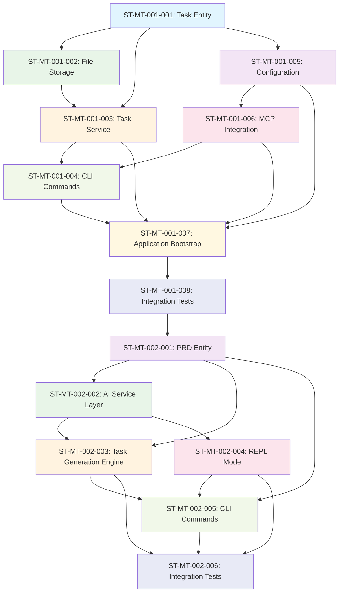

# Task Index - Lerian MCP Memory Integrated System

## Main Tasks Overview

| Task ID | Status | Name | Sub-Tasks | Estimated Total |
|---------|--------|------|-----------|--------------------|
| MT-001 | In Progress | CLI Foundation with Local Storage and MCP Integration | 8 | 29 hours |
| MT-002 | In Progress | AI-Powered Development Automation with Document Generation | 6 | 35 hours |
| MT-003 | Pending | Bidirectional Server Integration and Real-Time Sync | TBD | ~14 hours |
| MT-004 | Pending | Intelligence Features and Pattern Learning | TBD | ~18 hours |
| MT-005 | Pending | Production-Ready System with Advanced Features | TBD | ~12 hours |

## Sub-Tasks by Main Task

### MT-001: CLI Foundation with Local Storage and MCP Integration

- [ ] [ST-MT-001-001](MT-001/ST-MT-001-001.md): Create Task Entity with Validation (3h) - ⏳ Pending
- [ ] [ST-MT-001-002](MT-001/ST-MT-001-002.md): Implement Local File Storage System (4h) - ⏳ Pending  
- [ ] [ST-MT-001-003](MT-001/ST-MT-001-003.md): Create Task Service with Business Logic (4h) - ⏳ Pending
- [ ] [ST-MT-001-004](MT-001/ST-MT-001-004.md): Implement CLI Commands with Cobra Framework (4h) - ⏳ Pending
- [ ] [ST-MT-001-005](MT-001/ST-MT-001-005.md): Implement Configuration Management System (3h) - ⏳ Pending
- [ ] [ST-MT-001-006](MT-001/ST-MT-001-006.md): Implement MCP Integration Layer (4h) - ⏳ Pending
- [ ] [ST-MT-001-007](MT-001/ST-MT-001-007.md): Create Application Bootstrap and Dependency Injection (3h) - ⏳ Pending
- [ ] [ST-MT-001-008](MT-001/ST-MT-001-008.md): Implement Integration Tests and End-to-End Validation (4h) - ⏳ Pending

**Progress:** 0/8 Complete (0%) - Ready for implementation

### MT-002: AI-Powered PRD Processing and Task Generation

- [ ] [ST-MT-002-001](MT-002/ST-MT-002-001.md): Create PRD Entity and File Processing System (3h) - ⏳ Pending
- [ ] [ST-MT-002-002](MT-002/ST-MT-002-002.md): Implement AI Service Layer with Multi-Model Routing (4h) - ⏳ Pending
- [ ] [ST-MT-002-003](MT-002/ST-MT-002-003.md): Implement Task Generation Engine with Complexity Analysis (4h) - ⏳ Pending
- [ ] [ST-MT-002-004](MT-002/ST-MT-002-004.md): Implement REPL Mode with HTTP Server for Interactive AI Sessions (4h) - ⏳ Pending
- [ ] [ST-MT-002-005](MT-002/ST-MT-002-005.md): Implement CLI Commands for PRD Processing (3h) - ⏳ Pending
- [ ] [ST-MT-002-006](MT-002/ST-MT-002-006.md): Implement Integration Tests and End-to-End Validation (4h) - ⏳ Pending

**Progress:** 0/6 Complete (0%) - Ready for implementation

### Dependencies Visualization



### Implementation Sequence

**Week 1:**
- Day 1: ST-MT-001-001 (Task Entity) + ST-MT-001-005 (Configuration) - 6h total
- Day 2: ST-MT-001-002 (File Storage) - 4h
- Day 3: ST-MT-001-003 (Task Service) - 4h

**Week 2:**
- Day 1: ST-MT-001-006 (MCP Integration) - 4h  
- Day 2: ST-MT-001-004 (CLI Commands) - 4h
- Day 3: ST-MT-001-007 (Application Bootstrap) - 3h

**Week 3:**
- Day 1-2: ST-MT-001-008 (Integration Tests) - 4h
- Day 3: Final integration and testing

**Week 4 (MT-002 Start):**
- Day 1: ST-MT-002-001 (PRD Entity) - 3h
- Day 2: ST-MT-002-002 (AI Service Layer) - 4h
- Day 3: ST-MT-002-003 (Task Generation Engine) - 4h

**Week 5:**
- Day 1: ST-MT-002-004 (REPL Mode) - 4h
- Day 2: ST-MT-002-005 (CLI Commands) - 3h
- Day 3: ST-MT-002-006 (Integration Tests) - 4h

## Status Legend

- ✅ Complete
- 🔄 In Progress  
- ⏳ Pending
- ❌ Blocked
- 🚫 Cancelled

## Development Notes

### Key Architectural Decisions
- **Hexagonal Architecture**: CLI follows hexagonal/clean architecture patterns
- **Go Language**: Consistency with existing server codebase
- **Local-First**: Offline capability with ~/.lmmc/ storage
- **MCP Integration**: Sync with existing memory_tasks tools
- **Configuration**: XDG-compliant with fallback to ~/.lmmc/

### Quality Standards
- **Test Coverage**: ≥85% for all components
- **Documentation**: Godoc for all public interfaces
- **Error Handling**: User-friendly messages with context
- **Performance**: <100ms response time for local operations
- **Security**: Secure file permissions, input validation

### Next Steps After MT-001 Completion
1. Begin MT-002: AI-Powered PRD Processing and Task Generation
2. Generate sub-tasks for MT-002 using the same detailed breakdown approach
3. Continue with sequential implementation of remaining main tasks

## File Organization

```
docs/pre-development/tasks/
├── main-tasks-lmmc.md                          # Input document (overview)
├── task-index.md                               # This file
├── MT-001/                                     # MT-001 directory
│   ├── ST-MT-001-001.md                       # Task Entity
│   ├── ST-MT-001-002.md                       # File Storage
│   ├── ST-MT-001-003.md                       # Task Service
│   ├── ST-MT-001-004.md                       # CLI Commands
│   ├── ST-MT-001-005.md                       # Configuration
│   ├── ST-MT-001-006.md                       # MCP Integration
│   ├── ST-MT-001-007.md                       # Application Bootstrap
│   └── ST-MT-001-008.md                       # Integration Tests
├── MT-002/                                     # Future: MT-002 directory
├── MT-003/                                     # Future: MT-003 directory
├── MT-004/                                     # Future: MT-004 directory
└── MT-005/                                     # Future: MT-005 directory
```

This structure ensures each sub-task can be:
- Assigned to individual developers
- Tracked independently in project management tools  
- Reviewed as focused, manageable pieces
- Implemented in parallel where dependencies allow