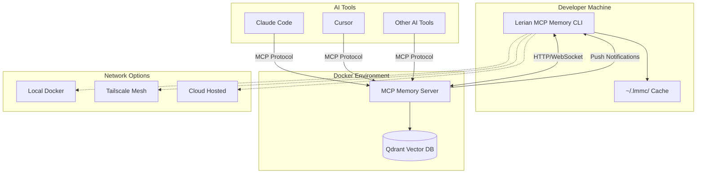
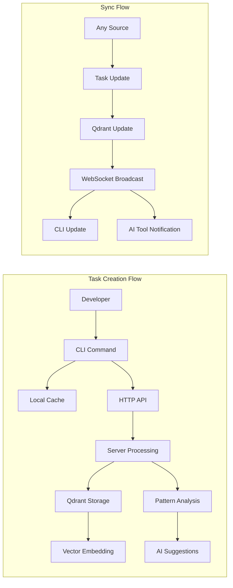
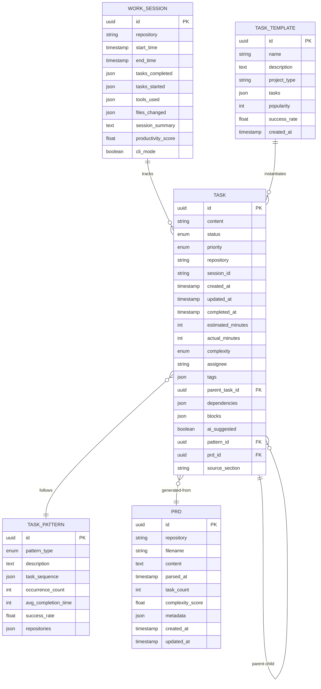
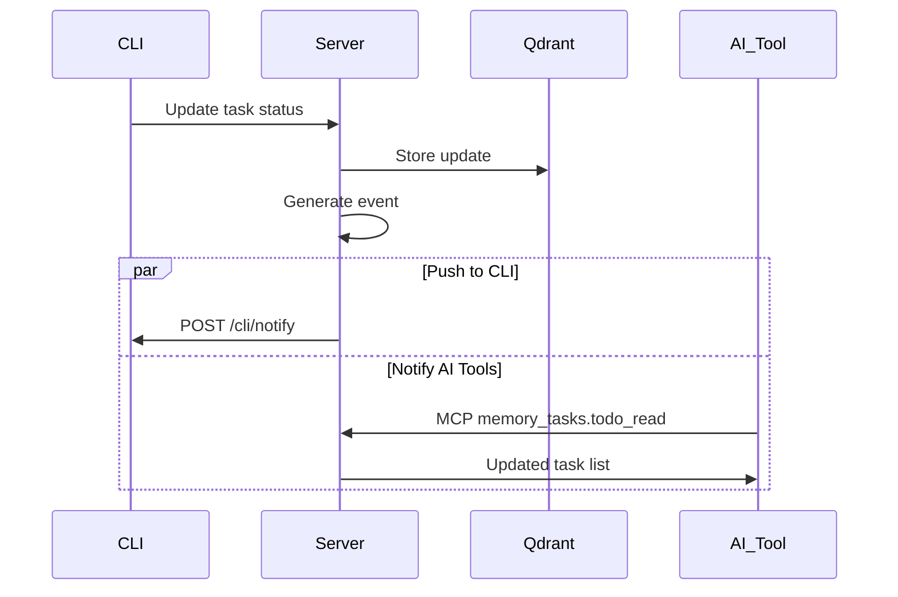
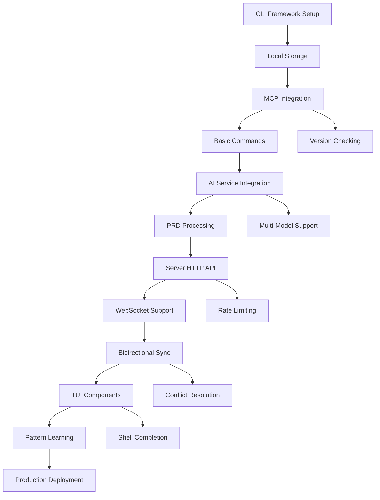

# TRD: Lerian MCP Memory - Integrated Memory and Task Management System

**Based on**: `docs/pre-development/prd-lmmc.md`  
**Created**: 2025-01-08  
**Version**: 1.0.0

## 0. Index

1. [Executive Summary](#1-executive-summary)
2. [System Architecture](#2-system-architecture)
3. [Technology Stack](#3-technology-stack)
4. [Data Architecture](#4-data-architecture)
5. [API Specifications](#5-api-specifications)
6. [Component Design](#6-component-design)
7. [Integration Architecture](#7-integration-architecture)
8. [Security Architecture](#8-security-architecture)
9. [Performance Requirements](#9-performance-requirements)
10. [Infrastructure Requirements](#10-infrastructure-requirements)
11. [Development Standards](#11-development-standards)
12. [Testing Strategy](#12-testing-strategy)
13. [Deployment Architecture](#13-deployment-architecture)
14. [Monitoring & Observability](#14-monitoring--observability)
15. [Technical Risks](#15-technical-risks)
16. [Implementation Roadmap](#16-implementation-roadmap)
17. [Technical Decisions](#17-technical-decisions)

## 1. Executive Summary

The Lerian MCP Memory system implements a hybrid architecture combining a containerized memory server with a local CLI client. This technical specification defines the implementation of bidirectional task management, AI-powered PRD parsing, and real-time synchronization across development tools.

### Key Technical Objectives

- **Hybrid Deployment**: Docker containers for server components, native CLI for user interface
- **Bidirectional Communication**: HTTP API + WebSocket for CLI↔Server, HTTP endpoints in CLI for push notifications
- **Multi-Model AI Integration**: Support for main, research, and fallback AI models via server's API keys
- **Source of Truth**: Qdrant vector database with local file fallback (~/.lmmc/)
- **Version Enforcement**: Strict semantic version compatibility between CLI and server
- **Offline-First CLI**: Full task management with sync warnings when disconnected

## 2. System Architecture

### High-Level Architecture



### Component Breakdown

**CLI Components**:
- Command handlers (Cobra framework)
- HTTP client for server communication
- Local storage manager (~/.lmmc/)
- REPL mode HTTP server (port 8080)
- AI model abstraction layer
- Sync manager with conflict resolution

**Server Components**:
- Existing MCP protocol handlers
- New HTTP API layer
- WebSocket manager for real-time updates
- Task processing engine
- PRD parser with AI integration
- Pattern detection engine

**Communication Patterns**:
- **CLI → Server**: HTTP/JSON for task operations
- **Server → CLI**: WebSocket events + HTTP push notifications
- **AI Tools → Server**: Existing MCP protocol
- **Server → Vector DB**: Direct Qdrant operations

### Data Flow



## 3. Technology Stack

### CLI Technology Stack

| Component | Technology | Version | Rationale |
|-----------|------------|---------|-----------|
| **Language** | Go | 1.23+ | Consistency with server, excellent CLI libraries |
| **CLI Framework** | Cobra | v1.8+ | Industry standard, excellent command structure |
| **TUI Library** | Bubble Tea | v0.25+ | Rich terminal UI, cross-platform |
| **HTTP Client** | Standard Library + Retries | Go 1.23 | Built-in reliability, no external deps |
| **Configuration** | Viper | v1.18+ | Flexible config management |
| **Local Storage** | JSON + File I/O | Standard Library | Simple, human-readable |
| **WebSocket Client** | gorilla/websocket | v1.5+ | Reliable WebSocket implementation |
| **Logging** | slog | Go 1.23 | Structured logging, built-in |

### Server Enhancement Stack

| Component | Technology | Version | Rationale |
|-----------|------------|---------|-----------|
| **HTTP Framework** | Chi Router | v5.0+ | Lightweight, compatible with existing code |
| **WebSocket Server** | gorilla/websocket | v1.5+ | Match client technology |
| **JSON Processing** | Standard Library | Go 1.23 | Performance, no external deps |
| **API Documentation** | OpenAPI 3.0 | Latest | Standard REST documentation |
| **Rate Limiting** | golang.org/x/time/rate | Latest | Built-in rate limiting |

### AI Integration Stack

| Component | Technology | Version | Rationale |
|-----------|------------|---------|-----------|
| **Primary Model** | Claude Sonnet 4 | Latest API | Main model for complex tasks and PRD parsing |
| **Research Model** | Perplexity Sonar Pro | Latest API | Deep analysis and research-intensive tasks |
| **Fallback Model** | OpenAI GPT-4o | Latest API | Reliable fallback for rate limiting scenarios |
| **Embedding Model** | text-embedding-ada-002 | Latest | Existing server integration |

### Infrastructure Stack

| Component | Technology | Version | Rationale |
|-----------|------------|---------|-----------|
| **Containerization** | Docker | 24.0+ | Server deployment consistency |
| **Vector Database** | Qdrant | 1.7+ | Existing production setup |
| **Orchestration** | Docker Compose | 2.0+ | Development simplicity |
| **Network Mesh** | Tailscale (User-Managed) | Latest | Zero-config secure networking (user responsibility) |
| **Distribution** | Homebrew + go install | Latest | Native package management |

## 4. Data Architecture

### Enhanced Entity Relationship Model

**Multi-Session Support**: The system must support multiple CLI instances running concurrently, each working on different sessions/projects simultaneously. Session isolation is achieved through the `session_id` field and repository-based filtering.



### Database Schema

**Task Table (Extended)**:
```sql
CREATE TABLE tasks (
    id UUID PRIMARY KEY DEFAULT uuid_generate_v4(),
    content TEXT NOT NULL,
    status VARCHAR(20) NOT NULL CHECK (status IN ('pending', 'in_progress', 'completed', 'cancelled')),
    priority VARCHAR(10) NOT NULL CHECK (priority IN ('low', 'medium', 'high')),
    repository VARCHAR(255) NOT NULL,
    session_id VARCHAR(255),
    created_at TIMESTAMP DEFAULT CURRENT_TIMESTAMP,
    updated_at TIMESTAMP DEFAULT CURRENT_TIMESTAMP,
    completed_at TIMESTAMP,
    estimated_minutes INTEGER CHECK (estimated_minutes >= 0),
    actual_minutes INTEGER CHECK (actual_minutes >= 0),
    complexity VARCHAR(10) CHECK (complexity IN ('simple', 'medium', 'complex', 'epic')),
    assignee VARCHAR(255),
    tags JSONB DEFAULT '[]',
    parent_task_id UUID REFERENCES tasks(id),
    dependencies JSONB DEFAULT '[]',
    blocks JSONB DEFAULT '[]',
    ai_suggested BOOLEAN DEFAULT FALSE,
    pattern_id UUID,
    prd_id UUID,
    source_section VARCHAR(255)
);

CREATE INDEX idx_tasks_repository ON tasks(repository);
CREATE INDEX idx_tasks_status ON tasks(status);
CREATE INDEX idx_tasks_created_at ON tasks(created_at);
CREATE INDEX idx_tasks_parent ON tasks(parent_task_id);
CREATE INDEX idx_tasks_prd ON tasks(prd_id);
CREATE INDEX idx_tasks_tags ON tasks USING GIN(tags);
```

**PRD Table**:
```sql
CREATE TABLE prds (
    id UUID PRIMARY KEY DEFAULT uuid_generate_v4(),
    repository VARCHAR(255) NOT NULL,
    filename VARCHAR(255) NOT NULL,
    content TEXT NOT NULL,
    parsed_at TIMESTAMP DEFAULT CURRENT_TIMESTAMP,
    task_count INTEGER DEFAULT 0,
    complexity_score FLOAT CHECK (complexity_score >= 0 AND complexity_score <= 1),
    metadata JSONB DEFAULT '{}',
    created_at TIMESTAMP DEFAULT CURRENT_TIMESTAMP,
    updated_at TIMESTAMP DEFAULT CURRENT_TIMESTAMP,
    UNIQUE(repository, filename)
);

CREATE INDEX idx_prds_repository ON prds(repository);
CREATE INDEX idx_prds_filename ON prds(filename);
```

### Data Migration Strategy

**Phase 1**: Extend existing tables
- Add new columns to existing task-related tables
- Maintain backward compatibility
- Use feature flags for new columns

**Phase 2**: Create new tables
- Add PRD, TaskTemplate, TaskPattern tables
- Populate with default data

**Schema Evolution**:
```sql
-- Migration 001: Add CLI task columns
ALTER TABLE chunks ADD COLUMN IF NOT EXISTS task_metadata JSONB DEFAULT '{}';
ALTER TABLE chunks ADD COLUMN IF NOT EXISTS cli_managed BOOLEAN DEFAULT FALSE;

-- Migration 002: Create task-specific tables
CREATE TABLE IF NOT EXISTS task_templates (...);
CREATE TABLE IF NOT EXISTS task_patterns (...);
CREATE TABLE IF NOT EXISTS prds (...);
```

## 5. API Specifications

### OpenAPI 3.0 Specification

```yaml
openapi: 3.0.0
info:
  title: Lerian MCP Memory API
  version: 1.0.0
  description: API for CLI task management and bidirectional communication

paths:
  /api/v1/tasks:
    get:
      summary: List tasks for repository
      security:
        - versionAuth: []
      parameters:
        - name: repository
          in: query
          required: true
          schema:
            type: string
        - name: status
          in: query
          schema:
            type: string
            enum: [pending, in_progress, completed, cancelled]
        - name: limit
          in: query
          schema:
            type: integer
            default: 50
            maximum: 200
      responses:
        '200':
          description: Task list retrieved successfully
          content:
            application/json:
              schema:
                $ref: '#/components/schemas/TaskListResponse'
        '400':
          description: Invalid parameters
        '429':
          description: Rate limit exceeded
    
    post:
      summary: Create new task
      security:
        - versionAuth: []
      requestBody:
        required: true
        content:
          application/json:
            schema:
              $ref: '#/components/schemas/CreateTaskRequest'
      responses:
        '201':
          description: Task created successfully
          content:
            application/json:
              schema:
                $ref: '#/components/schemas/Task'

  /api/v1/tasks/{id}:
    patch:
      summary: Update task
      security:
        - versionAuth: []
      parameters:
        - name: id
          in: path
          required: true
          schema:
            type: string
            format: uuid
      requestBody:
        required: true
        content:
          application/json:
            schema:
              $ref: '#/components/schemas/UpdateTaskRequest'
      responses:
        '200':
          description: Task updated successfully
        '404':
          description: Task not found
        '409':
          description: Conflict - task was modified

  /api/v1/prd/import:
    post:
      summary: Import and parse PRD
      security:
        - versionAuth: []
      requestBody:
        required: true
        content:
          application/json:
            schema:
              $ref: '#/components/schemas/PRDImportRequest'
      responses:
        '201':
          description: PRD imported and parsed successfully
          content:
            application/json:
              schema:
                $ref: '#/components/schemas/PRDImportResponse'

  /api/v1/tasks/suggest:
    post:
      summary: Get AI task suggestions
      security:
        - versionAuth: []
      requestBody:
        required: true
        content:
          application/json:
            schema:
              $ref: '#/components/schemas/TaskSuggestionRequest'
      responses:
        '200':
          description: Suggestions generated successfully
          content:
            application/json:
              schema:
                $ref: '#/components/schemas/TaskSuggestionResponse'

  /api/v1/ws:
    get:
      summary: WebSocket connection for real-time updates
      parameters:
        - name: repository
          in: query
          required: true
          schema:
            type: string
      responses:
        '101':
          description: WebSocket connection established

components:
  securitySchemes:
    versionAuth:
      type: apiKey
      in: header
      name: X-CLI-Version
      description: CLI version for compatibility checking

  schemas:
    Task:
      type: object
      required: [id, content, status, repository, created_at]
      properties:
        id:
          type: string
          format: uuid
        content:
          type: string
          minLength: 1
          maxLength: 1000
        status:
          type: string
          enum: [pending, in_progress, completed, cancelled]
        priority:
          type: string
          enum: [low, medium, high]
        repository:
          type: string
          pattern: '^[a-zA-Z0-9._/-]+$'
        estimated_minutes:
          type: integer
          minimum: 0
          maximum: 10080
        tags:
          type: array
          items:
            type: string
          maxItems: 10

    CreateTaskRequest:
      type: object
      required: [repository, content]
      properties:
        repository:
          type: string
        content:
          type: string
          minLength: 1
        priority:
          type: string
          enum: [low, medium, high]
          default: medium
        estimated_minutes:
          type: integer
          minimum: 0

    PRDImportRequest:
      type: object
      required: [repository, filename, content]
      properties:
        repository:
          type: string
        filename:
          type: string
        content:
          type: string
          minLength: 100
        auto_generate_subtasks:
          type: boolean
          default: true

    PRDImportResponse:
      type: object
      properties:
        prd_id:
          type: string
          format: uuid
        task_count:
          type: integer
        complexity_score:
          type: number
          minimum: 0
          maximum: 1
        tasks:
          type: array
          items:
            $ref: '#/components/schemas/Task'
```

### Rate Limiting Strategy

| Endpoint | Rate Limit | Window | Burst |
|----------|------------|--------|-------|
| GET /tasks | 100 req/min | 1 minute | 10 |
| POST /tasks | 30 req/min | 1 minute | 5 |
| PATCH /tasks/{id} | 60 req/min | 1 minute | 10 |
| POST /prd/import | 5 req/min | 1 minute | 2 |
| POST /tasks/suggest | 10 req/min | 1 minute | 3 |

### WebSocket Event Schema

**Task Update Event**:
```json
{
  "type": "task.updated",
  "timestamp": "2024-01-15T15:00:00Z",
  "data": {
    "id": "task_123",
    "repository": "github.com/user/project",
    "changes": {
      "status": "completed",
      "completed_at": "2024-01-15T15:00:00Z"
    },
    "updated_by": "ai_assistant"
  }
}
```

**Connection Protocol**:
```
1. Client connects with ?repository=<repo>&version=<cli_version>
2. Server validates version compatibility
3. Server sends connection_accepted event
4. Client subscribes to repository-specific updates
5. Server sends real-time task updates
```

## 6. Component Design

### CLI Architecture (Hexagonal)

```
CLI Application (Hexagonal Architecture)
├── cmd/
│   └── lerian-mcp-memory-cli/
│       └── main.go                    # Application entry point
├── internal/
│   ├── domain/                        # Business logic (no external deps)
│   │   ├── entities/
│   │   │   ├── task.go               # Task entity with validation
│   │   │   ├── session.go            # Work session entity
│   │   │   ├── prd.go                # PRD entity
│   │   │   └── template.go           # Task template entity
│   │   ├── services/
│   │   │   ├── task_service.go       # Core task operations
│   │   │   ├── prd_parser.go         # PRD parsing logic
│   │   │   ├── sync_service.go       # Synchronization logic
│   │   │   └── suggestion_service.go # AI suggestion logic
│   │   └── ports/                     # Interfaces for external deps
│   │       ├── api_client.go         # HTTP client interface
│   │       ├── storage.go            # Local storage interface
│   │       ├── ai_engine.go          # AI model interface
│   │       └── notification.go       # Push notification interface
│   ├── adapters/
│   │   ├── primary/                   # Inbound adapters
│   │   │   ├── cli/
│   │   │   │   ├── commands.go       # Cobra command handlers
│   │   │   │   ├── tui.go            # Bubble Tea components
│   │   │   │   └── repl.go           # REPL mode handler
│   │   │   └── http/
│   │   │       ├── server.go         # HTTP server for push notifications
│   │   │       └── handlers.go       # Notification handlers
│   │   ├── secondary/                 # Outbound adapters
│   │   │   ├── api/
│   │   │   │   ├── http_client.go    # Server HTTP client
│   │   │   │   ├── websocket.go      # WebSocket client
│   │   │   │   └── retry.go          # Retry logic
│   │   │   ├── storage/
│   │   │   │   ├── file_store.go     # ~/.lmmc/ file operations
│   │   │   │   ├── cache.go          # Local caching
│   │   │   │   └── sync.go           # Sync coordination
│   │   │   ├── ai/
│   │   │   │   ├── claude_client.go     # Claude Sonnet 4 API client
│   │   │   │   ├── perplexity_client.go # Perplexity Sonar Pro client
│   │   │   │   ├── openai_client.go     # OpenAI GPT-4o fallback client
│   │   │   │   ├── model_router.go      # Multi-model routing
│   │   │   │   └── fallback.go          # Fallback logic
│   │   │   └── network/
│   │   │       ├── tailscale.go      # Tailscale detection
│   │   │       └── discovery.go      # Server discovery
│   │   └── config/
│   │       ├── viper.go              # Configuration management
│   │       ├── env.go                # Environment variables
│   │       └── validation.go         # Config validation
│   └── infrastructure/               # Cross-cutting concerns
│       ├── logging/
│       │   └── slog.go              # Structured logging
│       ├── metrics/
│       │   └── telemetry.go         # Usage analytics
│       ├── auth/
│       │   └── version.go           # Version-based auth
│       └── errors/
│           └── handling.go          # Error handling
└── pkg/                             # Shared packages
    ├── types/                       # Shared types
    └── utils/                       # Utility functions
```

### Server Component Enhancements

```
Server Enhancements (Minimal Changes)
├── internal/
│   ├── api/                         # NEW: HTTP API layer
│   │   ├── handlers/
│   │   │   ├── task_handler.go      # Task CRUD operations
│   │   │   ├── prd_handler.go       # PRD import/parsing
│   │   │   ├── suggestion_handler.go # AI suggestions
│   │   │   └── websocket_handler.go # WebSocket management
│   │   ├── middleware/
│   │   │   ├── version_check.go     # CLI version validation
│   │   │   ├── rate_limit.go        # Rate limiting
│   │   │   ├── logging.go           # Request logging
│   │   │   └── cors.go              # CORS handling
│   │   ├── router.go                # Chi router setup
│   │   └── server.go                # HTTP server
│   ├── push/                        # NEW: Push notification system
│   │   ├── notifier.go              # CLI notification service
│   │   ├── registry.go              # CLI endpoint registry
│   │   └── events.go                # Event handling
│   └── mcp/                         # EXISTING: No initial changes
│       └── ...                      # Keep existing MCP handlers
└── cmd/
    └── server/
        └── main.go                  # MODIFIED: Add HTTP server startup
```

### State Management

**CLI State Flow**:
```
Local State → API Call → Server Processing → Qdrant Update → 
WebSocket Broadcast → CLI Update → Local State Sync
```

**Conflict Resolution**:
```
1. Detect version mismatch on API response
2. Fetch latest from Qdrant (source of truth)
3. Merge local changes if possible
4. Prompt user for manual resolution if needed
5. Update local cache with resolved state
```

## 7. Integration Architecture

### Communication Protocols

**CLI ↔ Server Communication**:
- **Protocol**: HTTPS + WebSocket
- **Format**: JSON
- **Authentication**: Version-based header validation
- **Retry Strategy**: Exponential backoff (100ms → 1.6s → 25.6s)
- **Timeout**: 30s for API calls, persistent WebSocket

**Server ↔ CLI Push Notifications**:
- **Protocol**: HTTP POST to CLI endpoints
- **Port**: CLI runs HTTP server on localhost:8080 (REPL mode only)
- **Security**: Localhost-only binding, no authentication required
- **Fallback**: WebSocket if push fails

**AI Tools ↔ Server**:
- **Protocol**: Existing MCP tools (memory_tasks.*)
- **No Changes**: Maintains backward compatibility
- **Enhancement**: Server enriches responses with CLI-generated data

### Integration Patterns

**Event-Driven Architecture**:


**Circuit Breaker Pattern**:
```go
type APIClient struct {
    client      *http.Client
    breaker     *circuitbreaker.CircuitBreaker
    fallback    *LocalStorage
}

func (c *APIClient) CreateTask(task *Task) error {
    return c.breaker.Execute(func() error {
        return c.httpCreateTask(task)
    }, func() error {
        // Fallback to local storage
        return c.fallback.StoreTask(task)
    })
}
```

**Saga Pattern for Complex Operations**:
```
PRD Import Saga:
1. Validate PRD file → [Rollback: return error]
2. Parse with AI → [Rollback: cleanup temp data]
3. Generate tasks → [Rollback: cleanup PRD record]
4. Store in Qdrant → [Rollback: cleanup tasks]
5. Notify CLI → [Rollback: mark sync pending]
```

## 8. Security Architecture

### Authentication Flow

**Local Connections (Default)**:
```
1. CLI detects local Docker containers
2. Connects to localhost:9080 (no auth required)
3. Server validates CLI version via header
4. Server allows full access for local connections
```

**Tailscale Mesh Networks**:
```
1. CLI detects Tailscale network
2. Connects to Tailscale IP (no additional auth)
3. Tailscale handles network-level security
4. Server validates CLI version
5. Server allows access based on network trust
```

**Cloud Connections (Future)**:
```
1. CLI prompts for API key
2. Stores encrypted credentials locally
3. Includes API key in Authorization header
4. Server validates against user database
```

### Security Measures

**Data Protection**:
- All task data encrypted in transit (HTTPS/WSS)
- Local cache files readable only by user
- No sensitive data in logs
- AI API keys secured on server only

**Network Security**:
- CLI validates server certificates
- WebSocket connections use WSS
- Rate limiting prevents abuse
- CORS configured for specific origins

**Version Security**:
```go
type VersionMiddleware struct {
    compatibleVersions map[string]bool
}

func (v *VersionMiddleware) Handler(next http.Handler) http.Handler {
    return http.HandlerFunc(func(w http.ResponseWriter, r *http.Request) {
        version := r.Header.Get("X-CLI-Version")
        if !v.compatibleVersions[version] {
            http.Error(w, "Incompatible CLI version", http.StatusUpgradeRequired)
            return
        }
        next.ServeHTTP(w, r)
    })
}
```

**Input Validation**:
```go
type TaskValidator struct{}

func (v *TaskValidator) ValidateCreateTask(req *CreateTaskRequest) error {
    if len(req.Content) == 0 || len(req.Content) > 1000 {
        return errors.New("content must be 1-1000 characters")
    }
    if !regexp.MustCompile(`^[a-zA-Z0-9._/-]+$`).MatchString(req.Repository) {
        return errors.New("invalid repository format")
    }
    return nil
}
```

## 9. Performance Requirements

### Performance Targets

| Metric | Target | Measurement Method |
|--------|--------|--------------------|
| CLI Command Response | <100ms | Command execution time |
| API Response Time | <50ms p95 | Prometheus histograms |
| WebSocket Message Latency | <10ms | Custom metrics |
| Task Sync Time | <200ms | End-to-end measurement |
| PRD Parsing Time | <30s for 50-page PRD | Processing duration |
| Concurrent CLI Connections | 1000+ | Load testing |
| Task Search Response | <100ms | Vector search time |
| Local Cache Access | <5ms | File I/O metrics |

### Optimization Strategies

**CLI Performance**:
- Local cache for immediate responses
- Async sync operations
- Compressed API responses
- Connection pooling
- Command autocompletion caching

**Server Performance**:
- Redis cache for frequent queries
- Qdrant query optimization
- Batch operations for bulk updates
- Connection pooling for database
- Efficient WebSocket broadcasting

**AI Performance**:
- Model response caching
- Prompt optimization
- Parallel AI model requests
- Streaming responses for long operations

**Load Testing Strategy**:
```bash
# CLI Load Test
for i in {1..100}; do
  lmmc add "Test task $i" &
done
wait

# API Load Test
ab -n 1000 -c 50 -H "X-CLI-Version: 1.0.0" \
   http://localhost:9080/api/v1/tasks?repository=test

# WebSocket Load Test
ws-loadtest ws://localhost:9080/api/v1/ws?repository=test \
   --amount 100 --concurrency 10
```

### Capacity Planning

**Resource Requirements (per 100 active users)**:
- CPU: 2 cores (server), minimal (CLI)
- RAM: 4GB (server), 50MB (CLI)
- Storage: 10GB (Qdrant), 100MB (local cache)
- Network: 10 Mbps sustained
- File Descriptors: 2000 (for WebSocket connections)

## 10. Infrastructure Requirements

### Development Environment

**Local Development Setup**:
```yaml
# docker-compose.dev.yml
version: '3.8'
services:
  lmmc-server:
    build:
      context: .
      dockerfile: Dockerfile.dev
    ports:
      - "9080:9080"
      - "9081:9081"  # WebSocket
    environment:
      - ENVIRONMENT=development
      - QDRANT_HOST=qdrant
      - OPENAI_API_KEY=${OPENAI_API_KEY}
    volumes:
      - ./configs/dev:/app/configs
    depends_on:
      - qdrant
  
  qdrant:
    image: qdrant/qdrant:v1.7.0
    ports:
      - "6333:6333"
    volumes:
      - qdrant_data:/qdrant/storage
    environment:
      - QDRANT__SERVICE__HTTP_PORT=6333

volumes:
  qdrant_data:
```

**CLI Development**:
```bash
# CLI development in separate folder
cd cli/
go build -o bin/lmmc cmd/lerian-mcp-memory-cli/main.go
./bin/lmmc config set server.url http://localhost:9080
./bin/lmmc config set server.version 1.0.0
```

### Production Infrastructure

**Container Specifications**:
```yaml
# Production docker-compose.yml
version: '3.8'
services:
  lmmc-server:
    image: ghcr.io/lerianstudio/lerian-mcp-memory:1.0.0
    restart: unless-stopped
    ports:
      - "9080:9080"
    environment:
      - ENVIRONMENT=production
      - QDRANT_HOST=qdrant
      - LOG_LEVEL=info
    healthcheck:
      test: ["CMD", "curl", "-f", "http://localhost:9080/health"]
      interval: 30s
      timeout: 10s
      retries: 3
    volumes:
      - ./configs/production:/app/configs:ro
      - ./logs:/app/logs
    depends_on:
      - qdrant
  
  qdrant:
    image: qdrant/qdrant:v1.7.0
    restart: unless-stopped
    volumes:
      - qdrant_data:/qdrant/storage
      - ./qdrant-config.yaml:/qdrant/config/production.yaml
    environment:
      - QDRANT__SERVICE__HTTP_PORT=6333
      - QDRANT__CLUSTER__ENABLED=false

volumes:
  qdrant_data:
    driver: local
```

**CLI Distribution**:
```ruby
# Homebrew formula (homebrew-tap/lmmc.rb)
class Lmmc < Formula
  desc "Lerian MCP Memory CLI for intelligent task management"
  homepage "https://github.com/lerianstudio/lerian-mcp-memory"
  url "https://github.com/lerianstudio/lerian-mcp-memory/releases/download/v1.0.0/lmmc-darwin-amd64.tar.gz"
  sha256 "abc123..."
  version "1.0.0"

  def install
    bin.install "lmmc"
    bin.install_symlink "lmmc" => "lerian-mcp-memory-cli"
    
    # Install shell completions
    (bash_completion/"lmmc").write `#{bin}/lmmc completion bash`
    (zsh_completion/"_lmmc").write `#{bin}/lmmc completion zsh`
    (fish_completion/"lmmc.fish").write `#{bin}/lmmc completion fish`
  end
end
```

### Network Architecture

**Tailscale Integration** (User-Managed):
The CLI will detect Tailscale networks but users are responsible for setting up and managing their Tailscale mesh network. The best practice is to run the server under a Tailscale mesh network for secure remote access.
```go
type TailscaleDetector struct {
    client *http.Client
}

func (t *TailscaleDetector) DetectTailscaleNetwork() (*NetworkConfig, error) {
    // Check for tailscale status
    cmd := exec.Command("tailscale", "status", "--json")
    output, err := cmd.Output()
    if err != nil {
        return nil, err
    }
    
    var status TailscaleStatus
    json.Unmarshal(output, &status)
    
    return &NetworkConfig{
        Type: "tailscale",
        ServerURL: fmt.Sprintf("https://%s:9080", status.Self.TailscaleIPs[0]),
        Secure: true,
    }, nil
}
```

## 11. Development Standards

### Code Quality Standards

**Go Code Standards**:
```go
// golangci-lint configuration (.golangci.yml)
linters:
  enable:
    - gofmt
    - goimports
    - govet
    - errcheck
    - staticcheck
    - unused
    - gosimple
    - structcheck
    - varcheck
    - ineffassign
    - deadcode
    - misspell
    - gocyclo
    - golint

linters-settings:
  gocyclo:
    min-complexity: 10
  misspell:
    locale: US
```

**Code Documentation**:
```go
// TaskService handles core task operations
type TaskService struct {
    apiClient ports.APIClient
    storage   ports.Storage
    logger    *slog.Logger
}

// CreateTask creates a new task with validation and sync
// Returns the created task ID or an error if validation fails
func (s *TaskService) CreateTask(ctx context.Context, req *CreateTaskRequest) (*Task, error) {
    // Implementation with proper error handling
}
```

**Error Handling Standards**:
```go
// Define custom error types
type TaskValidationError struct {
    Field   string
    Message string
}

func (e *TaskValidationError) Error() string {
    return fmt.Sprintf("validation error on field %s: %s", e.Field, e.Message)
}

// Use structured error handling
func (s *TaskService) validateTask(task *Task) error {
    if len(task.Content) == 0 {
        return &TaskValidationError{
            Field:   "content",
            Message: "content cannot be empty",
        }
    }
    return nil
}
```

### Git Workflow

**Branching Strategy**:
- **main**: Production-ready code
- **develop**: Integration branch for features
- **feature/***: Individual feature branches
- **hotfix/***: Critical bug fixes
- **release/***: Release preparation

**Commit Message Format**:
```
<type>(<scope>): <description>

<body>

<footer>
```

**Types**: feat, fix, docs, style, refactor, test, build, ci, perf, chore

**Example**:
```
feat(cli): add PRD import command with AI parsing

- Implement lmmc prd import command
- Add AI-powered task generation
- Include complexity analysis
- Support subtask creation

Closes #123
```

**Pull Request Requirements**:
- [ ] All tests pass
- [ ] Code coverage ≥ 80%
- [ ] Documentation updated
- [ ] No linting errors
- [ ] Manual testing completed
- [ ] Security review (if applicable)

### Dependency Management

**Go Module Management**:
```go
// go.mod version pinning
module github.com/lerianstudio/lerian-mcp-memory/cli

go 1.23

require (
    github.com/spf13/cobra v1.8.0
    github.com/charmbracelet/bubbletea v0.25.0
    github.com/spf13/viper v1.18.0
    github.com/gorilla/websocket v1.5.0
)

// Use exact versions for critical dependencies
require (
    github.com/google/uuid v1.6.0 // exact version
    golang.org/x/time v0.5.0     // rate limiting
)
```

**Security Scanning**:
```bash
# Automated dependency scanning
go list -json -deps ./... | nancy sleuth

# Vulnerability checking
govulncheck ./...

# License compliance
go-licenses check ./...
```

## 12. Testing Strategy

### Test Distribution

```
Test Pyramid Distribution:
- Unit Tests: 70% (≥80% coverage)
- Integration Tests: 20% (API + storage)
- End-to-End Tests: 10% (critical user flows)
```

### Unit Testing

**CLI Component Tests**:
```go
func TestTaskService_CreateTask(t *testing.T) {
    tests := []struct {
        name    string
        request *CreateTaskRequest
        setup   func(*mocks.MockAPIClient, *mocks.MockStorage)
        want    *Task
        wantErr bool
    }{
        {
            name: "successful task creation",
            request: &CreateTaskRequest{
                Repository: "github.com/user/project",
                Content:    "Implement authentication",
                Priority:   "high",
            },
            setup: func(api *mocks.MockAPIClient, storage *mocks.MockStorage) {
                api.EXPECT().CreateTask(gomock.Any(), gomock.Any()).Return(&Task{
                    ID:         "task_123",
                    Content:    "Implement authentication",
                    Status:     "pending",
                    Repository: "github.com/user/project",
                }, nil)
                storage.EXPECT().CacheTask(gomock.Any()).Return(nil)
            },
            want: &Task{
                ID:         "task_123",
                Content:    "Implement authentication",
                Status:     "pending",
                Repository: "github.com/user/project",
            },
            wantErr: false,
        },
    }

    for _, tt := range tests {
        t.Run(tt.name, func(t *testing.T) {
            ctrl := gomock.NewController(t)
            defer ctrl.Finish()

            apiClient := mocks.NewMockAPIClient(ctrl)
            storage := mocks.NewMockStorage(ctrl)
            
            tt.setup(apiClient, storage)
            
            service := &TaskService{
                apiClient: apiClient,
                storage:   storage,
                logger:    slog.Default(),
            }

            got, err := service.CreateTask(context.Background(), tt.request)
            
            if tt.wantErr {
                assert.Error(t, err)
                return
            }
            
            assert.NoError(t, err)
            assert.Equal(t, tt.want, got)
        })
    }
}
```

### Integration Testing

**API Integration Tests**:
```go
func TestAPIIntegration(t *testing.T) {
    // Start test server
    server := httptest.NewServer(setupTestRoutes())
    defer server.Close()

    client := &http.Client{Timeout: 5 * time.Second}

    t.Run("create and retrieve task", func(t *testing.T) {
        // Create task
        task := CreateTaskRequest{
            Repository: "test/repo",
            Content:    "Test task",
            Priority:   "medium",
        }
        
        body, _ := json.Marshal(task)
        resp, err := client.Post(
            server.URL+"/api/v1/tasks",
            "application/json",
            bytes.NewBuffer(body),
        )
        
        assert.NoError(t, err)
        assert.Equal(t, http.StatusCreated, resp.StatusCode)
        
        var created Task
        json.NewDecoder(resp.Body).Decode(&created)
        
        // Retrieve task
        resp, err = client.Get(
            server.URL+"/api/v1/tasks/"+created.ID,
        )
        
        assert.NoError(t, err)
        assert.Equal(t, http.StatusOK, resp.StatusCode)
        
        var retrieved Task
        json.NewDecoder(resp.Body).Decode(&retrieved)
        assert.Equal(t, created.ID, retrieved.ID)
    })
}
```

### End-to-End Testing

**CLI E2E Tests**:
```bash
#!/bin/bash
# e2e_test.sh

set -e

# Setup test environment
docker-compose -f docker-compose.test.yml up -d
trap 'docker-compose -f docker-compose.test.yml down' EXIT

# Wait for services
./scripts/wait-for-services.sh

# Build CLI
cd cli && go build -o ../bin/lmmc-test cmd/lerian-mcp-memory-cli/main.go
cd ..

# Configure test CLI
export LMMC_CONFIG_PATH=./test-config
./bin/lmmc-test config set server.url http://localhost:9080
./bin/lmmc-test config set repository test/repo

# Test basic workflow
echo "Testing basic task workflow..."
./bin/lmmc-test add "Test task from e2e"
TASK_ID=$(./bin/lmmc-test list --format=json | jq -r '.[0].id')
./bin/lmmc-test start "$TASK_ID"
./bin/lmmc-test done "$TASK_ID"

# Test PRD import
echo "Testing PRD import..."
./bin/lmmc-test prd import ./test-data/sample-prd.md

# Verify results
TASK_COUNT=$(./bin/lmmc-test list --format=json | jq length)
if [ "$TASK_COUNT" -lt 2 ]; then
    echo "E2E test failed: Expected at least 2 tasks"
    exit 1
fi

echo "E2E tests passed!"
```

### Test Data Management

**Test Fixtures**:
```go
// testdata/fixtures.go
var TestTasks = []Task{
    {
        ID:         "task_001",
        Content:    "Implement user authentication",
        Status:     "pending",
        Priority:   "high",
        Repository: "github.com/user/project",
        CreatedAt:  time.Date(2024, 1, 15, 10, 0, 0, 0, time.UTC),
    },
    // More test fixtures...
}

func LoadTestData(t *testing.T) []Task {
    return TestTasks
}
```

## 13. Deployment Architecture

### CI/CD Pipeline

```yaml
# .github/workflows/ci.yml
name: CI/CD Pipeline

on:
  push:
    branches: [main, develop]
  pull_request:
    branches: [main]

jobs:
  test:
    runs-on: ubuntu-latest
    services:
      qdrant:
        image: qdrant/qdrant:v1.7.0
        ports:
          - 6333:6333
    steps:
      - uses: actions/checkout@v4
      - uses: actions/setup-go@v4
        with:
          go-version: '1.23'
      
      - name: Run tests
        run: |
          make test
          make test-integration
          make test-coverage
      
      - name: Upload coverage
        uses: codecov/codecov-action@v3

  build-cli:
    needs: test
    runs-on: ubuntu-latest
    strategy:
      matrix:
        os: [darwin, linux, windows]
        arch: [amd64, arm64]
    steps:
      - uses: actions/checkout@v4
      - uses: actions/setup-go@v4
        with:
          go-version: '1.23'
      
      - name: Build CLI
        run: |
          cd cli
          GOOS=${{ matrix.os }} GOARCH=${{ matrix.arch }} \
          go build -o ../dist/lmmc-${{ matrix.os }}-${{ matrix.arch }} \
          cmd/lerian-mcp-memory-cli/main.go
      
      - name: Upload artifacts
        uses: actions/upload-artifact@v3
        with:
          name: cli-binaries
          path: dist/

  build-server:
    needs: test
    runs-on: ubuntu-latest
    steps:
      - uses: actions/checkout@v4
      - name: Build and push Docker image
        uses: docker/build-push-action@v4
        with:
          context: .
          push: true
          tags: ghcr.io/lerianstudio/lerian-mcp-memory:${{ github.sha }}

  release:
    needs: [build-cli, build-server]
    runs-on: ubuntu-latest
    if: github.ref == 'refs/heads/main'
    steps:
      - name: Create GitHub Release
        uses: actions/create-release@v1
        with:
          tag_name: v${{ github.run_number }}
          release_name: Release v${{ github.run_number }}
          
      - name: Update Homebrew formula
        run: |
          # Automated Homebrew formula update
          ./scripts/update-homebrew.sh
```

### Container Strategy

**Dockerfile.production**:
```dockerfile
# Multi-stage build for server
FROM golang:1.23-alpine AS builder

WORKDIR /app
COPY go.mod go.sum ./
RUN go mod download

COPY . .
RUN CGO_ENABLED=0 GOOS=linux go build -a -installsuffix cgo \
    -o server cmd/server/main.go

FROM alpine:3.18
RUN apk --no-cache add ca-certificates tzdata
WORKDIR /root/

COPY --from=builder /app/server .
COPY --from=builder /app/configs ./configs

EXPOSE 9080 9081
HEALTHCHECK --interval=30s --timeout=10s --start-period=60s --retries=3 \
  CMD curl -f http://localhost:9080/health || exit 1

CMD ["./server"]
```

**Kubernetes Deployment (Future)**:
```yaml
apiVersion: apps/v1
kind: Deployment
metadata:
  name: lmmc-server
spec:
  replicas: 3
  selector:
    matchLabels:
      app: lmmc-server
  template:
    metadata:
      labels:
        app: lmmc-server
    spec:
      containers:
      - name: server
        image: ghcr.io/lerianstudio/lerian-mcp-memory:latest
        ports:
        - containerPort: 9080
        env:
        - name: QDRANT_HOST
          value: "qdrant-service"
        - name: ENVIRONMENT
          value: "production"
        resources:
          limits:
            cpu: 1000m
            memory: 2Gi
          requests:
            cpu: 500m
            memory: 1Gi
        livenessProbe:
          httpGet:
            path: /health
            port: 9080
          initialDelaySeconds: 30
          periodSeconds: 10
        readinessProbe:
          httpGet:
            path: /ready
            port: 9080
          initialDelaySeconds: 5
          periodSeconds: 5
```

### Rollback Strategy

**Zero-Downtime Deployment**:
```bash
#!/bin/bash
# deploy.sh

set -e

OLD_VERSION=$(docker ps --format "table {{.Image}}" | grep lmmc | head -1)
NEW_VERSION="ghcr.io/lerianstudio/lerian-mcp-memory:$1"

echo "Deploying $NEW_VERSION (current: $OLD_VERSION)"

# Pull new image
docker pull "$NEW_VERSION"

# Update docker-compose with new version
sed -i "s|image: .*lmmc.*|image: $NEW_VERSION|" docker-compose.yml

# Rolling update
docker-compose up -d --no-deps server

# Wait for health check
for i in {1..30}; do
    if curl -f http://localhost:9080/health; then
        echo "Deployment successful"
        break
    fi
    echo "Waiting for health check... ($i/30)"
    sleep 2
done

# Cleanup old images
docker image prune -f

echo "Deployment completed"
```

**Rollback Procedure**:
```bash
#!/bin/bash
# rollback.sh

PREVIOUS_VERSION=$(docker images --format "table {{.Repository}}:{{.Tag}}" | grep lmmc | sed -n '2p')

if [ -z "$PREVIOUS_VERSION" ]; then
    echo "No previous version found for rollback"
    exit 1
fi

echo "Rolling back to $PREVIOUS_VERSION"

# Update docker-compose
sed -i "s|image: .*lmmc.*|image: $PREVIOUS_VERSION|" docker-compose.yml

# Deploy previous version
docker-compose up -d --no-deps server

# Verify rollback
curl -f http://localhost:9080/health
echo "Rollback completed"
```

## 14. Monitoring & Observability

### Metrics Collection

**CLI Metrics**:
```go
type TelemetryCollector struct {
    endpoint string
    client   *http.Client
    buffer   chan Metric
}

type Metric struct {
    Name      string            `json:"name"`
    Value     float64           `json:"value"`
    Labels    map[string]string `json:"labels"`
    Timestamp time.Time         `json:"timestamp"`
}

func (t *TelemetryCollector) RecordCommand(command string, duration time.Duration, success bool) {
    metric := Metric{
        Name:  "cli_command_duration_seconds",
        Value: duration.Seconds(),
        Labels: map[string]string{
            "command": command,
            "success": strconv.FormatBool(success),
            "version": BuildVersion,
        },
        Timestamp: time.Now(),
    }
    
    select {
    case t.buffer <- metric:
    default:
        // Drop metric if buffer full
    }
}
```

**Server Metrics (Prometheus)**:
```go
var (
    httpRequestsTotal = prometheus.NewCounterVec(
        prometheus.CounterOpts{
            Name: "lmmc_http_requests_total",
            Help: "Total number of HTTP requests",
        },
        []string{"method", "endpoint", "status"},
    )
    
    httpRequestDuration = prometheus.NewHistogramVec(
        prometheus.HistogramOpts{
            Name:    "lmmc_http_request_duration_seconds",
            Help:    "HTTP request duration in seconds",
            Buckets: prometheus.DefBuckets,
        },
        []string{"method", "endpoint"},
    )
    
    tasksTotal = prometheus.NewCounterVec(
        prometheus.CounterOpts{
            Name: "lmmc_tasks_total",
            Help: "Total number of tasks created",
        },
        []string{"repository", "status"},
    )
    
    aiRequestsTotal = prometheus.NewCounterVec(
        prometheus.CounterOpts{
            Name: "lmmc_ai_requests_total",
            Help: "Total number of AI API requests",
        },
        []string{"model", "operation", "status"},
    )
)
```

### Logging Strategy

**Structured Logging**:
```go
// CLI logging
logger := slog.New(slog.NewJSONHandler(os.Stdout, &slog.HandlerOptions{
    Level: slog.LevelInfo,
}))

logger.Info("command executed",
    slog.String("command", "add"),
    slog.String("repository", "github.com/user/project"),
    slog.Duration("duration", duration),
    slog.Bool("success", true),
)

// Server logging
logger.Error("failed to create task",
    slog.String("task_id", taskID),
    slog.String("repository", repository),
    slog.Any("error", err),
    slog.String("trace_id", traceID),
)
```

**Log Levels**:
- **DEBUG**: Detailed information for diagnosis
- **INFO**: General information about operations
- **WARN**: Warning messages for unusual conditions
- **ERROR**: Error conditions that don't stop the application
- **FATAL**: Critical errors that stop the application

### Alerting Rules

**Critical Alerts**:
```yaml
# alerts.yml
groups:
- name: lmmc-critical
  rules:
  - alert: LMMCServerDown
    expr: up{job="lmmc-server"} == 0
    for: 1m
    labels:
      severity: critical
    annotations:
      summary: "LMMC Server is down"
      description: "LMMC Server has been down for more than 1 minute"

  - alert: HighErrorRate
    expr: |
      (
        rate(lmmc_http_requests_total{status=~"5.."}[5m]) /
        rate(lmmc_http_requests_total[5m])
      ) > 0.05
    for: 5m
    labels:
      severity: warning
    annotations:
      summary: "High error rate detected"
      description: "Error rate is {{ $value | humanizePercentage }} over the last 5 minutes"

  - alert: QdrantDown
    expr: up{job="qdrant"} == 0
    for: 30s
    labels:
      severity: critical
    annotations:
      summary: "Qdrant database is down"
      description: "Qdrant has been unreachable for more than 30 seconds"
```

### Distributed Tracing

**OpenTelemetry Integration**:
```go
func setupTracing() *trace.TracerProvider {
    exporter, err := jaeger.New(jaeger.WithCollectorEndpoint(
        jaeger.WithEndpoint("http://localhost:14268/api/traces"),
    ))
    if err != nil {
        log.Fatal(err)
    }

    tp := trace.NewTracerProvider(
        trace.WithBatcher(exporter),
        trace.WithResource(resource.NewWithAttributes(
            semconv.SchemaURL,
            semconv.ServiceNameKey.String("lmmc-server"),
            semconv.ServiceVersionKey.String("1.0.0"),
        )),
    )
    
    otel.SetTracerProvider(tp)
    return tp
}

func (s *TaskService) CreateTask(ctx context.Context, req *CreateTaskRequest) (*Task, error) {
    ctx, span := tracer.Start(ctx, "task_service.create_task")
    defer span.End()
    
    span.SetAttributes(
        attribute.String("repository", req.Repository),
        attribute.String("priority", req.Priority),
    )
    
    // Implementation with tracing
    task, err := s.processTask(ctx, req)
    if err != nil {
        span.RecordError(err)
        span.SetStatus(codes.Error, err.Error())
        return nil, err
    }
    
    span.SetAttributes(attribute.String("task_id", task.ID))
    return task, nil
}
```

### Dashboard Configuration

**Grafana Dashboard**:
```json
{
  "dashboard": {
    "title": "LMMC System Monitoring",
    "panels": [
      {
        "title": "CLI Command Rate",
        "type": "graph",
        "targets": [
          {
            "expr": "rate(lmmc_cli_commands_total[5m])",
            "legendFormat": "{{command}}"
          }
        ]
      },
      {
        "title": "API Response Time",
        "type": "graph",
        "targets": [
          {
            "expr": "histogram_quantile(0.95, rate(lmmc_http_request_duration_seconds_bucket[5m]))",
            "legendFormat": "95th percentile"
          }
        ]
      },
      {
        "title": "Task Creation Rate",
        "type": "stat",
        "targets": [
          {
            "expr": "rate(lmmc_tasks_total[1h])",
            "legendFormat": "Tasks/hour"
          }
        ]
      }
    ]
  }
}
```

## 15. Technical Risks

### High-Impact Risks

**Risk: CLI-Server Version Synchronization**
- **Impact**: Critical - Incompatible versions break functionality
- **Probability**: Medium
- **Technical Mitigation**: 
  ```go
  type VersionChecker struct {
      requiredVersion string
      compatibleVersions []string
  }
  
  func (v *VersionChecker) ValidateVersion(clientVersion string) error {
      if !v.isCompatible(clientVersion) {
          return &VersionMismatchError{
              Required: v.requiredVersion,
              Provided: clientVersion,
              UpgradeURL: "https://github.com/lerianstudio/lerian-mcp-memory/releases",
          }
      }
      return nil
  }
  ```
- **Contingency**: Automatic version checking, clear upgrade paths

**Risk: WebSocket Connection Stability**
- **Impact**: High - Real-time sync fails
- **Probability**: Medium
- **Technical Mitigation**:
  ```go
  type ReconnectingWebSocket struct {
      url           string
      conn          *websocket.Conn
      reconnectDelay time.Duration
      maxReconnects  int
  }
  
  func (r *ReconnectingWebSocket) maintainConnection() {
      for {
          if err := r.connect(); err != nil {
              r.reconnectDelay = min(r.reconnectDelay*2, 30*time.Second)
              time.Sleep(r.reconnectDelay)
              continue
          }
          r.reconnectDelay = 1 * time.Second
          r.handleMessages()
      }
  }
  ```
- **Contingency**: HTTP fallback, periodic polling

**Risk: Qdrant Performance Under Load**
- **Impact**: High - System becomes unresponsive
- **Probability**: Low
- **Technical Mitigation**:
  ```go
  type QdrantCircuitBreaker struct {
      breaker *circuit.Breaker
      cache   *sync.Map
  }
  
  func (q *QdrantCircuitBreaker) Search(query *SearchQuery) (*SearchResult, error) {
      return q.breaker.Execute(func() (*SearchResult, error) {
          return q.qdrantClient.Search(query)
      }, func() (*SearchResult, error) {
          // Fallback to cached results
          return q.getCachedResults(query)
      })
  }
  ```
- **Contingency**: Query optimization, caching layer, read replicas

### Medium-Impact Risks

**Risk: AI Model Rate Limiting**
- **Impact**: Medium - PRD parsing becomes slow
- **Probability**: High
- **Technical Mitigation**:
  ```go
  type AIModelRouter struct {
      primary   AIClient
      secondary AIClient
      fallback  AIClient
      rateLimiter *rate.Limiter
  }
  
  func (r *AIModelRouter) ProcessPRD(prd string) (*TaskList, error) {
      if r.rateLimiter.Allow() {
          if result, err := r.primary.Process(prd); err == nil {
              return result, nil
          }
      }
      
      // Try secondary model
      if result, err := r.secondary.Process(prd); err == nil {
          return result, nil
      }
      
      // Fallback to simpler model
      return r.fallback.Process(prd)
  }
  ```
- **Contingency**: Multiple model tiers, request queuing

**Risk: Local Cache Corruption**
- **Impact**: Medium - CLI data loss, sync issues
- **Probability**: Low
- **Technical Mitigation**:
  ```go
  type SafeFileStorage struct {
      basePath string
      mutex    sync.RWMutex
  }
  
  func (s *SafeFileStorage) SaveTasks(tasks []Task) error {
      s.mutex.Lock()
      defer s.mutex.Unlock()
      
      tempFile := s.basePath + ".tmp"
      backupFile := s.basePath + ".backup"
      
      // Write to temp file first
      if err := s.writeToFile(tempFile, tasks); err != nil {
          return err
      }
      
      // Create backup of current file
      if _, err := os.Stat(s.basePath); err == nil {
          os.Rename(s.basePath, backupFile)
      }
      
      // Atomic move
      return os.Rename(tempFile, s.basePath)
  }
  ```
- **Contingency**: Automatic backup, integrity checks, server recovery

### Low-Impact Risks

**Risk: Shell Completion Installation**
- **Impact**: Low - Reduced UX convenience
- **Probability**: Medium
- **Technical Mitigation**:
  ```bash
  # Auto-detect shell and install completion
  detect_shell() {
      case "$SHELL" in
          */bash) echo "bash" ;;
          */zsh) echo "zsh" ;;
          */fish) echo "fish" ;;
          *) echo "unknown" ;;
      esac
  }
  
  install_completion() {
      SHELL_TYPE=$(detect_shell)
      case "$SHELL_TYPE" in
          bash) lmmc completion bash > /usr/local/etc/bash_completion.d/lmmc ;;
          zsh) lmmc completion zsh > "${fpath[1]}/_lmmc" ;;
          fish) lmmc completion fish > ~/.config/fish/completions/lmmc.fish ;;
          *) echo "Manual completion setup required" ;;
      esac
  }
  ```
- **Contingency**: Manual installation docs, fallback instructions

## 16. Implementation Roadmap

### Phase 1: CLI Foundation (4-6 weeks)

**Week 1-2: Project Setup**
- [ ] Create `cli/` folder structure following Hexagonal Architecture
- [ ] Setup Go modules and dependency management
- [ ] Implement Cobra command framework
- [ ] Create basic commands: `add`, `list`, `start`, `done`
- [ ] Setup local file storage in `~/.lmmc/`
- [ ] Implement configuration management with Viper

**Week 3-4: Core Features**
- [ ] Implement task entity and validation
- [ ] Create local storage adapters (JSON files)
- [ ] Add version checking mechanism
- [ ] Implement basic CLI output formatting
- [ ] Create error handling and logging

**Week 5-6: MCP Integration**
- [ ] Integrate with existing `memory_tasks` MCP tools
- [ ] Implement sync between local storage and Qdrant
- [ ] Add offline mode with graceful degradation
- [ ] Setup automated testing (unit + integration)

**Deliverable**: Working CLI that manages tasks locally and syncs with MCP Memory Server

### Phase 2: AI-Powered Features (3-4 weeks)

**Week 7-8: PRD Processing**
- [ ] Implement PRD file import functionality
- [ ] Create AI service with multi-model support
- [ ] Develop PRD parsing with task generation
- [ ] Add complexity analysis algorithms

**Week 9-10: Intelligence Features**
- [ ] Implement sub-task generation
- [ ] Add task relationship handling
- [ ] Create suggestion engine
- [ ] Setup REPL mode with HTTP server for push notifications

**Deliverable**: CLI with AI-powered PRD parsing and intelligent task suggestions

### Phase 3: Server Integration (3-4 weeks)

**Week 11-12: HTTP API Layer**
- [ ] Add minimal HTTP endpoints to server
- [ ] Implement version compatibility checking
- [ ] Create WebSocket support for real-time updates
- [ ] Add rate limiting and security measures

**Week 13-14: Bidirectional Communication**
- [ ] Implement CLI HTTP server for push notifications
- [ ] Setup real-time synchronization
- [ ] Add conflict resolution with Qdrant as source of truth
- [ ] Implement Tailscale auto-detection

**Deliverable**: Full bidirectional sync between CLI and AI assistants

### Phase 4: Advanced Features (4-5 weeks)

**Week 15-16: Enhanced UI**
- [ ] Implement Bubble Tea TUI components
- [ ] Add interactive task selection
- [ ] Create rich terminal formatting
- [ ] Setup shell completion auto-installation

**Week 17-18: Pattern Learning**
- [ ] Implement task pattern detection
- [ ] Create template system
- [ ] Add cross-project insights
- [ ] Setup analytics and reporting

**Week 19: Polish & Documentation**
- [ ] Performance optimization
- [ ] Complete test coverage
- [ ] Documentation and examples
- [ ] Homebrew formula preparation

**Deliverable**: Production-ready system with advanced features

### Phase 5: Production Deployment (2-3 weeks)

**Week 20-21: Deployment Infrastructure**
- [ ] Setup CI/CD pipeline
- [ ] Configure monitoring and observability
- [ ] Implement automated testing in CI
- [ ] Setup release automation

**Week 22: Distribution & Launch**
- [ ] Publish Homebrew formula
- [ ] Setup `go install` distribution
- [ ] Create documentation website
- [ ] Prepare launch materials

**Deliverable**: Fully deployed and distributed system

### Technical Dependencies Map



## 17. Technical Decisions

### Architecture Decisions

**Decision: Hybrid Deployment Model**
- **Rationale**: Server in Docker provides consistency and isolation, CLI local provides fast response and offline capability
- **Alternative Considered**: Full cloud-based solution (rejected due to latency and offline requirements)
- **Implementation**: Docker Compose for server, native binaries for CLI

**Decision: Qdrant as Single Source of Truth**
- **Rationale**: Existing vector database, proven performance, semantic search capabilities
- **Alternative Considered**: PostgreSQL with vector extension (rejected due to existing investment)
- **Implementation**: All authoritative data stored in Qdrant, local cache for performance

**Decision: Go for CLI Implementation**
- **Rationale**: Consistency with server language, excellent CLI libraries, single binary distribution
- **Alternative Considered**: Python (rejected due to dependency management), Rust (rejected due to team expertise)
- **Implementation**: Cobra + Bubble Tea for rich CLI experience

### Integration Decisions

**Decision: Version-Based Authentication**
- **Rationale**: Ensures compatibility without complex auth infrastructure
- **Alternative Considered**: JWT tokens (rejected as overkill for local connections)
- **Implementation**: CLI version in headers, server validates compatibility

**Decision: WebSocket + HTTP Push Hybrid**
- **Rationale**: Real-time updates with fallback for reliability
- **Alternative Considered**: Server-Sent Events only (rejected due to client complexity)
- **Implementation**: WebSocket primary, HTTP push to CLI endpoints as backup

**Decision: Multi-Model AI Strategy**
- **Rationale**: Cost optimization and reliability through fallback models
- **Alternative Considered**: Single model (rejected due to rate limiting risks)
- **Implementation**: Primary (Claude Sonnet 4), research (Perplexity Sonar Pro), fallback (OpenAI GPT-4o)

### Data Decisions

**Decision: JSON File Format for Local Cache**
- **Rationale**: Human-readable, easy to debug, standard Go library support
- **Alternative Considered**: SQLite (rejected due to complexity), Binary format (rejected due to debugging difficulty)
- **Implementation**: Structured JSON with atomic file operations

**Decision: Event-Driven Synchronization**
- **Rationale**: Efficient updates, real-time experience, loose coupling
- **Alternative Considered**: Polling-based sync (rejected due to latency), Manual sync (rejected due to UX)
- **Implementation**: WebSocket events + HTTP callbacks

### Security Decisions

**Decision: No Authentication for Local Connections**
- **Rationale**: Localhost is trusted environment, reduces complexity
- **Alternative Considered**: Local authentication (rejected as unnecessary overhead)
- **Implementation**: Trust local connections, validate versions only

**Decision: Tailscale for Remote Access**
- **Rationale**: Zero-config VPN, network-level security, existing adoption
- **Alternative Considered**: Custom VPN solution (rejected due to complexity), API keys (added for cloud scenarios)
- **Implementation**: Auto-detect Tailscale, use mesh network security

---

This Technical Requirements Document provides the complete technical specification for implementing the Lerian MCP Memory system. Each section includes concrete implementation details, code examples, and specific technologies required to deliver the system described in the PRD.

The document ensures that developers have all the information needed to implement the system without requiring additional technical decisions, while maintaining alignment with the business requirements defined in the PRD.